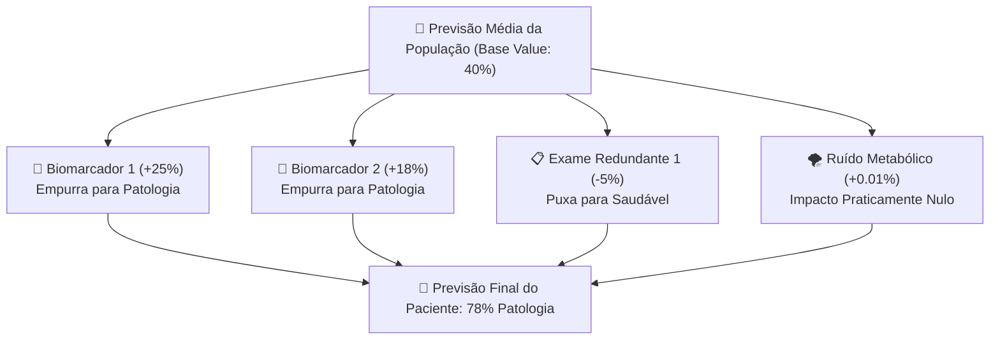

# Aula 02 - Explicabilidade Global com SHAP e a Teoria dos Jogos Cooperativos

**Disciplina:** Inteligência Artificial Explicável (XAI) & Otimização de Modelos  
**Professor:** Eduardo Lázaro Roesler de Oliveira  
**Instituição:** UNIVEM — Centro Universitário de Marília  

---

> [!NOTE]
> 🔙 **De onde viemos:** Na Aula 01, construímos nosso classificador Baseline com Random Forest sobre 40 variáveis clínicas. Embora o modelo tenha atingido um bom $F_1$-score (~85%), ele ainda opera como uma **caixa-preta hermética**: olhando apenas para a matriz de confusão, não sabemos se ele tomou decisões baseando-se nos 10 biomarcadores reais ou se foi enganado pelos 20 ruídos metabólicos.
> 🎯 **Objetivo Principal da Aula:** Dominar os fundamentos da Teoria dos Jogos Cooperativos de Lloyd Shapley aplicados à Inteligência Artificial (**SHAP — SHapley Additive exPlanations**), implementar o algoritmo otimizado **TreeSHAP** (`shap.TreeExplainer`), computar o ranking de importância média global ($|\text{SHAP}|$) e interpretar gráficos de impacto direcional (**Beeswarm Plot**).
> 🚀 **Para onde vamos:** Na Aula 03, daremos um zoom microscópico: sairemos da visão global da população e usaremos o **LIME** para dissecar a decisão médica individual de um único paciente limítrofe cuja probabilidade diagnóstica ficou em exatos 50% ("em cima do muro").

---

## Organização Tática da Aula

| Módulo | Atividade | Foco Pedagógico |
| :--- | :--- | :--- |
| **Módulo 1** | **Fundamentação Teórica & Teoria dos Jogos** | A intuição matemática dos Valores Shapley e como a distribuição de mérito em jogos cooperativos resolve a explicabilidade de IA. |
| **Módulo 2** | **O Mecanismo por Dentro & TreeSHAP vs. Abordagens Clássicas** | Por que a importância Gini do Random Forest é tendenciosa e como o TreeSHAP reduz complexidade exponencial para polinomial. |
| **Módulo 3** | **Prática Guiada no Google Colab** | 5 blocos de código em Python minuciosamente comentados linha por linha, com caixas de dúvidas e gráficos Beeswarm. |
| **Módulo 4** | **Prática Orientada & Experimentação Fácil** | Experimentação com amostragem e análise do impacto da variação de parâmetros visuais. |
| **Módulo 5** | **Checklist de Autonomia & Bibliografia** | Autoavaliação do estudante e referências seminais de XAI. |

---

## Módulo 1: Fundamentação Teórica & Teoria dos Jogos de Lloyd Shapley

### 1.1 A Pergunta Central da Explicabilidade Global
Em um modelo de aprendizado de máquina, quando ele prevê que um paciente tem **88% de probabilidade de patologia**, nós temos uma pergunta ética e científica inegociável:
> *"Quanto desse prognóstico foi responsabilidade de cada exame realizado?"*

Em **1953, o matemático Lloyd Shapley** propôs uma solução para um problema análogo na teoria dos jogos cooperativos: se um grupo de jogadores forma uma coalizão para produzir um valor conjunto (lucro ou vitória), como dividir a recompensa de maneira que nenhum participante seja injustiçado?

Em **2017, Scott Lundberg e Su-In Lee** demonstraram que podemos enxergar um modelo de IA exatamente como um jogo cooperativo:
- **Os Jogadores:** São os atributos de entrada (biomarcadores, exames, ruídos).
- **O Jogo:** É a função preditiva do modelo ($f(x)$).
- **A Recompensa:** É a predição final (a probabilidade ou score gerado).
- **O Valor Shapley ($\phi_i$):** É a contribuição marginal justa que o atributo $i$ teve para afastar a previsão do valor médio esperado da população!



> [!TIP]
> ⚔️ **Analogia Geek — O Bônus de Missão dos Vingadores:**
> Imagine que a equipe dos Vingadores venceu um supervilão e recebeu uma recompensa de 1 milhão de moedas de ouro. O Homem de Ferro causou 40% do dano, Thor destruiu as naves, o Doutor Estranho abriu os portais de fuga e o Gavião Arqueiro atirou 3 flechas. Como dividir o ouro? Se dividirmos igualmente em 4 partes (como faz a média simples), Thor e Stark serão injustiçados! O Valor Shapley calcula quanto o time teria conquistado em **todas as combinações possíveis de heróis** (com e sem o Stark, com e sem o Gavião) para atribuir a fatia exata que cada herói gerou!

> [!NOTE]
> 💡 **Curiosidade da Aula — O Nobel de Economia e o NeurIPS 2017:**
> Lloyd Shapley recebeu o **Prêmio Nobel de Economia em 2012** pela Teoria dos Jogos Estáveis. Apenas 5 anos depois, o pesquisador Scott Lundberg apresentou no prestigiado congresso **NeurIPS 2017** o artigo *"A Unified Approach to Interpreting Model Predictions"*, transformando os Valores Shapley no padrão-ouro da moderna indústria de IA (adotado por Google, Microsoft, Netflix e centros de medicina diagnóstica).

> [!IMPORTANT]
> 💡 **Em 1 Frase:** O SHAP calcula a contribuição de cada atributo medindo o quanto a previsão do modelo se altera quando aquele atributo está presente contra todas as combinações onde ele esteve ausente.

---

## Módulo 2: O Mecanismo por Dentro & Regras Práticas

### 2.1 A Equação dos Valores Shapley Desmistificada

A equação clássica de Shapley é dada por:

$$\phi_i(v) = \sum_{S \subseteq F \setminus \{i\}} \frac{|S|!(|F| - |S| - 1)!}{|F|!} \Big[ v(S \cup \{i\}) - v(S) \Big]$$

Vamos traduzir os símbolos matemáticos para linguagem humana:
- $F$: É o conjunto completo de todos os atributos disponíveis (no nosso caso, as 40 variáveis).
- $S$: É um subconjunto ("coalizão") de atributos sem o atributo $i$.
- $v(S \cup \{i\}) - v(S)$: É a **contribuição marginal** que o atributo $i$ trouxe ao entrar no grupo $S$.
- $\frac{|S|!(|F| - |S| - 1)!}{|F|!}$: É o peso combinatório (fatorial) que garante que todas as ordens de entrada na sala de votação tenham a mesma probabilidade.

### 2.2 Comparativo: Importância Clássica (Gini) vs. TreeSHAP

| Critério | Importância Nativa Random Forest (Gini / MDI) | Valores SHAP (TreeSHAP) |
| :--- | :--- | :--- |
| **Consistência Teórica** | **Baixa:** Pode atribuir alto valor a variáveis contínuas aleatórias (viés de cardinalidade). | **Alta:** Garantida por 4 axiomas matemáticos da teoria dos jogos (Eficiência, Simetria, Dummy e Aditividade). |
| **Direção do Efeito** | Não informa se a variável ajuda ou atrapalha a previsão (apenas um número positivo). | Informa magnitude E direção (valores positivos empurram para classe 1; negativos para classe 0). |
| **Complexidade Computacional** | Imediata ($O(1)$ pós-treino). | $O(T \cdot L \cdot D^2)$ (otimização polinomial veloz para árvores). |
| **Explicação Local** | Não fornece (mede apenas o comportamento global da floresta). | Fornece valores Shapley individuais para cada paciente e média global. |

> [!IMPORTANT]
> 💡 **Em 1 Frase:** Nunca tome decisões de descarte de atributos baseando-se apenas na importância Gini do Random Forest; use sempre o $|SHAP|$, que é rigorosamente imune a distorções estatísticas.

---

## Módulo 3: Prática Guiada no Google Colab

Abra o seu Notebook no [Google Colab](https://colab.research.google.com) e execute as células na ordem abaixo.

> [!NOTE]
> **Roteiro de estudo:** Nós recuperaremos os dados e o modelo treinados na Aula 01. Em seguida, instanciaremos o `TreeExplainer` e geraremos dois gráficos espetaculares: o **Bar Plot de Importância Média** (colorido por tipo semântico de variável) e o **Beeswarm Summary Plot**.

---

### Bloco 2.1 — Preparação dos Dados e Reutilização do Baseline

> [!IMPORTANT]
> 🤔 **Dúvidas Comuns de Iniciantes:**  
> **Por que recriamos a função `gerar_dataset_sintetico_saude()` aqui?**  
> Para garantir que este notebook seja totalmente autocontido e independente no Google Colab! Usando a mesma semente (`random_state=42`), garantimos exatamente os mesmos 40 atributos e dados da aula anterior.

```python
# 1. Importamos as bibliotecas necessarias para computacao, graficos e XAI
import numpy as np
import pandas as pd
import matplotlib.pyplot as plt
import seaborn as sns
import shap
from sklearn.datasets import make_classification
from sklearn.model_selection import train_test_split
from sklearn.ensemble import RandomForestClassifier

# 2. Definimos a funcao geradora de dados clinicos sinteticos identica a Aula 01
def gerar_dataset_sintetico_saude(n_samples=2000, n_features=40, n_informative=10, n_redundant=10, random_state=42):
    X_raw, y = make_classification(
        n_samples=n_samples,
        n_features=n_features,
        n_informative=n_informative,
        n_redundant=n_redundant,
        n_repeated=0,
        n_classes=2,
        weights=[0.6, 0.4],
        flip_y=0.03,
        random_state=random_state
    )
    feature_names = (
        [f"biomarcador_{i+1}" for i in range(n_informative)] +
        [f"exame_redundante_{i+1}" for i in range(n_redundant)] +
        [f"ruido_metabolico_{i+1}" for i in range(n_features - n_informative - n_redundant)]
    )
    return pd.DataFrame(X_raw, columns=feature_names), y

# 3. Geramos o dataset e particionamos em treino e teste com estratificacao
X, y = gerar_dataset_sintetico_saude()
X_train, X_test, y_train, y_test = train_test_split(X, y, test_size=0.25, random_state=42, stratify=y)

# 4. Ajustamos a floresta aleatoria de referencia (Baseline)
modelo_baseline = RandomForestClassifier(n_estimators=100, random_state=42, n_jobs=1)
modelo_baseline.fit(X_train, y_train)

# 5. Exibimos a confirmacao de prontidao do modelo para explicabilidade
print(f"[OK] Modelo Baseline ajustado com sucesso sobre {X_train.shape[1]} atributos!")
```

---

### Bloco 2.2 — Instanciando o `TreeExplainer` e Extraindo a Matriz SHAP

> [!IMPORTANT]
> 🤔 **Dúvidas Comuns de Iniciantes:**  
> **O que é o `TreeExplainer` e por que ele é muito mais rápido que o `KernelExplainer`?**  
> O `KernelExplainer` é agnóstico a modelos e precisa avaliar milhares de permutações combinatórias (tempo exponencial). Já o `TreeExplainer` aproveita a estrutura interna de nós e ramificações das árvores do Random Forest, calculando os valores Shapley exatos em tempo polinomial ultrarrápido!

```python
# 1. Definimos a funcao que executa o calculo matematico do TreeSHAP
def calcular_explicacoes_shap(modelo, X_train):
    """
    Calcula os valores SHAP usando o algoritmo otimizado TreeExplainer.
    """
    # 2. Instanciamos o explicador de arvores passando nosso Random Forest treinado
    explainer = shap.TreeExplainer(modelo)
    
    # 3. Extraímos os valores SHAP calculados para todos os pacientes do conjunto de treino
    shap_values = explainer(X_train)
    
    # 4. Verificamos a dimensionalidade dos valores SHAP (formato 3D para classificacao binaria)
    if len(shap_values.shape) == 3:
        # 5. Extraímos exclusivamente a matriz de impacto da classe 1 (presenca de patologia)
        shap_vals_class1 = shap_values.values[:, :, 1]
    else:
        # 6. Para formatos 2D, extraímos diretamente os valores
        shap_vals_class1 = shap_values.values
        
    # 7. Computamos o modulo medio absoluto |SHAP| de cada coluna ao longo de todos os pacientes
    mean_abs_shap = np.abs(shap_vals_class1).mean(axis=0)
    
    # 8. Criamos uma tabela consolidando os nomes dos atributos e sua respectiva importancia media
    df_importancia = pd.DataFrame({
        "atributo": X_train.columns,
        "importancia_shap": mean_abs_shap
    }).sort_values(by="importancia_shap", ascending=False).reset_index(drop=True)
    
    # 9. Retornamos o objeto explicador, a matriz de valores e o DataFrame ordenado
    return explainer, shap_values, shap_vals_class1, df_importancia

# 10. Computamos a explicabilidade global com TreeSHAP
print("[*] Computando valores TreeSHAP no conjunto de treinamento... Aguarde alguns segundos...")
explainer, shap_values, shap_vals_class1, df_importancia = calcular_explicacoes_shap(modelo_baseline, X_train)

# 11. Exibimos os 10 atributos de maior impacto no console
print("\n" + "=" * 65)
print("--- TOP 10 ATRIBUTOS MAIS IMPORTANTES SEGUNDO O SHAP ---")
print("=" * 65)
for i, row in df_importancia.head(10).iterrows():
    print(f" {i+1:2d}. {row['atributo']:<25} | Importância Média |SHAP|: {row['importancia_shap']:.4f}")
print("=" * 65)
```

---

### Bloco 2.3 — Gráficos de Alto Impacto: Bar Plot Semântico e Beeswarm Plot

> [!IMPORTANT]
> 🤔 **Dúvidas Comuns de Iniciantes:**  
> **Como interpretar os pontos vermelhos e azuis no Beeswarm Plot?**  
> Cada ponto representa um paciente real. A cor indica o valor original do exame do paciente (Vermelho = valor alto; Azul = valor baixo). O eixo horizontal mostra o impacto no diagnóstico (Direita = empurra para Patologia; Esquerda = empurra para Saudável). Se pontos vermelhos acumulam-se à direita, significa que *quanto mais alto o biomarcador, maior o risco de doença*!

```python
# 1. Definimos a funcao de geracao dos paineis graficos de explicabilidade global
def gerar_graficos_shap(shap_values, X_train, df_importancia, output_path="modulo2_shap_summary.png"):
    """
    Plota o Bar Plot de relevância global e o Beeswarm Summary Plot lado a lado.
    """
    # 2. Criamos a figura contendo 1 linha e 2 colunas amplas
    fig, axes = plt.subplots(1, 2, figsize=(18, 7))
    
    # 3. Extraímos o ranking dos 15 principais atributos
    top15 = df_importancia.head(15)
    
    # 4. Mapeamos cores semanticas: Azul para biomarcadores, Laranja para redundantes e Vermelho para ruidos
    colors = [
        '#1f77b4' if 'biomarcador' in name else ('#ff7f0e' if 'redundante' in name else '#d62728')
        for name in top15['atributo']
    ]
    
    # 5. Plotamos o grafico horizontal de barras invertendo a ordem para o maior ficar no topo
    axes[0].barh(top15['atributo'][::-1], top15['importancia_shap'][::-1], color=colors[::-1])
    axes[0].set_title("Top 15 Atributos por Importância Média |SHAP|", fontsize=12, fontweight="bold")
    axes[0].set_xlabel("Impacto Médio Absoluto no Modelo (|SHAP value|)", fontweight="bold")
    axes[0].grid(True, alpha=0.3)
    
    # 6. Criamos a legenda explicativa para identificar o tipo de dado de cada barra
    from matplotlib.patches import Patch
    legend_elements = [
        Patch(facecolor='#1f77b4', label='Biomarcadores Vitais (Informativos)'),
        Patch(facecolor='#ff7f0e', label='Exames Redundantes (Colineares)'),
        Patch(facecolor='#d62728', label='Ruído Metabólico (Sem Efeito Real)')
    ]
    axes[0].legend(handles=legend_elements, loc="lower right")
    
    # 7. Configuramos o eixo da direita como ativo para renderizar o beeswarm da biblioteca shap
    plt.sca(axes[1])
    
    # 8. Extraímos a porcao adequada dos valores SHAP para o plot
    if len(shap_values.shape) == 3:
        sv_plot = shap_values[:, :, 1]
    else:
        sv_plot = shap_values
        
    # 9. Renderizamos o Beeswarm Plot nos 15 maiores atributos sem fechar a janela antes do layout
    shap.plots.beeswarm(sv_plot, max_display=15, show=False)
    axes[1].set_title("SHAP Beeswarm Plot (Distribuição de Impacto Local)", fontsize=12, fontweight="bold")
    
    # 10. Ajustamos o espacamento entre os graficos
    plt.tight_layout()
    
    # 11. Salvamos a imagem no disco em resolucao grafica profissional (300 DPI)
    plt.savefig(output_path, dpi=300, bbox_inches='tight')
    
    # 12. Exibimos a imagem no Google Colab
    plt.show()
    print(f"[+] Gráficos SHAP gerados e salvos com sucesso em: {output_path}")

# 13. Invocamos a funcao para visualizar o mapa completo da mente da IA
gerar_graficos_shap(shap_values, X_train, df_importancia)
```

---

### Bloco 2.4 — Teste de Sanidade Automatizado do SHAP

> [!IMPORTANT]
> 🤔 **Dúvidas Comuns de Iniciantes:**  
> **O que este teste de sanidade comprova cientificamente?**  
> Ele comprova que o algoritmo SHAP foi capaz de identificar que os atributos informativos (biomarcadores e redundantes) são os que verdadeiramente governam as decisões da floresta, empurrando as 20 variáveis de ruído aleatório para o fundo do ranking!

```python
# 1. Definimos a funcao de teste de integridade da explicabilidade
def teste_de_sanidade_shap(df_importancia, shap_vals_class1, X_train):
    """
    Sanity Check do Módulo 2:
    - Valida dimensões da matriz calculada.
    - Confirma se variáveis informativas lideram o topo do ranking sobre ruídos.
    """
    # 2. Asseguramos que o tamanho da matriz SHAP bate exatamente com a matriz de treino (pacientes x colunas)
    assert shap_vals_class1.shape == X_train.shape, f"Dimensão SHAP inconsistente: {shap_vals_class1.shape}"
    
    # 3. Extraímos os 5 principais atributos ranqueados pelo SHAP
    top5_atributos = df_importancia.head(5)["atributo"].tolist()
    
    # 4. Contabilizamos quantos atributos do Top 5 sao biomarcadores genuinos ou exames redundantes
    informativos_no_top5 = sum(1 for feat in top5_atributos if "biomarcador" in feat or "redundante" in feat)
    
    # 5. Asseguramos que pelo menos 3 dos 5 maiores atributos sejam genuinamente uteis
    assert informaticos_no_top5 >= 3, f"Erro: Esperado que informativos dominassem o Top 5, mas obtido {top5_atributos}"
    
    # 6. Exibimos a mensagem de validacao
    print("\n[OK] SANITY CHECK DO SHAP APROVADO: Matriz dimensionalmente correta e atributos informativos validados no topo!")

# 7. Executamos o teste de sanidade
teste_de_sanidade_shap(df_importancia, shap_vals_class1, X_train)
```

---

## Módulo 4: Prática Orientada & Experimentação Fácil

### Roteiro de Personalização para o Estudante:
Agora é sua vez de explorar o Beeswarm Plot. Altere a quantidade de variáveis exibidas para enxergar como os ruídos se comportam visualmente:

1. **Altere o número de atributos no gráfico:** Na linha `max_display_aluno = 8`, mude para `25`.
2. **Execute e observe:** Veja como a partir da 15ª variável, os pontos começam a ficar acumulados exatamente em cima da linha vertical $0.0$! Isso prova visualmente que os atributos de ruído metabólico têm impacto nulo na decisão do modelo.

```python
# =============================================================================
# CÓDIGO BASE PRONTO PARA SUA EXPERIMENTAÇÃO
# =============================================================================
import shap
import matplotlib.pyplot as plt

# -----------------------------------------------------------------------------
# STEP 1: PASSO DE EXPERIMENTAÇÃO DO ALUNO — ALTERE O LIMITE DE VARIÁVEIS:
# -----------------------------------------------------------------------------
max_display_aluno = 8  # Experimente trocar por 25 para ver os ruídos em cena!

# 1. Configuramos a figura para visualizacao rapida
plt.figure(figsize=(10, 6))

# 2. Extraímos o objeto correto da classe 1
sv_aluno = shap_values[:, :, 1] if len(shap_values.shape) == 3 else shap_values

# 3. Renderizamos o Beeswarm com o parametro configurado pelo estudante
shap.plots.beeswarm(sv_aluno, max_display=max_display_aluno, show=False)
plt.title(f"Beeswarm Customizado: Top {max_display_aluno} Atributos", fontsize=12, fontweight="bold")
plt.tight_layout()
plt.show()
```

---

### 🔮 Aquecimento & Spoiler da Próxima Aula (Para Ir Além)

> [!TIP]
> 🧠 **Conceito-Semente — O Diagnóstico Individual no Limiar do Risco**  
> O SHAP nos deu uma visão macroscópica de toda a população. Mas e quando um médico atende o **Sr. Carlos (Paciente #42)**, e o modelo diz que ele tem **50.2% de probabilidade de patologia**? O médico precisa saber os motivos cirúrgicos daquele paciente específico!  
> Na **Aula 03**, estudaremos o **LIME (Local Interpretable Model-agnostic Explanations)**: aprenderemos a criar uma perturbação matemática ao redor desse paciente limítrofe para extrair regras locais do tipo: *"Se Glicemia > 130 E Colesterol < 200, a probabilidade sobe 12%"*!
> 
> 🚀 **Desafio Proativo de Autoestudo (Opcional):**  
> Dê uma olhada no artigo clássico do LIME: *"Why Should I Trust You? Explaining the Predictions of Any Classifier"* (Ribeiro et al., 2016). Veja como eles usam um modelo simples para explicar um modelo de rede neural complexa!

---

## Módulo 5: Checklist de Autonomia do Estudante

- [ ] Compreendi a formulação conceitual da Teoria dos Jogos Cooperativos de Lloyd Shapley.
- [ ] Sei a diferença fundamental entre importância de Gini e os Valores Shapley.
- [ ] Entendi por que o `TreeExplainer` é exponencialmente mais veloz do que abordagens agnósticas a modelos.
- [ ] Sei calcular e interpretar o ranking de importância média global ($|\text{SHAP}|$).
- [ ] Consigo ler um Beeswarm Plot, identificando a direção do impacto (azul vs. vermelho) e sua dispersão.
- [ ] Executei com sucesso o teste de sanidade validando que o ruído ficou no final da lista.

---

## Referências Bibliográficas & Documentações Oficiais

- 📖 **Artigo Seminal SHAP:** Lundberg, S. M., & Lee, S. I. (2017). *A unified approach to interpreting model predictions*. In Advances in Neural Information Processing Systems (NeurIPS 2017).
- 📖 **Artigo TreeSHAP:** Lundberg, S. M. et al. (2020). *From local explanations to global understanding with explainable AI for trees*. Nature Machine Intelligence.
- 🔗 **Documentação Oficial do SHAP:** [SHAP (SHapley Additive exPlanations) Documentation](https://shap.readthedocs.io/)
