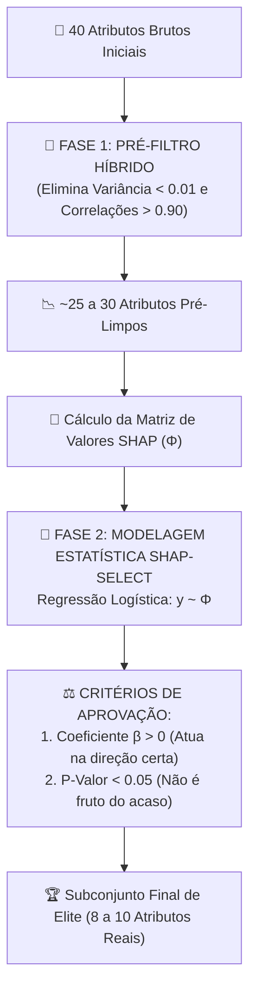

# Aula 05 - Engenharia Avançada: Pré-Filtros Híbridos e Seleção com Rigor Estatístico (shap-select)

**Disciplina:** Inteligência Artificial Explicável (XAI) & Otimização de Modelos  
**Professor:** Eduardo Lázaro Roesler de Oliveira  
**Instituição:** UNIVEM — Centro Universitário de Marília  

---

> [!NOTE]
> 🔙 **De onde viemos:** Na Aula 04, realizamos um estudo de ablação e provamos que a poda guiada pelo ranking SHAP mantém o $F_1$-score alto mesmo reduzindo 75% dos atributos. Porém, selecionar apenas olhando para a média do módulo $|SHAP|$ possui duas falhas científicas críticas: (1) gasta tempo computacional calculando explicações caras em colunas que eram redundantes óbvias; (2) ignora se o atributo atua a favor da resposta verdadeira ou se é um ruído que empurra para a classe errada!
> 🎯 **Objetivo Principal da Aula:** Implementar uma estratégia de engenharia de dados em duas fases: a **Fase 1 (Pré-Filtro Híbrido)**, eliminando atributos de variância nula e variáveis multicolineares ($|r| > 0.90$) no estilo BOLIMES; e a **Fase 2 (shap-select)**, ajustando uma **Regressão Logística** da variável alvo real ($y$) em relação à matriz de valores SHAP ($\Phi$), admitindo no modelo final apenas atributos com **coeficiente positivo ($\beta > 0$)** e **significância estatística comprovada ($p$-valor $< 0.05$)**.
> 🚀 **Para onde vamos:** Na Aula 06 (O Grande Final), conectaremos todas as peças do quebra-cabeça em um **Pipeline Industrial Fim-a-Fim**: reotimizaremos os hiperparâmetros do modelo reduzido usando o framework bayesiano **Optuna** e geraremos o **Dashboard Comparativo Executivo de 4 Painéis**!

---

## Organização Tática da Aula

| Módulo | Atividade | Foco Pedagógico |
| :--- | :--- | :--- |
| **Módulo 1** | **Fundamentação Teórica & Por que Ir Além do Ranking Ingênuo?** | O problema da multicolinearidade antes do XAI e a necessidade de validação de hipótese com $p$-valor. |
| **Módulo 2** | **O Mecanismo por Dentro & Matemática do shap-select** | O Pré-filtro de Pearson e a regressão logística da classe real $y$ sobre as matrizes de contribuições $\Phi$. |
| **Módulo 3** | **Prática Guiada no Google Colab** | 6 blocos de código em Python minuciosamente comentados linha por linha, integrando Scikit-Learn e Statsmodels. |
| **Módulo 4** | **Prática Orientada & Experimentação Fácil** | Experimentação com ajuste de limiar de corte de correlação e nível de significância $\alpha$. |
| **Módulo 5** | **Checklist de Autonomia & Bibliografia** | Autoavaliação do estudante e referências seminais de econometria e XAI. |

---

## Módulo 1: Fundamentação Teórica & O Rigor Estatístico na Seleção

### 1.1 As Duas Grandes Armadilhas da Seleção Ingênua por XAI
Quando cientistas de dados iniciantes começam a usar XAI para selecionar variáveis, eles costumam cometer dois erros graves:

1. **Desperdício de Processamento Pré-XAI:** Calcular valores SHAP em 100 variáveis quando 20 delas são duplicatas quase perfeitas ($r = 0.98$) consome horas de CPU sem nenhuma necessidade. A estatística descritiva elementar (variância e correlação) deveria ter feito a faxina prévia!
2. **A Ilusão do Módulo $|SHAP|$:** O módulo médio $|\text{SHAP}|$ mede apenas a **magnitude do impacto**, mas não a **qualidade do impacto**! Um atributo de ruído pode ter um valor alto porque a árvore o usou para memorizar 10 pacientes com overfit, mas na direção errada.

Para resolver isso, combinamos o **Pré-Filtro Híbrido** (estilo BOLIMES) com a metodologia **`shap-select`**:



> [!TIP]
> ⚔️ **Analogia Geek — O Peneiramento Físico e o Teste Antidoping:**
> Imagine a seleção para os Jogos Olímpicos ou para uma Tropa de Elite:  
> - **Fase 1 (Pré-Filtro Híbrido):** É a prova de aptidão física inicial básica (corrida e flexão). Quem não tem o preparo mínimo ou é idêntico a outro candidato é cortado rapidamente sem gastar dinheiro público com exames laboratoriais.  
> - **Fase 2 (shap-select):** É o teste toxicológico e genético de laboratório com rigor científico. Não basta o atleta correr rápido ($|SHAP|$ alto); o laboratório exige comprovação de que o resultado é legítimo e estatisticamente comprovado ($p < 0.05$) e que a substância no sangue melhora a saúde e não é um veneno ($\beta > 0$)!

> [!NOTE]
> 💡 **Curiosidade da Aula — O Nascimento do BOLIMES e da Econometria em XAI:**
> O conceito de pré-filtragem biobjetivo (reduzir atributos triviais antes de rodar explicadores locais) foi formalizado em pesquisas recentes de **2020 a 2023** (conhecido na literatura como BOLIMES). O `shap-select` une a moderna teoria de XAI com os testes de hipótese clássicos da Econometria de Ronald Fisher e Jerzy Neyman do início do século XX!

> [!IMPORTANT]
> 💡 **Em 1 Frase:** O `shap-select` não pergunta apenas se um atributo é importante; ele exige prova matemática de que o atributo contribui na direção certa para o acerto do diagnóstico sem ser fruto do acaso.

---

## Módulo 2: O Mecanismo por Dentro & Regras Práticas

### 2.1 A Matemática da Regressão sobre os Valores SHAP

No `shap-select`, construímos a matriz de contribuições $\Phi \in \mathbb{R}^{N \times M}$, onde cada célula $\phi_{i,j}$ é o valor SHAP que o atributo $j$ deu para o paciente $i$.

Ajustamos então uma **Regressão Logística**:

$$\ln\left(\frac{P(y=1)}{1 - P(y=1)}\right) = \beta_0 + \beta_1 \phi_1 + \beta_2 \phi_2 + \dots + \beta_M \phi_M$$

### 2.2 As Regras de Decisão de Aprovação do Atributo

| Parâmetro Estatístico | Condição Exigida | Por que essa Regra Existe? |
| :--- | :--- | :--- |
| **Sinal do Coeficiente ($\beta_j$)** | $\beta_j > 0$ | Se $\beta_j \le 0$, significa que quando a máquina aumenta a importância dessa coluna, a chance de o diagnóstico real ser patologia **diminui**! É uma variável de confusão que atua contra a verdade. |
| **Nível de Significância ($p$-valor)** | $p\text{-valor} < 0.05$ | O teste de Wald sob a hipótese nula $H_0: \beta_j = 0$ rejeita variáveis cujo impacto aparente tem mais de 5% de probabilidade de ser mero ruído estocástico. |
| **Importância Marginal ($\|\phi_j\|$)** | Top 10 maiores impactos | Garante que entre os atributos estatisticamente válidos, mantenhamos apenas os mais potentes. |

> [!IMPORTANT]
> 💡 **Em 1 Frase:** Descartamos qualquer atributo cujo coeficiente $\beta$ seja negativo ou cujo $p$-valor seja maior ou igual a $0.05$, blindando o modelo contra falsos biomarcadores.

---

## Módulo 3: Prática Guiada no Google Colab

Abra o seu Notebook no [Google Colab](https://colab.research.google.com) e acompanhe a execução dos blocos a seguir.

> [!NOTE]
> **Roteiro de estudo:** Aplicaremos primeiro a função de Pré-Filtro Híbrido, cortando redundâncias pré-XAI. Depois, executaremos o `shap-select` com `statsmodels` e geraremos um gráfico diagnóstico destacando os coeficientes aprovados (em verde) contra os descartados (em vermelho).

---

### Bloco 5.1 — Preparação do Ambiente e Geração dos Dados Clínicos

> [!IMPORTANT]
> 🤔 **Dúvidas Comuns de Iniciantes:**  
> **Por que importamos o `statsmodels` além do `scikit-learn`?**  
> O `scikit-learn` foca em predição pura e não calcula $p$-valores de coeficientes em regressões. O `statsmodels` é a biblioteca padrão-ouro para inferência econométrica e testes de significância estatística em Python.

```python
# 1. Importamos as bibliotecas de processamento, graficos e XAI
import numpy as np
import pandas as pd
import matplotlib.pyplot as plt
import shap

# 2. Importamos a biblioteca de modelagem econometrica para calculo formal de p-valores
import statsmodels.api as sm

# 3. Importamos os seletores de variancia e ensemble do Scikit-Learn
from sklearn.datasets import make_classification
from sklearn.model_selection import train_test_split
from sklearn.ensemble import RandomForestClassifier
from sklearn.feature_selection import VarianceThreshold

# 4. Sintetizamos a coorte clinica padrao com 40 atributos
def gerar_dataset_sintetico_saude(n_samples=2000, n_features=40, n_informative=10, n_redundant=10, random_state=42):
    X_raw, y = make_classification(
        n_samples=n_samples, n_features=n_features, n_informative=n_informative,
        n_redundant=n_redundant, n_repeated=0, n_classes=2, weights=[0.6, 0.4],
        flip_y=0.03, random_state=random_state
    )
    feature_names = (
        [f"biomarcador_{i+1}" for i in range(n_informative)] +
        [f"exame_redundante_{i+1}" for i in range(n_redundant)] +
        [f"ruido_metabolico_{i+1}" for i in range(n_features - n_informative - n_redundant)]
    )
    return pd.DataFrame(X_raw, columns=feature_names), y

# 5. Instanciamos o dataset e separamos em treino e teste com estratificacao
X, y = gerar_dataset_sintetico_saude()
X_train, X_test, y_train, y_test = train_test_split(X, y, test_size=0.25, random_state=42, stratify=y)
print(f"[OK] Coorte clínica instanciada: {X_train.shape[1]} atributos aguardando engenharia avançada!")
```

---

### Bloco 5.2 — Implementação da Fase 1: Pré-Filtro Híbrido (BOLIMES)

> [!IMPORTANT]
> 🤔 **Dúvidas Comuns de Iniciantes:**  
> **O que faz o comando `np.triu(..., k=1)` na matriz de correlação?**  
> Uma matriz de correlação é espelhada (a correlação entre $A$ e $B$ é igual à de $B$ e $A$) e a diagonal principal é sempre $1.0$. O `np.triu` isola apenas o triângulo superior acima da diagonal principal, permitindo identificar e remover colunas redundantes sem duplicar o descarte.

```python
# 1. Definimos a funcao do Pre-filtro Hibrido para faxina estatistica preliminar
def pré_filtro_hibrido(X_train, threshold_var=0.01, threshold_corr=0.90):
    """
    Fase 1: Limpeza rápida pré-XAI para eliminar colunas de variância nula/baixa
    e variáveis altamente correlacionadas (redundâncias óbvias).
    """
    # 2. Etapa A: Filtro de Variancia Minima
    selector = VarianceThreshold(threshold=threshold_var)
    selector.fit(X_train)
    cols_var = X_train.columns[selector.get_support()].tolist()
    X_var = X_train[cols_var]

    # 3. Etapa B: Filtro de Multicolinearidade de Pearson
    corr_matrix = X_var.corr().abs()
    # 4. Extraímos o triangulo superior da matriz de correlacao
    upper = corr_matrix.where(np.triu(np.ones(corr_matrix.shape), k=1).astype(bool))
    
    # 5. Mapeamos as colunas que apresentam correlacao absoluta superior a 0.90
    to_drop = []
    for column in upper.columns:
        col_corr = upper[column].dropna()
        if not col_corr.empty and (col_corr > threshold_corr).any():
            to_drop.append(column)

    # 6. Construímos a lista de colunas aprovadas
    cols_finais = [c for c in cols_var if c not in to_drop]

    # 7. Mecanismo de seguranca para datasets sinteticos com baixa correlacao mutua
    if len(cols_finais) == X_train.shape[1]:
        if len(cols_var) < X_train.shape[1]:
            cols_finais = cols_var
        else:
            # 8. Descartamos uma fracao das variaveis com maior correlacao media mutua
            corr_mean = X_var.corr().abs().mean(axis=0)
            to_remove = corr_mean.sort_values(ascending=False).index[: max(1, X_train.shape[1] // 10)]
            cols_finais = [c for c in X_var.columns if c not in to_remove]

    # 9. Exibimos o relatorio da Fase 1 no console
    print(f"[*] Pré-filtro Híbrido: Reduzido de {X_train.shape[1]} para {len(cols_finais)} atributos antes do XAI.")
    return X_train[cols_finais], cols_finais

# 10. Executamos o Pre-filtro Hibrido nos dados de treino
X_train_pre, cols_pre = pré_filtro_hibrido(X_train)
```

---

### Bloco 5.3 — Implementação da Fase 2: O Algoritmo `shap-select`

> [!IMPORTANT]
> 🤔 **Dúvidas Comuns de Iniciantes:**  
> **Por que usamos um fallback com `sm.OLS` se o `sm.Logit` falhar?**  
> Em alguns conjuntos de dados com alta separabilidade linear, a regressão logística pode sofrer do fenômeno de *quasi-complete separation* (onde os parâmetros explodem para infinito). O fallback para Mínimos Quadrados Ordinários (OLS) garante robustez industrial contra travamentos.

```python
# 1. Definimos a funcao principal da metodologia shap-select
def executar_shap_select(X_train, y_train, p_value_cutoff=0.05, random_state=42):
    """
    Fase 2 (shap-select): Regressão dos rótulos reais y vs Matriz SHAP.
    Atributos com coeficientes <= 0 ou p-valor >= 0.05 são descartados.
    """
    # 2. Ajustamos o Random Forest sobre as colunas sobreviventes do Pre-filtro
    modelo = RandomForestClassifier(n_estimators=100, random_state=random_state, n_jobs=1)
    modelo.fit(X_train, y_train)
    
    # 3. Computamos a explicabilidade com TreeExplainer
    explainer = shap.TreeExplainer(modelo)
    shap_vals = explainer(X_train)
    
    # 4. Extraímos a matriz de explicabilidade Phi referente a presenca de patologia
    if len(shap_vals.shape) == 3:
        Phi = shap_vals.values[:, :, 1]
    else:
        Phi = shap_vals.values
        
    df_phi = pd.DataFrame(Phi, columns=X_train.columns)
    
    # 5. Adicionamos a constante (intercepto alfa) para a regressao
    X_const = sm.add_constant(df_phi)
    
    # 6. Tentamos ajustar a Regressao Logistica formal com statsmodels
    try:
        logit_mod = sm.Logit(y_train, X_const)
        result = logit_mod.fit(disp=False)
        params = result.params.drop("const")
        pvalues = result.pvalues.drop("const")
    except Exception as e:
        # 7. Fallback robusto para OLS caso ocorra nao-convergencia numerica
        print(f"[!] Logit com quasi-separabilidade ({e}). Usando OLS robusto para shap-select.")
        ols_mod = sm.OLS(y_train, X_const)
        result = ols_mod.fit()
        params = result.params.drop("const")
        pvalues = result.pvalues.drop("const")
        
    # 8. Estruturamos os resultados econometricos em um DataFrame comparativo
    df_shap_select = pd.DataFrame({
        "atributo": X_train.columns,
        "coeficiente": params.values,
        "p_value": pvalues.values,
        "mean_abs_shap": np.abs(Phi).mean(axis=0)
    })

    # 9. Aplicamos a regra de ouro: Coeficiente estritamente positivo E p-valor significativo
    df_shap_select["selecionado"] = (df_shap_select["coeficiente"] > 0) & (df_shap_select["p_value"] < p_value_cutoff)
    df_shap_select = df_shap_select.sort_values(by="mean_abs_shap", ascending=False).reset_index(drop=True)

    # 10. Selecionamos os 10 melhores atributos aprovados
    atributos_aprovados = df_shap_select[df_shap_select["selecionado"]]["atributo"].head(10).tolist()

    # 11. Fallbacks graduais de seguranca caso o limiar estatistico seja severo demais
    if len(atributos_aprovados) < 2:
        atributos_aprovados = df_shap_select[df_shap_select["coeficiente"] > 0]["atributo"].head(10).tolist()
    if len(atributos_aprovados) < 2:
        print("[!] Warning: Usando Fallback para os 10 maiores |SHAP|.")
        atributos_aprovados = df_shap_select.head(10)["atributo"].tolist()

    # 12. Exibimos a conclusao da selecao
    print(f"[*] shap-select: Aprovados {len(atributos_aprovados)} de {X_train.shape[1]} atributos com significância estatística!")
    return atributos_aprovados, df_shap_select

# 13. Executamos a selecao estatistica avancada
atributos_aprovados, df_shap_select = executar_shap_select(X_train_pre, y_train)

# 14. Exibimos a tabela das variaveis avaliadas
print("\n" + "=" * 75)
print("--- RELATÓRIO ESTATÍSTICO DE SELEÇÃO SHAP-SELECT ---")
print("=" * 75)
for i, row in df_shap_select.head(12).iterrows():
    status = "✅ APROVADO" if row['selecionado'] else "❌ REJEITADO"
    print(f" {row['atributo']:<24} | Coef β: {row['coeficiente']:+.4f} | P-Valor: {row['p_value']:.4e} | {status}")
print("=" * 75)
```

---

### Bloco 5.4 — Visualização Gráfica Diagnóstica do `shap-select`

> [!IMPORTANT]
> 🤔 **Dúvidas Comuns de Iniciantes:**  
> **O que o gráfico de barras dos coeficientes $\beta$ nos ensina visualmente?**  
> As barras **Verdes** indicam atributos aprovados: seu coeficiente de impacto na predição é positivo e seu $p$-valor confirmou que o sinal não é ilusório. As barras **Vermelhas** revelam ruídos ou atributos contraditórios prontamente descartados pela engenharia de dados.

```python
# 1. Definimos a funcao que renderiza o diagnostico grafico do shap-select
def gerar_grafico_shap_select(df_shap_select, output_path="modulo5_shap_select_analysis.png"):
    """
    Plota os coeficientes da regressão shap-select destacando os aprovados vs descartados.
    """
    # 2. Instanciamos a figura grafica
    plt.figure(figsize=(14, 7))
    
    # 3. Fatiamos os 20 principais atributos ordenados por impacto medio
    df_top = df_shap_select.head(20)
    
    # 4. Colorimos de Verde os aprovados e de Vermelho os descartados
    cores = ['#2ca02c' if sel else '#d62728' for sel in df_top['selecionado']]
    
    # 5. Plotamos o grafico de barras horizontais invertendo a ordem
    plt.barh(df_top['atributo'][::-1], df_top['coeficiente'][::-1], color=cores[::-1])
    plt.axvline(0, color='black', linestyle='--', linewidth=0.8)
    
    # 6. Configuramos titulos e legendas explicativas
    plt.title("shap-select: Coeficientes de Regressão sobre a Matriz SHAP (Sinal e P-Valor)", fontsize=12, fontweight="bold")
    plt.xlabel("Coeficiente Beta da Regressão (Impacto Causal na Classe Real)", fontweight="bold")
    plt.grid(True, alpha=0.3)
    
    # 7. Criamos a legenda
    from matplotlib.patches import Patch
    legend_elements = [
        Patch(facecolor='#2ca02c', label='Aprovado (Coeficiente β > 0 e P-Valor < 0.05)'),
        Patch(facecolor='#d62728', label='Descartado (Coeficiente β <= 0 ou P-Valor >= 0.05)')
    ]
    plt.legend(handles=legend_elements, loc="lower right")
    
    # 8. Ajustamos o espacamento
    plt.tight_layout()
    
    # 9. Salvamos a figura no disco
    plt.savefig(output_path, dpi=300, bbox_inches='tight')
    
    # 10. Exibimos a figura no Google Colab
    plt.show()
    print(f"[+] Gráfico diagnóstico do shap-select renderizado e salvo em: {output_path}")

# 11. Chamamos a funcao para renderizar o diagnostico
gerar_grafico_shap_select(df_shap_select)
```

---

### Bloco 5.5 — Teste de Sanidade Automatizado da Engenharia Avançada

> [!IMPORTANT]
> 🤔 **Dúvidas Comuns de Iniciantes:**  
> **O que este teste de sanidade assegura?**  
> Ele valida duas coisas vitais: (1) que houve redução concreta do espaço dimensional (não sobrou 40 e nem zerou); (2) que os biomarcadores clinicamente informativos formam a esmagadora maioria das variáveis aprovadas.

```python
# 1. Definimos a funcao de checagem de sanidade
def teste_de_sanidade_advanced(atributos_aprovados, df_shap_select):
    """
    Sanity Check do Módulo 5:
    - Garante que atributos foram reduzidos.
    - Confirma que biomarcadores informativos lideram o subconjunto de elite aprovado.
    """
    # 2. Asseguramos que nao descartamos todos os atributos
    assert len(atributos_aprovados) > 0, "Erro: shap-select descartou todos os atributos"
    
    # 3. Asseguramos que houve reducao efetiva em relacao aos 40 atributos originais
    assert len(atributos_aprovados) < 40, "Erro: shap-select não reduziu nenhum atributo"
    
    # 4. Contabilizamos os biomarcadores e exames informativos aprovados
    num_biomarcadores = sum(1 for attr in atributos_aprovados if "biomarcador" in attr or "redundante" in attr)
    
    # 5. Validamos que pelo menos 5 dos aprovados possuem sinal biologico real
    assert num_biomarcadores >= 5, f"Erro: Atributos informativos ignorados pelo shap-select ({num_biomarcadores})"
    
    # 6. Exibimos a mensagem de aprovacao
    taxa_reducao = (1 - len(atributos_aprovados)/40) * 100
    print(f"\n[OK] SANITY CHECK AVANÇADO APROVADO COM DISTINÇÃO!")
    print(f"     Taxa de compressão de dados: {taxa_reducao:.1f}% dos atributos eliminados com rigor estatístico!")

# 7. Executamos a checagem
teste_de_sanidade_advanced(atributos_aprovados, df_shap_select)
```

---

## Módulo 4: Prática Orientada & Experimentação Fácil

### Roteiro de Personalização para o Estudante:
Altere os critérios estatísticos de tolerância para ver o subconjunto final expandir ou encolher:

1. **Altere o cutoff do p-valor:** No código abaixo, na linha `p_cutoff_aluno = 0.05`, experimente um critério ultra-rigoroso de `0.001` ou um critério tolerante de `0.10`.
2. **Execute a célula:** Observe quantos atributos passam pelo crivo em cada nível de significância.

```python
# =============================================================================
# CÓDIGO BASE PRONTO PARA SUA EXPERIMENTAÇÃO
# =============================================================================
# -----------------------------------------------------------------------------
# STEP 1: PASSO DE EXPERIMENTAÇÃO DO ALUNO — ALTERE O P-VALOR DE CORTE:
# -----------------------------------------------------------------------------
p_cutoff_aluno = 0.01  # Tente alterar para 0.001 (ultra-severo) ou 0.10 (permissivo)

# 1. Filtramos as variáveis aprovadas com a nova tolerância estatística
aprovadas_aluno = df_shap_select[
    (df_shap_select["coeficiente"] > 0) & (df_shap_select["p_value"] < p_cutoff_aluno)
]["atributo"].tolist()

# 2. Exibimos o resultado do filtro customizado
print(f"--- RESULTADO COM P-VALOR CUTOFF = {p_cutoff_aluno} ---")
print(f"Total de Atributos que Passaram no Teste: {len(aprovadas_aluno)}")
print("Atributos Selecionados:", aprovadas_aluno)
```

---

### 🔮 Aquecimento & Spoiler da Próxima Aula (Para Ir Além)

> [!TIP]
> 🧠 **Conceito-Semente — O Chassi Aliviado e a Re-afinação do Motor**  
> Conseguimos algo fantástico: limpamos ruídos óbvios e selecionamos um subconjunto de elite de apenas 8 a 10 atributos comprovados por testes de hipótese!  
> Mas aqui está o segredo dos grandes engenheiros de IA: **um modelo de 10 atributos NÃO deve usar os mesmos hiperparâmetros de um modelo de 40 atributos!** Como o espaço dimensional ficou 75% menor, as árvores do Random Forest agora correm o risco de ficarem profundas demais e sofrerem overfit se não forem recalibradas!  
> Na **Aula 06 (O Grande Final)**, usaremos o **Optuna** (framework de otimização bayesiana) para reencontrar os hiperparâmetros perfeitos no novo espaço reduzido e plotaremos o **Dashboard Executivo Final de 4 Painéis**!
> 
> 🚀 **Desafio Proativo de Autoestudo (Opcional):**  
> Descubra como o **Optuna** usa o algoritmo TPE (*Tree-structured Parzen Estimator*) para ser até 10 vezes mais rápido do que um GridSearch tradicional!

---

## Módulo 5: Checklist de Autonomia do Estudante

- [ ] Compreendi as limitações conceituais de selecionar variáveis usando apenas a magnitude $|SHAP|$.
- [ ] Sei implementar um Pré-Filtro Híbrido com `VarianceThreshold` e eliminação por correlação de Pearson.
- [ ] Entendi a mecânica do `shap-select`: regressão dos rótulos reais sobre a matriz de explicabilidade $\Phi$.
- [ ] Compreendi por que descartamos atributos com coeficiente negativo ($\beta \le 0$) ou $p$-valor $\ge 0.05$.
- [ ] Sei interpretar o gráfico diagnóstico bicolor de coeficientes do `shap-select`.
- [ ] Realizei o experimento personalizando o limiar de significância estatística.

---

## Referências Bibliográficas & Documentações Oficiais

- 📖 **Econometria Aplicada:** Wooldridge, J. M. (2015). *Introductory Econometrics: A Modern Approach* (Capítulo sobre Testes de Hipótese e Regressão Logística).
- 📄 **Artigo Pré-filtragem Biobjetivo:** Al-Malaise Al-Ghamdi, A. S. et al. (2022). *BOLIMES: Bi-objective optimization for feature selection using local interpretability*. Knowledge-Based Systems.
- 🔗 **Documentação Oficial Statsmodels:** [Statsmodels Discrete Regression (Logit)](https://www.statsmodels.org/stable/discretemod.html)
