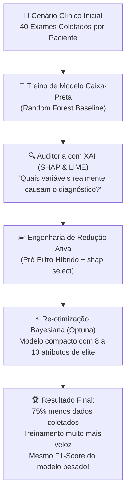

# Camada 00: Visão Geral do Projeto (A Perspectiva de 30 Mil Pés)

**Trilha de Estudo:** XAI Aplicada à Redução de Dados em Machine Learning  
**Base Curricular:** Roteiro de Estudo — Etapa 0  
**Contexto Técnico:** [pipeline_completo.py](file:///c:/Users/eduar/projetos/xai_data_reduction/pipeline_completo.py)

---

> [!NOTE]
> 🎯 **O Fio Condutor de Todo o Projeto:**  
> Se você precisar resumir este projeto inteiro em uma única frase para qualquer pessoa do mundo, a frase é esta:  
> *"Vamos treinar um modelo de Machine Learning com todas as variáveis disponíveis, 'perguntar' para a Inteligência Artificial Explicável (XAI) o que ela realmente usou para decidir, e treinar um modelo novo muito mais leve apenas com o que importa, provando que o desempenho não cai."*

## Campo Didatico: Como Enxergar o Projeto Inteiro

Leia esta camada como o mapa de uma expedicao, nao como uma lista de ferramentas. Em cada etapa, responda quatro perguntas: **qual problema estamos tentando resolver, qual evidencia o codigo produz, qual risco metodologico pode invalidar a evidencia e qual decisao vem depois?**

```text
pergunta clinica -> baseline -> explicacao -> reducao -> re-treino -> comparacao
       |              |            |           |           |            |
       v              v            v           v           v            v
   o que medir?   como esta?   por que?    o que sai?  ficou igual?  vale usar?
```

O estudante deve caminhar sempre em tres movimentos: primeiro explicar a etapa para uma pessoa leiga, depois executar o pequeno experimento, e por fim confrontar o resultado com F1, recall, gap, latencia, custo e proxies de interpretabilidade. O protocolo compara SHAP com filter, wrapper e embedded; o LIME permanece como auditoria local, não como seletor global. O erro mais comum e confundir um grafico bonito com uma conclusao clinica. O grafico e evidencia; a conclusao exige comparacao justa, teste reservado e limitacoes declaradas.

---

## Cultura, Historia e Referencias do Projeto

Este projeto esta dentro de uma historia maior. A inteligencia artificial nasceu como programa de pesquisa no encontro de Dartmouth de 1956, mas a preocupacao atual nao e apenas fazer maquinas acertarem: e conseguir explicar, avaliar e governar suas decisoes. Vale conhecer a [proposta original do Dartmouth Summer Research Project](http://www-formal.stanford.edu/jmc/history/dartmouth/dartmouth.html), o [AI Risk Management Framework do NIST](https://www.nist.gov/itl/ai-risk-management-framework) e os principios da [OMS para etica e governanca de IA em saude](https://www.who.int/publications/i/item/9789240029200).

O artefato visual central e o [dashboard comparativo do projeto](../assets/dashboard_final_comparativo.png). Observe-o como um documento historico da pesquisa: ele registra o momento em que precisao, custo, latencia e quantidade de dados deixam de ser assuntos separados e passam a formar uma decisao de engenharia.

**Pergunta cultural:** quando um modelo melhora a metrica mas fica menos auditavel, isso e progresso? A resposta nao vem do algoritmo isolado; depende do contexto, das pessoas afetadas e do tipo de erro que a sociedade aceita.

Para atualizar a base teorica, consulte o [Interpretable Machine Learning](https://christophm.github.io/interpretable-ml-book/) de Molnar (2022), o [AI Risk Management Framework](https://www.nist.gov/itl/ai-risk-management-framework) do NIST (2023), a documentacao de [Feature Selection](https://scikit-learn.org/stable/modules/feature_selection.html) e as referencias originais de [SHAP](https://papers.nips.cc/paper/7062-a-unified-approach-to-interpreting-model-predictions) e [LIME](https://arxiv.org/abs/1602.04938). A atualidade bibliografica deve acompanhar a precisao metodologica: referencias recentes ajudam a contextualizar, mas nao substituem a validacao do experimento.

## 1. O que Estudar em Profundidade?

### 1.1 O Paradoxo da Coleta Massiva de Dados
No início do aprendizado em Ciência de Dados, é natural acreditar na máxima intuitiva: *"Quanto mais colunas e dados eu der para a IA, mais inteligente ela ficará"*.  
No entanto, no mundo real da computação e da medicina, dados não vêm de graça e atributos em excesso trazem uma série de problemas ocultos:
- **Custo Operacional e Humano:** Em um hospital, cada atributo representa um exame invasivo, coleta de sangue, tomografia ou biópsia que o paciente precisa esperar dias para fazer e o sistema de saúde precisa pagar.
- **Lentidão em Tempo Real (Latência):** Em sistemas de triagem de emergência ou em dispositivos médicos portáteis (*Edge AI*), um modelo que exige 40 parâmetros demora muito mais para responder do que um que exige apenas 8 ou 10.
- **Confusão Algorítmica:** Algoritmos de aprendizado supervisionado são caçadores de correlações estatísticas. Se você entregar 20 colunas de puro ruído aleatório, o modelo encontrará, por mera coincidência matemática, padrões falsos que não existem na vida real.



---

## 2. Por que isso Importa para o Projeto? (O Porquê e a Necessidade)

### 2.1 Por que a Abordagem Tradicional de Seleção é Insuficiente?
As técnicas tradicionais de seleção de atributos (como testes estatísticos univariados ou eliminação recursiva RFE) são heurísticas cegas: elas tentam adivinhar quais variáveis servem sem nos dar uma justificativa causal humana sobre a decisão.

### 2.2 A Necessidade da Explicabilidade Ativa
Aqui reside a grande inovação do seu projeto: **XAI não é usada apenas para "olhar" ou auditar o modelo no final** (como se fosse um laudo decorativo). Nós transformamos a explicabilidade em uma **ferramenta ativa de engenharia de dados**:
1. O modelo é quem nos ensina o que é importante.
2. Usamos SHAP para obter um ranking global e LIME para auditar uma decisão individual.
3. Comparamos filter, wrapper e embedded, removemos atributos segundo o protocolo e avaliamos desempenho, custo e proxies de interpretabilidade sem afirmar causalidade clínica.

---

## 3. Onde Aparece no Código?

No arquivo consolidado [pipeline_completo.py](file:///c:/Users/eduar/projetos/xai_data_reduction/pipeline_completo.py), essa visão de 30 mil pés se materializa na função orquestradora:
- `executar_pipeline_completo()`: A função mestra que encadeia a geração sintética, o baseline, a auditoria SHAP/LIME, a ablação, o pré-filtro, o shap-select, a sintonia bayesiana com Optuna e o Dashboard Comparativo.

---

## 4. Checkpoint de Autonomia do Estudante

Antes de avançar para a Camada 01, responda mentalmente ou em suas anotações:

> [!IMPORTANT]
> 🧠 **Pergunta do Checkpoint:**  
> **Você consegue explicar o objetivo central deste projeto em duas frases simples para uma pessoa totalmente leiga em tecnologia?**  
> *(Dica: Pense na analogia de um médico experiente que descobre que de 40 exames que o hospital pede, apenas 10 são os que realmente salvam vidas, e passa a pedir só os 10 para atender os pacientes na metade do tempo).*
