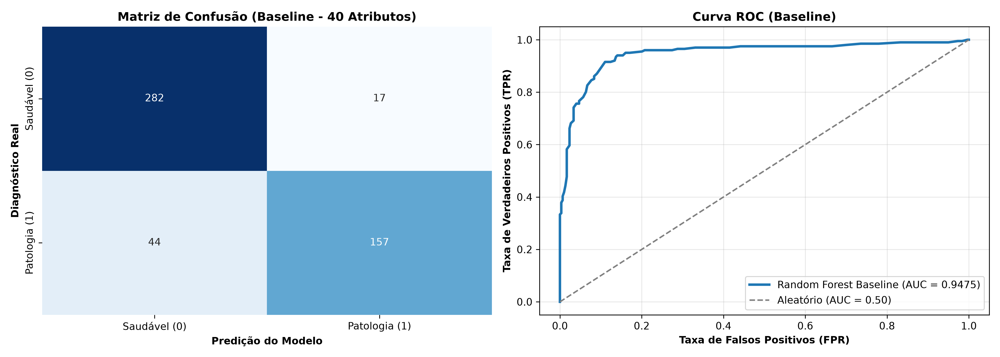

# Camada 02: O Algoritmo Random Forest

**Trilha:** XAI Aplicada à Redução de Dados em Machine Learning  
**Aplicação:** classificação binária de saúde (`0 = Saudável`, `1 = Patologia`)  
**Código de referência:** [pipeline_completo.py](../pipeline_completo.py), classe `RandomForestClassifier`

> **Objetivo da aula:** entender como uma arvore de decisao faz perguntas aos dados, por que uma arvore isolada e instavel e como o comite de arvores do Random Forest, apoiado em bagging e selecao aleatoria de atributos, reduz a variancia e prepara o terreno para a explicabilidade com TreeSHAP.

## Campo Didático: Da Árvore ao Comitê

O experimento percorre seis movimentos: **criar uma árvore, observar sua regra, formar amostras bootstrap, treinar árvores diversas, agregar as previsões e comparar com o baseline**. A pergunta central é: a floresta melhora porque cada árvore é perfeita ou porque seus erros deixam de coincidir?

```text
amostra sorteada -> arvore 1 --\
amostra sorteada -> arvore 2 ----> votacao/medias -> previsao
atributos sorteados -> arvore N -/
```

O gráfico deve revelar diversidade entre árvores e estabilidade no resultado final. A probabilidade da floresta não é certeza clínica: é uma agregação estatística que ainda precisa de calibração e avaliação. A ponte seguinte é a Camada 03, na qual a previsão será julgada por métricas que distinguem tipos de erro.

### Roteiro de domínio

Uma árvore faz cortes, bootstrap muda os pacientes de cada árvore, `max_features` muda as colunas candidatas e a votação combina as saídas. A diversidade reduz a chance de todos os membros cometerem o mesmo erro; 100 árvores não significam 100 certezas independentes.

### Duvidas que esta aula responde

- **Bagging é a mesma coisa que treinar 100 vezes a mesma árvore?** Não. As amostras e os atributos candidatos variam.
- **Mais árvores sempre melhoram?** Normalmente estabilizam até um ponto; aumentam custo e não corrigem dados ruins ou vazamento.
- **Importância Gini é explicação causal?** Não. É uma medida de uso nos cortes; TreeSHAP será estudado para atribuir impacto nas previsões.

### Regra de explicacao Feynman

Uma árvore é uma opinião; a floresta é um conselho cujos membros viram amostras diferentes. O conselho fica mais confiável quando os membros são bons e não cometem exatamente o mesmo erro.

### Uma previsao acompanhada de perto

Suponha que quatro arvores avaliem o mesmo paciente e votem `[1, 1, 0, 1]`. A floresta produz `1` por maioria, mas essa resposta nao significa que quatro medicos concordaram sobre uma verdade clinica. Significa que, sob quatro amostras e subconjuntos de atributos diferentes, tres regras chegaram a classe positiva. Se as probabilidades forem `0.62`, `0.71`, `0.48` e `0.83`, a media e `0.66`; o limiar de decisao transforma essa media em classe.

```text
bootstrap A -> arvore 1 -> 1 (0.62) --\
bootstrap B -> arvore 2 -> 1 (0.71) ----> media = 0.66 -> classe 1
bootstrap C -> arvore 3 -> 0 (0.48) ----/
bootstrap D -> arvore 4 -> 1 (0.83) --/
```

### O que o laboratório revela

Ao comparar árvore e floresta, leia quatro coisas: acurácia de treino, acurácia de teste, gap e desenho da fronteira. Uma árvore pode atingir treino perfeito e criar bolsões minúsculos; a floresta pode continuar complexa, mas reduzir a instabilidade porque seus erros não são idênticos. `n_estimators` controla a quantidade de árvores; `max_depth` controla a complexidade de cada uma.

### Um exemplo numerico de votacao

Para um paciente novo, quatro arvores podem produzir as probabilidades `0,62`, `0,71`, `0,48` e `0,83` para patologia. A floresta calcula:

$$
\frac{0,62 + 0,71 + 0,48 + 0,83}{4} = 0,66
$$

Com limiar de `0,50`, a classe final e `1`. Se o limiar subir para `0,70`, a mesma media sera classificada como `0`. A floresta agrega evidencias; o limiar transforma a media em decisao. Em um hospital, mudar o limiar altera `FP` e `FN`, portanto nao e um detalhe cosmetico.

### Duvidas frequentes

- **Por que a floresta nao e apenas uma arvore grande?** Porque cada arvore recebe variacoes de dados e atributos e suas previsoes sao agregadas.
- **O voto majoritario explica a decisao?** Explica o mecanismo de agregacao, nao quais atributos causaram o voto; essa e a funcao da XAI.
- **Mais arvores sempre melhoram?** Depois de certo ponto, o ganho tende a estabilizar enquanto custo e latencia continuam aumentando.
- **Bootstrap usa o teste?** Nao. O sorteio ocorre dentro do treino; o teste permanece cego.

### Leitura da ponte para a proxima aula

A floresta entrega uma previsao e uma probabilidade agregada. A Camada 03 ensina por que essa previsao precisa ser examinada por `TP`, `TN`, `FP`, `FN`, F1, recall e ROC-AUC, e nao apenas por uma porcentagem de acertos.

## Cultura, História e Referências

O Random Forest foi formalizado por Leo Breiman no artigo [Random Forests (2001)](https://doi.org/10.1023/A:1010933404324). A ideia culturalmente importante e que uma boa solucao nem sempre e um especialista perfeito: um conjunto diverso de modelos imperfeitos pode generalizar melhor. A [documentacao oficial de florestas do scikit-learn](https://scikit-learn.org/stable/modules/ensemble.html#random-forests) tambem alerta que importancia por impureza pode enganar e recomenda comparar com importancia por permutacao.

Observe essa diferenca no artefato [modulo1_baseline_metrics.png](../assets/modulo1_baseline_metrics.png) e no ranking SHAP da camada seguinte. A floresta nao e uma “votacao democratica” no sentido humano: ela agrega previsoes matematicamente e ainda pode reproduzir vieses dos dados.

**Pergunta cultural:** por que Breiman chamou atencao para diversidade de erros? Porque consenso sem diversidade e apenas duplicacao de opiniao. Essa ideia atravessa ensembles, revisao por pares e sistemas de recomendacao.

## Recursos de Mídia (Visual e Áudio)

- **Visual local:** a comparação entre árvore e floresta no laboratório, acompanhada do artefato [baseline do projeto](../assets/modulo1_baseline_metrics.png).
- **Referência visual:** [Random forests no scikit-learn](https://scikit-learn.org/stable/modules/ensemble.html#random-forests).
- **Áudio sugerido:** a história do comitê e o exemplo `[1, 1, 0, 1]`, seguido da média `0,66`.
- **Imagem mental:** várias árvores diferentes compartilhando uma urna de previsões.



## 📊 Elementos de Comunidade e Status

- **Status:** `Floresta entendida` quando bootstrap, `max_features`, profundidade e votação puderem ser diferenciados.
- **Debate:** “Uma floresta com muitas árvores é sempre melhor que uma árvore bem regulada?”
- **Questão de comunidade:** como reconhecer consenso que nasce de diversidade e consenso que nasce de cópias?

## 💡 Engajamento e Conhecimento

- **Experimento:** alterar apenas `n_estimators` ou `max_features` e comparar fronteira, F1 e tempo.
- **Produto da aula:** desenhar uma árvore e explicar por que 100 cópias idênticas não formam uma floresta diversa.
- **Conexão profissional:** registrar por que a floresta foi escolhida como baseline antes do SHAP.

## Mapa da aula

1. [Subcamada 2.1: O conceito na vida real](#subcamada-21-o-conceito-na-vida-real)
2. [Subcamada 2.2: Desenhando o conceito](#subcamada-22-desenhando-o-conceito)
3. [Subcamada 2.3: Desmistificando a teoria e a notacao formal](#subcamada-23-desmistificando-a-teoria-e-a-notacao-formal)
4. [Subcamada 2.4: Laboratorio ludico no Colab](#subcamada-24-laboratorio-ludico-no-colab)
5. [Subcamada 2.5: O momento serio da nossa aplicacao](#subcamada-25-o-momento-serio-da-nossa-aplicacao)
6. [Subcamada 2.6: Checkpoint de autonomia e fixacao ativa](#subcamada-26-checkpoint-de-autonomia-e-fixacao-ativa)

---

## Subcamada 2.1: O Conceito na Vida Real

### A historia da junta medica de 100 especialistas

Imagine que voce precisa tomar uma decisao medica delicada. Voce tem duas opcoes:

1. Consultar um unico medico, muito brilhante, mas que atendeu um caso raro ontem e pode estar cansado ou excessivamente apegado a um sintoma especifico.
2. Reunir uma junta medica com 100 medicos independentes, onde cada especialista examina uma copia do prontuario e foca em grupos diferentes de exames, decidindo o diagnostico por votacao majoritaria.

Uma arvore de decisao e o primeiro medico: ela divide o espaco com regras claras de sim ou nao, mas pode criar regras obsessivas para acertar cada detalhe da amostra de treino.

O Random Forest e a junta medica: ele cria dezenas ou centenas de arvores ligeiramente diferentes e consolida os votos. Se cada arvore for minimamente melhor que o acaso e errar em pontos distintos, a probabilidade de a maioria errar junta cai expressivamente.

**A grande sacada:** a forca do Random Forest nao vem de arvores perfeitas, mas da combinacao democratica entre arvores diversas.

### Arvore unica e floresta: diferencas fundamentais

| Caracteristica | Arvore de decisao isolada | Random Forest (100 arvores) |
|---|---|---|
| Decisao | regra hierarquica unica | media ou votacao majoritaria |
| Sensibilidade a mudancas | alta: mudar poucos dados altera a arvore | baixa: o consenso amortece variacoes |
| Risco de overfitting | alto em arvores profundas | controlado pelo ensacamento (bagging) |
| Interpretabilidade visual | direta no fluxograma | exige tecnicas de explicabilidade (XAI) |

---

## Subcamada 2.2: Desenhando o Conceito

### Uma arvore como jogo de 20 perguntas

```text
                  [ Glicose > 126 mg/dL? ]
                         /        \
                   SIM  /          \  NAO
                       /            \
          [ Idade > 45 anos? ]    [ Pressao > 140 mmHg? ]
               /        \               /        \
         SIM  /          \ NAO    SIM  /          \ NAO
             v            v           v            v
        patologia     saudavel   patologia     saudavel
```

### O comite democratico da floresta

```text
               Paciente novo entra no hospital
                              |
       +--------------+-------+-------+--------------+
       |              |               |              |
       v              v               v              v
    Arvore 1       Arvore 2       Arvore 3       Arvore 100
    vota: 1        vota: 1        vota: 0        vota: 1
       |              |               |              |
       +--------------+-------+-------+--------------+
                              |
                              v
                     [ Urna de votos ]
                     82 votos: patologia (1)
                     18 votos: saudavel  (0)
                              |
                              v
                Veredito final: 1 (probabilidade 82%)
```

### As duas chaves da aleatoriedade

Para que a junta funcione, os especialistas nao podem ser clones:

```text
1. Bootstrap (amostras com reposicao)
   Cada arvore estuda em um sorteio com reposicao de pacientes (~63% unicos).

2. Amostragem de atributos (max_features)
   Em cada corte, a arvore avalia apenas um subconjunto sorteado de colunas (sqrt(M)).
   Isso impede que uma variavel dominante mas ruidosa comande todas as arvores.
```

| Mecanismo | O que faz | Efeito no modelo |
|---|---|---|
| Bootstrap | sorteia pacientes com reposicao | cria diferencas na base de treino de cada arvore |
| `max_features` | sorteia colunas a cada no | obriga as arvores a explorarem outros biomarcadores |
| Votacao | agrega as probabilidades | reduz a variancia sem aumentar o viés |

---

## Subcamada 2.3: Desmistificando a Teoria e a Notacao Formal

### Impureza de Gini: como a arvore escolhe a pergunta

Em cada no, o algoritmo busca o corte que deixa os nos-filhos o mais homogeneos possivel. A impureza de Gini mede essa mistura:

$$
Gini = 1 - \sum_{k=1}^{C} p_k^2
$$

Traducao simbolo por simbolo:

| Simbolo | Leitura simples |
|---|---|
| `C` | quantidade de classes (no projeto, `C = 2`: saudavel e patologia) |
| `p_k` | proporcao de pacientes da classe `k` naquele no |
| `p_k^2` | peso que penaliza misturas equilibradas |
| `Gini = 0` | pureza total: todos os pacientes do no pertencem a mesma classe |
| `Gini = 0.5` | mistura maxima em classificacao binaria (50% saudaveis e 50% doentes) |

### Agregacao de votos no Random Forest

Dada uma colecao de $T$ arvores $\{h_1, h_2, \dots, h_T\}$, a probabilidade prevista da classe positiva e a media das probabilidades individuais:

$$
P(y=1 \mid x) = \frac{1}{T} \sum_{t=1}^{T} P_t(y=1 \mid x)
$$

### A ordem correta evita vazamento

O ajuste das arvores e o sorteio de bootstrap ocorrem estritamente dentro de `X_train`. O conjunto de teste `X_test` apenas percorre as regras ja congeladas da floresta para mensuracao cega.

---

## Subcamada 2.4: Laboratorio Ludico no Colab

### Toy example: arvore solitaria contra a floresta

O codigo compara uma arvore sem limites de profundidade com um Random Forest de 100 arvores em um problema bidimensional ruidoso.

```python
# Bibliotecas: numeros, grafico, dados de treino/teste e modelos de arvores.
import numpy as np
import matplotlib.pyplot as plt
from sklearn.datasets import make_moons
from sklearn.model_selection import train_test_split
from sklearn.tree import DecisionTreeClassifier
from sklearn.ensemble import RandomForestClassifier
from sklearn.metrics import accuracy_score

# n_samples=150: cria 150 pacientes ficticios.
# noise=0.35: espalha os pontos; quanto maior, mais dificil separar as classes.
# random_state=42: fixa o sorteio para o resultado ser reproduzivel.
X, y = make_moons(n_samples=150, noise=0.35, random_state=42)
# test_size=0.30: reserva 30% para a prova que o modelo ainda nao viu.
# stratify=y: preserva a proporcao entre classes no treino e no teste.
X_train, X_test, y_train, y_test = train_test_split(
# O treino aprende as regras; o teste apenas mede se elas generalizam.
    X, y, test_size=0.30, stratify=y, random_state=42)

modelos = {
    # Uma arvore: modelo individual, sensivel aos detalhes da amostra.
    "Arvore unica": DecisionTreeClassifier(random_state=42),
    # 100 arvores: varias visoes que terao suas probabilidades agregadas.
    "Random Forest (100 arvores)": RandomForestClassifier(n_estimators=100, random_state=42)
}

# Dois paineis tornam a comparacao visual direta.
fig, axes = plt.subplots(1, 2, figsize=(12, 4))
for ax, (nome, modelo) in zip(axes, modelos.items()):
    # fit aprende as regras usando somente os dados de treino.
    modelo.fit(X_train, y_train)
    # A malha transforma a regra matematica em uma fronteira desenhada.
    xx, yy = np.meshgrid(np.linspace(-1.5, 2.5, 250), np.linspace(-1, 1.5, 250))
    z = modelo.predict(np.c_[xx.ravel(), yy.ravel()]).reshape(xx.shape)
    ax.contourf(xx, yy, z, alpha=0.25, cmap="coolwarm")
    ax.scatter(X_train[:, 0], X_train[:, 1], c=y_train, cmap="coolwarm", edgecolor="k", label="treino")
    ax.scatter(X_test[:, 0], X_test[:, 1], c=y_test, cmap="coolwarm", marker="*", s=70, label="teste")
    # Comparamos treino e teste para enxergar generalizacao e overfitting.
    acc_tr = accuracy_score(y_train, modelo.predict(X_train))
    acc_te = accuracy_score(y_test, modelo.predict(X_test))
    ax.set_title(f"{nome}\nTreino: {acc_tr:.2f} | Teste: {acc_te:.2f}")
    ax.legend()
plt.tight_layout(); plt.show()
```

> **O que voce deve notar no grafico gerado:** a arvore unica cria bordas retangulares e pequenos bolsões isolados para capturar pontos de treino difíceis. A floresta produz uma superficie mais suave e curva, que costuma sustentar acuracia de teste mais estavel.

**Mini-experimento:** altere `n_estimators=100` para `5` e `300`. Observe como poucas arvores ainda deixam a fronteira irregular e como muitas arvores estabilizam o desenho.

---

## Subcamada 2.5: O Momento Serio da Nossa Aplicacao

> **Chega de brinquedo!** Agora que o conceito esta cristalino, vamos para a trincheira real da nossa aplicacao com os dados do projeto.

Vamos confrontar uma arvore unica e o Random Forest sobre a matriz sintetica oficial: 2.000 pacientes, 40 atributos, 10 informativos, 10 redundantes e 20 ruidos metabolicos.

```python
import time
import numpy as np
import pandas as pd
from sklearn.datasets import make_classification
from sklearn.model_selection import train_test_split
from sklearn.tree import DecisionTreeClassifier
from sklearn.ensemble import RandomForestClassifier
from sklearn.metrics import (accuracy_score, confusion_matrix, f1_score,
                             precision_score, recall_score, roc_auc_score)

# Semente fixa: reproduz os mesmos pacientes e a mesma comparacao.
SEED = 42
X_raw, y = make_classification(n_samples=2000, n_features=40, n_informative=10,
    n_redundant=10, weights=[0.6, 0.4], flip_y=0.03, random_state=SEED)
nomes = ([f"biomarcador_{i+1}" for i in range(10)] +
         [f"exame_redundante_{i+1}" for i in range(10)] +
         [f"ruido_metabolico_{i+1}" for i in range(20)])
X = pd.DataFrame(X_raw, columns=nomes)
X_train, X_test, y_train, y_test = train_test_split(
    X, y, test_size=0.25, stratify=y, random_state=SEED)

def avaliar(modelo, X_tr, X_te, y_tr, y_te):
    t0 = time.perf_counter(); modelo.fit(X_tr, y_tr)
    t_treino_ms = (time.perf_counter() - t0) * 1000
    t0 = time.perf_counter(); pred = modelo.predict(X_te)
    proba = modelo.predict_proba(X_te)[:, 1]
    t_inf_us = (time.perf_counter() - t0) * 1_000_000 / len(X_te)
    acc_tr = accuracy_score(y_tr, modelo.predict(X_tr))
    acc_te = accuracy_score(y_te, pred)
    tn, fp, fn, tp = confusion_matrix(y_te, pred).ravel()
    return {
        "acc_treino": acc_tr, "acc_teste": acc_te,
        "gap": acc_tr - acc_te, "f1": f1_score(y_te, pred),
        "recall": recall_score(y_te, pred), "roc_auc": roc_auc_score(y_te, proba),
        "tempo_treino_ms": t_treino_ms, "latencia_us_paciente": t_inf_us,
        "TN": tn, "FP": fp, "FN": fn, "TP": tp
    }

res_dt = avaliar(DecisionTreeClassifier(random_state=SEED), X_train, X_test, y_train, y_test)
# 100 arvores formam o baseline; n_jobs=1 mantem a medicao de tempo previsivel.
res_rf = avaliar(RandomForestClassifier(n_estimators=100, random_state=SEED, n_jobs=1), X_train, X_test, y_train, y_test)

comparativo = pd.DataFrame([res_dt, res_rf], index=["Arvore Unica", "Random Forest 100"]).round(4)
print(comparativo)
for nome, res in [("Arvore Unica", res_dt), ("Random Forest", res_rf)]:
    print(f"KPI {nome}: acc_treino={res['acc_treino']:.4f}; acc_teste={res['acc_teste']:.4f}; "
          f"gap={res['gap']:.4f}; f1={res['f1']:.4f}; recall={res['recall']:.4f}; "
          f"FN={res['FN']}; tempo_treino_ms={res['tempo_treino_ms']:.2f}")
```

### Tabela oficial de KPIs

Os valores abaixo sao produzidos pelo codigo, nao devem ser decorados como constantes. Tempo, latencia e ate pequenas variacoes de desempenho dependem do ambiente e da versao das bibliotecas.

| KPI | Interpretacao | O que investigar |
|---|---|---|
| Acuracia treino | desempenho nos dados vistos | o modelo memorizou as particularidades? |
| Acuracia teste | desempenho em dados reservados | a regra resiste a novos pacientes? |
| Gap de overfitting | `treino - teste` | a arvore unica abriu distancia excessiva? |
| F1-score | media harmonica de precision e recall | o comite estabilizou a classe positiva? |
| Recall | proporcao de doentes identificados | quantas patologias deixaram de ser vistas? |
| ROC-AUC | ordenacao de risco em varios limiares | a probabilidade media e confiavel? |
| Tempo de treino | duracao do `.fit` em ms | o custo de 100 arvores cabe na infraestrutura? |
| FN | falsos negativos | qual o impacto clinico dos pacientes liberados? |

### Interpretacao clinica e de negocio

- A arvore unica costuma apresentar gap de overfitting maior porque uma unica estrutura tenta acomodar o ruido dos 40 exames.
- O Random Forest mitiga parte desse efeito ao diluir os votos, elevando o recall e reduzindo os falsos negativos (`FN`).
- Esse ganho vem com custo: treinar 100 arvores consome mais tempo de CPU e memoria. Por isso, enxugar colunas inuteis nas proximas camadas beneficiara diretamente a escalabilidade do modelo.
- O Random Forest sera a nossa ancora metodologica: servira de baseline e permitira o calculo acelerado de explicabilidade com TreeSHAP.

---

## Subcamada 2.6: Checkpoint de Autonomia e Fixacao Ativa

Explique sem consultar o texto e depois confira sua resposta:

1. Por que uma junta de 100 especialistas tende a errar menos do que um unico medico?
2. O que e a impureza de Gini e qual o seu valor em um no perfeitamente puro?
3. O que e amostragem de atributos (`max_features`) e como ela forca a diversidade entre as arvores?
4. Por que o Random Forest tem custo computacional de treino superior ao de uma arvore isolada?
5. Qual a relacao entre bagging (bootstrap) e a reducao da variancia do modelo?
6. Por que uma arvore de decisao profunda com 100% de acuracia no treino frequentemente falha no teste?

### Mini-desafio pratico

Execute o experimento variando o numero de arvores no Random Forest e preencha a tabela:

```text
n_estimators       tempo_treino_ms     acuracia_teste     gap_overfitting     F1
1                  ...                 ...                ...                 ...
10                 ...                 ...                ...                 ...
50                 ...                 ...                ...                 ...
100                ...                 ...                ...                 ...
200                ...                 ...                ...                 ...
```

Depois responda: **a partir de quantas arvores o ganho de F1 atinge um platô que nao justifica mais o aumento do tempo de processamento?**
