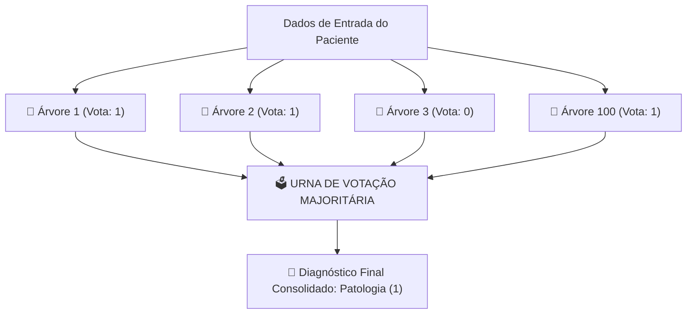

# Camada 02: O Algoritmo Escolhido — Anatomia e Funcionamento do Random Forest

**Trilha de Estudo:** XAI Aplicada à Redução de Dados em Machine Learning  
**Base Curricular:** Roteiro de Estudo — Etapa 2  
**Contexto Técnico:** [pipeline_completo.py](file:///c:/Users/eduar/projetos/xai_data_reduction/pipeline_completo.py) (`RandomForestClassifier`)

---

> [!NOTE]
> 🎯 **Foco Central desta Camada:**  
> Desmistificar a mecânica interna do algoritmo **Random Forest** (Florestas Aleatórias). Entender como uma simples Árvore de Decisão baseada em regras "SE/ENTÃO" evolui para um poderoso comitê de árvores (*Ensemble*), por que a técnica de *Bagging* reduz a variância do modelo e por que esse algoritmo é o alicerce de todo o nosso projeto experimental.

---

## 1. O que Estudar em Profundidade?

### 1.1 O Ponto de Partida: O que é uma Árvore de Decisão?
Uma Árvore de Decisão (*Decision Tree*) é o algoritmo de aprendizado de máquina mais intuitivo para a mente humana. Ele funciona criando uma sequência de perguntas binárias estruturadas hierarquicamente:

```
[Biomarcador 1 > 3.4?]
    ├── SIM: [Biomarcador 3 <= 1.2?]
    │           ├── SIM: Diagnóstico -> Patologia (1)
    │           └── NÃO: Diagnóstico -> Saudável (0)
    └── NÃO: Diagnóstico -> Saudável (0)
```

- **Critério de Divisão (Impureza de Gini ou Entropia):** Em cada nó da árvore, o algoritmo testa todos os atributos disponíveis e escolhe o ponto de corte exato que melhor separa os pacientes doentes dos saudáveis, maximizando a "pureza" dos nós filhos.
- **O Calcanhar de Aquiles de uma Única Árvore:** Uma única árvore de decisão profunda tem **alta variância**: se você alterar apenas 5 pacientes na base de treino, a árvore inteira pode mudar de estrutura, tornando-se muito instável e propensa ao overfitting.

---

### 1.2 A Solução Coletiva: O que é o Random Forest?
O **Random Forest** (criado por Leo Breiman em 2001) resolve a instabilidade das árvores individuais aplicando o princípio da **Sabedoria das Multidões** (*Wisdom of the Crowds*).

Em vez de treinar uma única árvore especialista, nós treinamos um **comitê de dezenas ou centenas de árvores independentes** (no nosso projeto usamos 100 árvores) e a decisão final é tomada por **Votação Majoritária**:
- Se 78 árvores votarem "Patologia (1)" e 22 árvores votarem "Saudável (0)", a predição final do paciente é **Patologia (1)** com probabilidade estimada de **78%**.



---

### 1.3 As Duas Fontes de Aleatoriedade do Random Forest
O que impede que as 100 árvores sejam cópias idênticas umas das outras? O Random Forest introduz **duas camadas cruciais de aleatoriedade**:

1. **Bagging (Bootstrap Aggregating):** Cada árvore é treinada em um subconjunto diferente de pacientes, sorteado com reposição a partir da base original (cerca de 63% dos dados originais por árvore).
2. **Amostragem Aleatória de Atributos (`max_features`):** Em cada nó de cada árvore, o algoritmo **não tem permissão** de olhar para todas as 40 variáveis! Ele sorteia aleatoriamente um subconjunto menor (por padrão, $\sqrt{M} = \sqrt{40} \approx 6$ atributos).  
   *Por que isso é genial?* Porque se houvesse um atributo hiperdominante, todas as 100 árvores começariam dividindo por ele e ficariam correlacionadas. Forçar o sorteio de variáveis obriga as árvores a explorarem biomarcadores alternativos, tornando a floresta diversificada e imune a falhas individuais!

---

## 2. Por que o Random Forest Importa para o Nosso Projeto?

1. **Tolerância Inicial ao Ruído:** O Random Forest tolera variáveis inúteis muito melhor do que modelos lineares simples, o que o torna a escolha perfeita para ser nosso modelo de referência (**Baseline**) quando temos 20 ruídos metabólicos.
2. **A Base Matemática do TreeSHAP:** Como veremos na Camada 06, o algoritmo **TreeSHAP** foi construído especificamente para explorar a estrutura de nós e folhas de ensembles de árvores, calculando os Valores Shapley em tempo polinomial ultrarrápido ($O(T \cdot L \cdot D^2)$) em vez de exponencial!

> [!TIP]
> ⚔️ **Analogia Leiga — O Conselho de 100 Médicos Especialistas:**
> Em vez de consultar apenas um único médico genial (mas que pode ter um dia ruim ou preconceitos pessoais), você consulta uma junta médica com **100 médicos independentes**. Cada um deles analisou prontuários ligeiramente diferentes e focou em sintomas diferentes. A decisão final é o consenso democrático da junta. A chance de 100 médicos errarem juntos é infinitamente menor do que a chance de 1 errar sozinho!

---

## 3. Onde Aparece no Código do Projeto?

No arquivo [pipeline_completo.py](file:///c:/Users/eduar/projetos/xai_data_reduction/pipeline_completo.py), o Random Forest é importado de `sklearn.ensemble.RandomForestClassifier` e utilizado em três momentos vitais:
1. **No Modelo Baseline:** `modelo_base = RandomForestClassifier(n_estimators=100, random_state=42, n_jobs=1)` na linha 300.
2. **Dentro do RFE e SHAP:** Servindo como o estimador que gera as importâncias de divisão.
3. **No Modelo Campeão Otimizado:** Recebendo os melhores parâmetros afinados pelo Optuna na linha 321.

---

## 4. Checkpoint de Autonomia do Estudante

Responda antes de avançar para a Camada 03:

> [!IMPORTANT]
> 🧠 **Pergunta do Checkpoint:**  
> **Você consegue explicar o que é um Random Forest para um familiar ou amigo leigo, sem usar palavras difíceis como "ensemble", "entropia" ou "hiperplano"?**  
> *(Dica: Use a analogia do comitê de médicos ou da votação em júri popular).*
