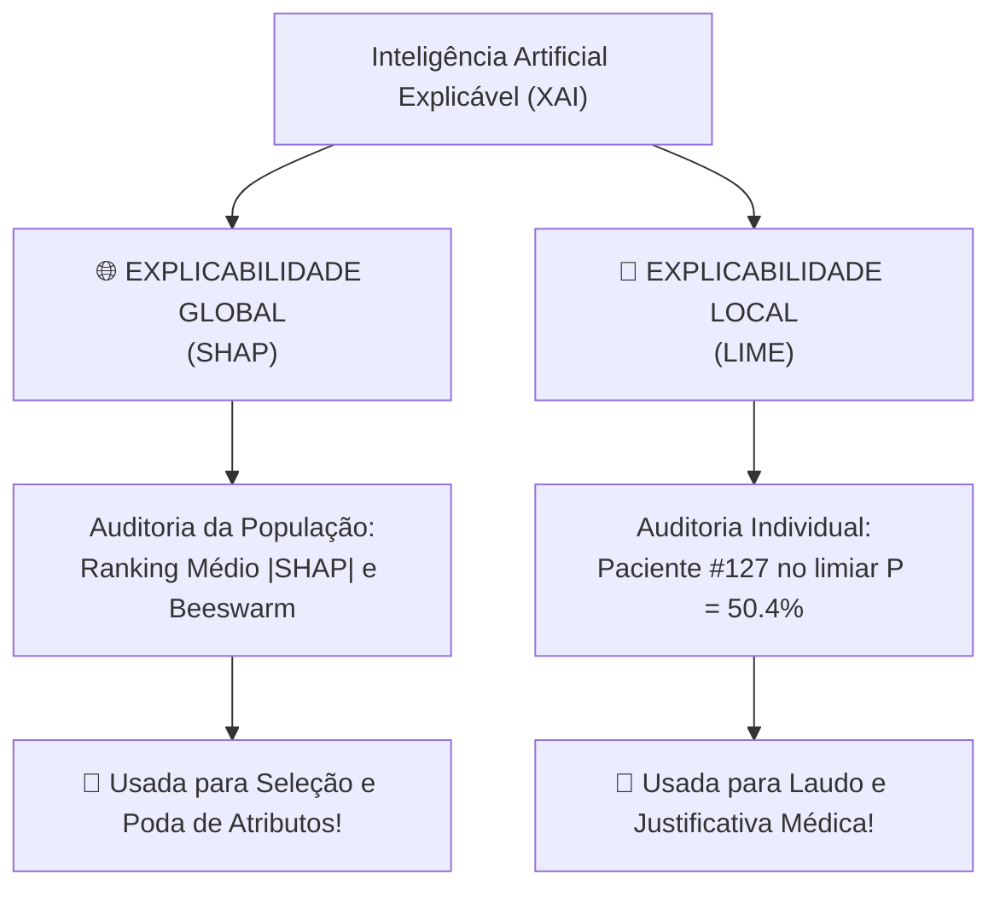

# Camada 05: Fundamentos de XAI — Da Caixa-Preta à Explicabilidade Global e Local

**Trilha de Estudo:** XAI Aplicada à Redução de Dados em Machine Learning  
**Base Curricular:** Roteiro de Estudo — Etapa 5  
**Contexto Técnico:** [pipeline_completo.py](file:///c:/Users/eduar/projetos/xai_data_reduction/pipeline_completo.py) (`executar_etapa_shap` e `executar_etapa_lime`)

---

> [!NOTE]
> 🎯 **Foco Central desta Camada:**  
> Compreender a emergência da **Inteligência Artificial Explicável (XAI — Explainable Artificial Intelligence)**. Superar a falsa dicotomia entre precisão e interpretabilidade, entender por que áreas críticas (medicina e finanças) exigem auditoria causal, e distinguir categoricamente os dois níveis de explicabilidade: a **Visão Global** (a mente da IA sobre a população) e a **Visão Local** (o veredito sobre um indivíduo específico).

---

## 1. O que Estudar em Profundidade?

### 1.1 O Dilema da Caixa-Preta (*Black-Box Problem*)
Por décadas, a Ciência da Computação conviveu com um dilema aparente:
- **Modelos Transparentes (White-Box):** Regressão Linear ou Árvores Rasas. Todo mundo entende como funcionam, mas eles têm baixo poder preditivo em problemas biológicos complexos e não-lineares.
- **Modelos Caixa-Preta (Black-Box):** Redes Neurais Profundas (*Deep Learning*) e Ensembles de Florestas (*Random Forest*, *XGBoost*). Possuem alto poder de acerto, mas são internamente incompreensíveis para seres humanos: realizam milhões de multiplicações matriciais ou milhares de divisões em árvores paralelas.

```
       [ENTRADA: 40 Exames]
                 │
                 ▼
     ┌───────────────────────┐
     │   ??? CAIXA PRETA ??? │  -> Como o médico confia?
     │ (100 Árvores em Voto) │  -> Como defender juridicamente?
     └───────────────────────┘
                 │
                 ▼
       [SAÍDA: 88% Patologia]
```

### 1.2 "O Modelo Acerta" vs. "Eu Entendo Por que Ele Acertou"
Na medicina, não basta um modelo acertar 90% dos casos. Imagine que um algoritmo preveja se um paciente com pneumonia morrerá nos próximos dias. Um estudo real nos EUA treinou uma rede neural que atingiu acurácia altíssima, mas quando os médicos foram investigar as regras internas, descobriram um absurdo:
> O modelo estava prevendo que **pacientes com histórico de asma tinham MENOR risco de morrer de pneumonia**!  
> *Por quê?* Porque no hospital real, pacientes asmáticos com pneumonia eram levados imediatamente para a UTI em estado de alerta máximo e recebiam atendimento prioritário agressivo. O modelo aprendeu a correlação estatística, mas inverteu a causa médica! Se esse algoritmo fosse usado para triagem na recepção, os asmáticos seriam mandados para casa e morreriam!

A XAI existe para impedir que erros fatais como esse passem despercebidos.

---

### 1.3 As Duas Dimensões da Explicabilidade: Global vs. Local

| Dimensão | Pergunta que Responde | Escopo | Ferramenta Usada no Projeto |
| :--- | :--- | :--- | :--- |
| **Explicabilidade Global** | *"No geral, ao longo de toda a população de pacientes, quais variáveis o modelo mais valoriza para tomar decisões?"* | Toda a base de dados (visão panorâmica/estatística). | **SHAP** (`shap.TreeExplainer`) |
| **Explicabilidade Local** | *"Por que o modelo classificou ESTE paciente específico (Sr. João, 58 anos) como doente, e não saudável?"* | Uma única linha/instância de teste (visão cirúrgica forense). | **LIME** (`LimeTabularExplainer`) |



---

## 2. Por que isso Importa para o Projeto?

Aqui está a mudança de paradigma do seu projeto:
- Tradicionalmente, pesquisadores usam XAI apenas como uma etapa decorativa no final do artigo (para colocar um gráfico bonito).
- **No nosso projeto, nós usamos XAI como FERRAMENTA ATIVA DE ENGENHARIA DE DADOS:** usamos a explicabilidade global do SHAP para identificar quais das 40 colunas realmente governam o aprendizado do Random Forest e guiar a poda de dados!

---

## 3. Onde Aparece no Código do Projeto?

No arquivo [pipeline_completo.py](file:///c:/Users/eduar/projetos/xai_data_reduction/pipeline_completo.py):
- Linhas 124 a 170: A função `executar_etapa_shap()` implementa a **Explicabilidade Global**.
- Linhas 176 a 217: A função `executar_etapa_lime()` implementa a **Explicabilidade Local**.

---

## 4. Checkpoint de Autonomia do Estudante

Responda antes de seguir para a Camada 06:

> [!IMPORTANT]
> 🧠 **Pergunta do Checkpoint:**  
> **Você sabe dizer, em exatamente uma frase clara, a diferença fundamental entre uma explicação global e uma explicação local em Machine Learning?**  
> *(Dica: Pense na diferença entre o diretor de um hospital analisando as estatísticas da epidemia na cidade inteira vs. um médico na sala de consulta examinando o raio-X de um único paciente).*
