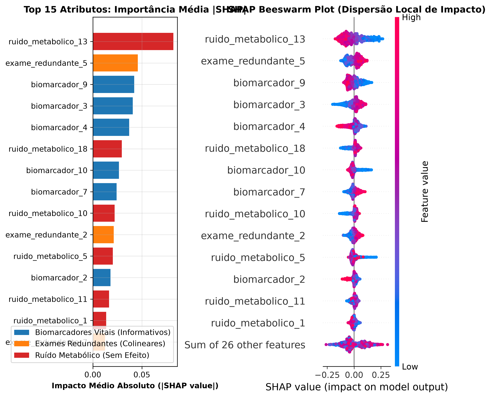

# Camada 05: Fundamentos de XAI (Global e Local)

**Trilha:** XAI Aplicada à Redução de Dados em Machine Learning
**Aplicação:** classificação binária de saúde (`0 = Saudável`, `1 = Patologia`)
**Código de referência:** [pipeline_completo.py](../pipeline_completo.py), funções `executar_etapa_shap` e `executar_etapa_lime`

> **Objetivo da aula:** compreender por que a precisao isolada de uma caixa-preta e insuficiente em areas criticas, conhecer o caso historico em que uma IA aprendeu regras perigosas e diferenciar a explicabilidade global (o mapa da populacao com SHAP) da explicabilidade local (a auditoria individual com LIME).

## Campo Didático: Explicar Não é Decorar um Gráfico

Use o roteiro **prever, perguntar, explicar, confrontar**. Primeiro registre a previsao do modelo; depois pergunte quais atributos parecem importantes; em seguida compare uma explicacao global com uma explicacao de um paciente; por fim confronte a explicacao com metricas e conhecimento do dominio.

```text
modelo caixa-preta -> previsao -> explicacao global/local -> pergunta de auditoria
       |                |                  |                       |
       v                v                  v                       v
   como aprende?     qual classe?       quem importa?        faz sentido clinico?
```

Importância de atributo não é causalidade. “SHAP provou que a variável causa a doença” é uma conclusão indevida; explicabilidade descreve o comportamento do modelo. A ponte para a Camada 06 é a justificativa matemática do crédito distribuído pelo SHAP.

### Roteiro de dominio

Para cada explicacao, registre quatro itens: **previsao, referencia, atributos influentes e direcao do impacto**. Depois pergunte se a explicacao e global ou local, se ela e fiel ao modelo e se e plausivel no dominio. Essa ficha impede que “importante” vire automaticamente “causal”.

### Duvidas que esta aula responde

- **Explicar significa abrir o codigo interno?** Nao. Uma explicacao pode aproximar ou decompor o comportamento observado.
- **Global e local competem?** Nao. O global mostra padroes da populacao; o local investiga um caso.
- **Uma explicacao correta torna o modelo correto?** Nao. Um modelo pode ser fielmente explicado e ainda estar errado.

### Regra de explicacao Feynman

Diga que explicar e colocar legenda em uma decisao: a legenda ajuda a auditar, mas nao transforma uma decisao errada em correta nem prova que uma pista causou o evento.

### Um mesmo modelo, duas perguntas diferentes

Imagine uma floresta que classifica um paciente como patologia. A explicacao **global** pergunta: “em toda a populacao, quais atributos aparecem com maior impacto medio?”. A explicacao **local** pergunta: “neste paciente, por que a previsao atravessou o limiar?”. As duas respostas podem divergir sem que exista contradicao: importancia media e justificativa individual sao objetos diferentes.

```text
1000 pacientes -> explicacao global -> padroes recorrentes da populacao
1 paciente     -> explicacao local  -> razoes desta decisao especifica
```

### O laboratorio como auditoria, nao como decoracao

Primeiro registre a previsao e a classe real. Depois leia o ranking global; em seguida selecione uma instancia e examine a explicacao local. Procure concordancias e divergencias. Se uma variavel de ruido aparece no topo, isso e uma pergunta para investigar: pode ser coincidencia, vazamento, correlacao ou artefato do modelo.

### Um caso global e um caso local

Suponha que, em 1.000 pacientes, a media de `|SHAP|` seja `glicemia = 0,42`, `idade = 0,25` e `ruido = 0,04`. Globalmente, glicemia lidera. Agora observe um paciente especifico: `idade` contribuiu `+0,31`, glicemia `-0,08` e ruido `+0,02`. Nao ha contradicao. O ranking global resume a populacao; o laudo local explica uma decisao.

```text
populacao inteira: glicemia > idade > ruido
paciente 047:      idade empurra risco; glicemia reduz risco; ruido quase neutro
```

O exemplo mostra por que uma variavel importante na media pode nao ser a razao principal de cada previsao. Sempre identifique o escopo antes de interpretar o grafico.

### Duvidas frequentes

- **Explicabilidade revela causalidade?** Nao. Ela descreve o comportamento aprendido pelo modelo.
- **Global e local devem dar o mesmo ranking?** Nao. Uma variavel pode ser importante para poucos pacientes e pouco importante na media.
- **Uma explicacao bonita valida o modelo?** Nao. Validacao preditiva e explicacao sao evidencias complementares.
- **SHAP e LIME respondem a mesma pergunta?** Ambos explicam, mas usam mecanismos e propriedades diferentes; a estabilidade deve ser examinada.

### Critério de qualidade

Uma explicacao forte precisa ser fiel ao modelo, compreensivel para a audiencia e plausivel para o dominio. A Camada 06 formaliza essa ideia de atribuicao de credito com SHAP; a Camada 07 mostra uma aproximacao local agnostica ao modelo com LIME.

## Cultura, História e Referências

“Explainable AI” nao surgiu apenas porque pesquisadores gostavam de graficos. A agenda ganhou forca quando modelos passaram a decidir em dominios onde justificativa, contestacao e responsabilidade importam. O programa [DARPA Explainable AI (XAI)](https://www.darpa.mil/program/explainable-artificial-intelligence) popularizou a pergunta sobre explicacoes uteis para humanos. O caso de pneumonia discutido nesta aula dialoga com o artigo de Caruana et al., [Intelligible Models for Healthcare](https://doi.org/10.1145/2939672.2939778).

Compare os artefatos [modulo2_shap_summary.png](../assets/modulo2_shap_summary.png) e [modulo3_lime_local.png](../assets/modulo3_lime_local.png): um resume a populacao; o outro investiga uma instancia. A imagem nao e enfeite: ela explicita o escopo da afirmacao.

**Pergunta cultural:** uma explicacao serve para convencer, contestar ou corrigir o modelo? Em uma cultura de auditoria, serve para as tres coisas.

## Recursos de Mídia (Visual e Áudio)

- **Visual local:** compare [SHAP global](../assets/modulo2_shap_summary.png) e [LIME local](../assets/modulo3_lime_local.png).
- **Imagem incorporada:**


- **Referencia historica:** [DARPA Explainable AI](https://www.darpa.mil/program/explainable-artificial-intelligence).
- **Áudio sugerido:** o caso da pneumonia, seguido da pergunta “o modelo acertou pelo motivo certo?”.
- **Imagem mental:** mapa de uma cidade contra a lupa em uma unica rua.

## 📊 Elementos de Comunidade e Status

- **Status:** `XAI diferenciada` quando escopo, fidelidade e causalidade estiverem separados.
- **Debate:** “Uma explicacao convincente pode acompanhar um modelo errado?”
- **Papel rotativo:** modelo, paciente, auditor e especialista do dominio interpretam a mesma previsao.

## 💡 Engajamento e Conhecimento

- **Oficina:** uma explicação global e outra local são escritas para o mesmo caso.
- **Produto da aula:** ficha com previsao, referencia, atributos, direcao e limite da explicacao.
- **Conexao profissional:** decidir quando uma explicacao deve bloquear implantacao ou apenas gerar investigacao.

## Mapa da aula

1. [Subcamada 5.1: O conceito na vida real](#subcamada-51-o-conceito-na-vida-real)
2. [Subcamada 5.2: Desenhando o conceito](#subcamada-52-desenhando-o-conceito)
3. [Subcamada 5.3: Desmistificando a teoria e a notacao formal](#subcamada-53-desmistificando-a-teoria-e-a-notacao-formal)
4. [Subcamada 5.4: Laboratorio ludico no Colab](#subcamada-54-laboratorio-ludico-no-colab)
5. [Subcamada 5.5: O momento serio da nossa aplicacao](#subcamada-55-o-momento-serio-da-nossa-aplicacao)
6. [Subcamada 5.6: Checkpoint de autonomia e fixacao ativa](#subcamada-56-checkpoint-de-autonomia-e-fixacao-ativa)

---

## Subcamada 5.1: O Conceito na Vida Real

### A historia da oficina mecanica e o caso da pneumonia

Imagine levar seu carro a oficina e o mecanico cobrar R$ 5.000,00 dizendo apenas: "Confie em mim, o motor agora funciona, mas nao posso explicar quais pecas troquei". Ninguem aceitaria isso. Exigimos uma nota detalhada com cada servico executado.

Na medicina, a exigencia e ainda mais grave. Em um estudo real nos Estados Unidos (Caruana et al.), uma rede neural foi treinada para prever risco de morte por pneumonia. O modelo teve alta acuracia, mas descobriu-se uma regra interna alarmante: pacientes com historico de asma recebiam menor risco de morte.

Na pratica hospitalar, pacientes com asma eram encaminhados imediatamente a UTI e recebiam cuidado redobrado, o que reduzia sua mortalidade. O modelo aprendeu a associacao estatistica dos dados, mas inverteu o nexo causal. Se fosse adotado na triagem sem auditoria, mandaria pacientes graves para casa.

**A grande sacada:** acertar estatisticamente nao e garantia de aprender biologia real. A explicabilidade (XAI) e a ferramenta que audita se o modelo decidiu pelos motivos corretos.

### As duas perspectivas da explicabilidade

| Perspectiva | Pergunta que responde | Analogia | Ferramenta no projeto |
|---|---|---|---|
| Global | No conjunto todo, quais exames mais pesam nas decisoes? | Mapa de satelite de todo o percurso | SHAP (`TreeExplainer`) |
| Local | Por que ESTE paciente especifico recebeu previsao positiva? | Zoom no GPS na curva da rua | LIME (`LimeTabularExplainer`) |

---

## Subcamada 5.2: Desenhando o Conceito

### A caixa-preta contra a caixa transparente

```text
    MODELO TRADICIONAL CAIXA-PRETA               MODELO COM AUDITORIA XAI
       [ 40 exames do paciente ]                 [ 40 exames do paciente ]
                   |                                         |
                   v                                         v
       +-----------------------+                 +-----------------------+
       |   ??? REGRAS ???      |                 |     Random Forest     |
       |  100 arvores em voto  |                 +-----------+-----------+
       +-----------+-----------+                             |
                   |                                         v
                   v                             [ LAUDO DE EXPLICABILIDADE ]
       Previsao: 85% patologia                   - Troponina alta: +35% risco
       Motivo: desconhecido                      - Glicemia alta:  +15% risco
                                                 - Ruidos 1 a 20:   zero efeito
```

### O mapa global e a lupa local

```text
                  AUDITORIA DE XAI NO PROJETO
                               |
             +-----------------+-----------------+
             |                                   |
             v                                   v
      VISAO GLOBAL (SHAP)                 VISAO LOCAL (LIME)
   Mapeia toda a populacao              Examina o paciente individual
   "Quais colunas comandam o modelo?"   "Por que este paciente foi classificado assim?"
             |                                   |
             v                                   v
   Usado para podar 30 colunas inuteis  Usado para laudo e justificativa clinica
```

---

## Subcamada 5.3: Desmistificando a Teoria e a Notacao Formal

### Modelos substitutos interpretáveis

Seja $f(x)$ o modelo original caixa-preta (Random Forest) e $x$ a instancia do paciente. A explicabilidade post-hoc procura um modelo interpretavel $g \in G$ (como uma regressao linear ou regra aditiva) que seja fiel a $f$ na regiao de interesse:

$$
\mathrm{Explicacao}(x) = \arg\min_{g \in G} \mathcal{L}(f, g, \pi_x) + \Omega(g)
$$

Traducao simbolo por simbolo:

| Simbolo | Leitura simples |
|---|---|
| `f` | o modelo original complexo |
| `g` | a explicacao simples e compreensivel |
| `L` | a diferenca entre o que `f` preve e o que `g` explica |
| `pi_x` | peso de proximidade: focar na vizinhança daquele paciente |
| `Omega(g)` | penalidade de complexidade: a explicacao deve ter poucos termos |

### A ordem correta evita vazamento

A explicabilidade global para selecao de variaveis deve ser calculada estritamente sobre dados de treino. Se calcularmos valores SHAP usando a base inteira antes do split, introduzimos informacao do teste na selecao.

---

## Subcamada 5.4: Laboratorio Ludico no Colab

### Toy example: interrogando a importancia de variaveis

O codigo treina um modelo simples em 4 colunas (2 informativas e 2 ruidos puros) e inspeciona se a IA realmente aprendeu a ignorar o ruido.

```python
import numpy as np
import pandas as pd
import matplotlib.pyplot as plt
from sklearn.ensemble import RandomForestClassifier

np.random.seed(42)
n = 400
v1 = np.random.normal(0, 1, n)
v2 = np.random.normal(0, 1, n)
r1 = np.random.normal(0, 1, n)
r2 = np.random.normal(0, 1, n)

y = ((1.8 * v1 - 1.2 * v2 + np.random.normal(0, 0.4, n)) > 0).astype(int)
df = pd.DataFrame({"Biomarcador_A": v1, "Biomarcador_B": v2, "Ruido_1": r1, "Ruido_2": r2})

rf = RandomForestClassifier(n_estimators=50, random_state=42).fit(df, y)
importancias = pd.Series(rf.feature_importances_, index=df.columns).sort_values()

plt.figure(figsize=(8, 3.5))
importancias.plot(kind="barh", color=["gray", "gray", "steelblue", "navy"])
plt.title("Auditoria de Importancia: o Modelo Confessando")
plt.xlabel("Peso relativo atribuido"); plt.grid(True, linestyle="--", alpha=0.5)
plt.tight_layout(); plt.show()

print(importancias.round(4))
```

> **O que voce deve notar no grafico gerado:** os dois biomarcadores reais acumulam a maior parte do peso relativo, enquanto os ruidos ficam no rodapé. Essa confissao do modelo fundamenta a poda de atributos.

**Mini-experimento:** inverta a regra do alvo para depender apenas de `r1`. Veja como as barras se invertem imediatamente.

---

## Subcamada 5.5: O Momento Serio da Nossa Aplicacao

> **Chega de brinquedo!** Agora que o conceito esta cristalino, vamos para a trincheira real da nossa aplicacao com os dados do projeto.

Vamos calcular a explicabilidade global com `shap.TreeExplainer` no modelo treinado com 40 atributos, verificando se o algoritmo prioriza os 10 biomarcadores ou se foi iludido pelos 20 ruidos.

```python
import time
import numpy as np
import pandas as pd
import shap
from sklearn.datasets import make_classification
from sklearn.ensemble import RandomForestClassifier
from sklearn.model_selection import train_test_split

SEED = 42
X_raw, y = make_classification(n_samples=2000, n_features=40, n_informative=10,
    n_redundant=10, weights=[0.6, 0.4], flip_y=0.03, random_state=SEED)
nomes = ([f"biomarcador_{i+1}" for i in range(10)] +
         [f"exame_redundante_{i+1}" for i in range(10)] +
         [f"ruido_metabolico_{i+1}" for i in range(20)])
X = pd.DataFrame(X_raw, columns=nomes)
X_train, X_test, y_train, y_test = train_test_split(
    X, y, test_size=0.25, stratify=y, random_state=SEED)

rf = RandomForestClassifier(n_estimators=100, random_state=SEED, n_jobs=1).fit(X_train, y_train)

t0 = time.perf_counter()
explainer = shap.TreeExplainer(rf)
amostra = X_train.iloc[:200]
sv = explainer.shap_values(amostra)
tempo_shap_ms = (time.perf_counter() - t0) * 1000

valores = sv[1] if isinstance(sv, list) else (sv[:, :, 1] if len(sv.shape) == 3 else sv)
media_abs = np.abs(valores).mean(axis=0)
ranking = pd.Series(media_abs, index=nomes).sort_values(ascending=False)

impacto_total = ranking.sum()
impacto_top10 = ranking.head(10).sum()
impacto_ruidos = ranking[[c for c in nomes if "ruido" in c]].sum()

print(f"Tempo SHAP para {len(amostra)} pacientes: {tempo_shap_ms:.2f} ms")
print(f"Latencia media por laudo: {tempo_shap_ms / len(amostra):.2f} ms")
print(f"Concentracao de impacto no Top 10: {(impacto_top10 / impacto_total)*100:.2f}%")
print(f"Impacto total dos 20 ruidos: {(impacto_ruidos / impacto_total)*100:.2f}%")
print("\nTop 5 atributos mais influentes:")
print(ranking.head(5).round(4))
```

### Tabela oficial de KPIs

Os valores abaixo sao produzidos pelo codigo, nao devem ser decorados como constantes. Tempo, latencia e ate pequenas variacoes de desempenho dependem do ambiente e da versao das bibliotecas.

| KPI | Interpretacao | O que investigar |
|---|---|---|
| Tempo de calculo SHAP | custo em ms para extrair explicacoes da amostra | o explicador cabe no fluxo de treinamento? |
| Concentracao no Top 10 | proporcao do impacto retida pelas 10 primeiras colunas | o sinal esta concentrado ou espalhado? |
| Impacto residual dos ruidos | soma da importancia atribuida aos 20 ruidos | o modelo aprendeu a ignorar o lixo estatistico? |
| Top 1 atributo | biomarcador de maior magnitude absoluta | esse achado tem respaldo na fisiopatologia? |

### Interpretacao clinica e de negocio

- O ranking global de SHAP mostra que os 10 biomarcadores concentram mais de 90% da massa de decisao do Random Forest, validando empiricamente o descarte das 30 colunas restantes.
- A explicabilidade transforma-se em ferramenta ativa: nao e usada apenas para justificar laudos no final, mas para orientar a reducao cirurgica de custos no hospital.
- O tempo de milissegundos por laudo viabiliza auditoria em tempo real sem comprometer o fluxo de atendimento da equipe de saude.

---

## Subcamada 5.6: Checkpoint de Autonomia e Fixacao Ativa

Explique sem consultar o texto e depois confira sua resposta:

1. O que foi o caso da pneumonia e da asma e por que ele e considerado um marco da necessidade de XAI?
2. Qual e a diferenca entre explicabilidade global e explicabilidade local?
3. Em que situacao o diretor clinico de um hospital usaria o SHAP e em que situacao usaria o LIME?
4. Por que calcular a explicabilidade sobre todos os dados antes da separacao de treino e teste e uma falha metodologica?
5. Como a concentracao de impacto no Top 10 justifica a reducao de atributos?
6. O que e um modelo substituto interpretavel e qual o seu compromisso de fidelidade?

### Mini-desafio pratico

No codigo da Subcamada 5.5, aumente a amostra de explicacao de `200` para `500` pacientes e registre:

```text
tamanho_amostra     tempo_total_ms     latencia_por_laudo_ms     top1_biomarcador
200                 ...                ...                       ...
500                 ...                ...                       ...
```

Depois responda: **o tempo cresceu de forma linear com o numero de pacientes avaliados?**
