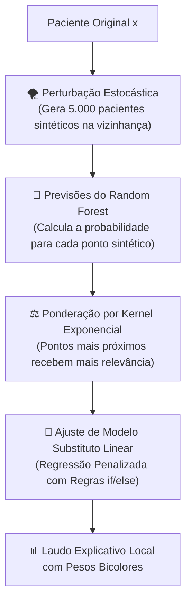

# Camada 07: LIME — Perturbação Local e Auditoria no Limiar de Decisão

**Trilha de Estudo:** XAI Aplicada à Redução de Dados em Machine Learning  
**Base Curricular:** Roteiro de Estudo — Etapa 7  
**Contexto Técnico:** [pipeline_completo.py](file:///c:/Users/eduar/projetos/xai_data_reduction/pipeline_completo.py) (`executar_etapa_lime`)

---

> [!NOTE]
> 🎯 **Foco Central desta Camada:**  
> Compreender o funcionamento do **LIME (Local Interpretable Model-agnostic Explanations)**. Entender como o método cria perturbações gaussianas sintéticas ao redor de um paciente específico, como ajusta um modelo linear substituto ponderado por distância e, fundamentalmente: **por que no nosso projeto escolhemos explicar justamente o paciente no limiar de decisão de 50% de probabilidade em vez de um caso óbvio?**

---

## 1. O que Estudar em Profundidade?

### 1.1 A Intuição da Perturbação Local (Aproximação por Vizinhança)
O LIME (Ribeiro et al., 2016) parte de uma premissa elegante:
> *"Pode ser impossível explicar o comportamento global de um modelo complexo com uma linha reta. Mas se você olhar apenas para a vizinhança imediata de um único ponto, o comportamento pode ser perfeitamente aproximado por um modelo linear simples!"*

Como o LIME faz isso na prática?
1. **Pega o Paciente-Alvo ($x$):** O paciente específico que queremos explicar (com seus 40 valores de exames).
2. **Gera Perturbações Sintéticas ($z'$):** Cria milhares de pequenas variações desse paciente (ex: sorteando pequenas variações gaussianas nos exames: glicemia um pouco maior, troponina um pouco menor).
3. **Pede Previsões ao Modelo Caixa-Preta:** Passa todas essas milhares de amostras sintéticas pelo Random Forest original para ver o que ele prevê para cada uma delas.
4. **Pondera por Proximidade:** Dá peso máximo aos pontos sintéticos que estão quase colados no paciente original e peso quase zero aos pontos que ficaram muito longe:
   $$\pi_x(z) = \exp\left(-\frac{D(x, z)^2}{\sigma^2}\right)$$
5. **Ajusta um Modelo Linear Simples (Lasso/Ridge):** Treina uma regressão linear simples apenas nesses pontos ponderados. Os coeficientes desse modelo linear viram a **explicação humana**:
   - *"Para este paciente, ter o Biomarcador 1 acima de 1.4 aumentou a probabilidade de patologia em +12%"*.
   - *"Ter o Biomarcador 3 abaixo de 0.8 reduziu a probabilidade em -8%"*.



---

### 1.2 Por que Explicar o Caso de 50% de Probabilidade? (A Fronteira Crítica)

No arquivo [pipeline_completo.py](file:///c:/Users/eduar/projetos/xai_data_reduction/pipeline_completo.py#L187), nós implementamos intencionalmente uma linha de busca algorítmica:
```python
idx_limiar = int(np.argmin(np.abs(y_proba_teste - 0.50)))
```
*Por que não escolhemos explicar o Paciente #0 ou um paciente com 99% de probabilidade?*

1. **Casos Óbvios Não Precisam de Auditoria:** Se um paciente tem todos os 10 biomarcadores extremamente alterados e o modelo dá **99.5% de certeza de patologia**, qualquer médico (e qualquer algoritmo simples) acertaria o diagnóstico. Auditar esse paciente traz pouco ganho de conhecimento.
2. **A Fronteira do Limiar é Onde Ocorrem as Tragédias Clínicas:** Se um paciente tem **50.4% de probabilidade**, o modelo emitirá o diagnóstico de "Doente" por uma margem de apenas **0.4%**! Se essa pequena margem foi causada por um biomarcador real, a decisão é clinicamente sustentável. Mas se foi causada por uma oscilação aleatória em um ruído metabólico, o hospital cometerá um erro grave!
3. **Máxima Sensibilidade Algorítmica:** É na fronteira de decisão de $P = 0.50$ que os gradientes são mais sensíveis e onde pequenas perturbações no LIME revelam quais variáveis têm o poder de "virar o voto" do modelo.

---

## 2. Por que isso Importa para o Projeto?

A explicabilidade local com LIME cumpre dois papéis cruciais:
1. **Validação Cruzada com o SHAP:** Se o SHAP diz que o `biomarcador_1` é a variável mais importante da população e o LIME mostra que, para o paciente crítico do limiar, o `biomarcador_1` também foi o fator que definiu o diagnóstico, temos uma **convergência científica entre duas técnicas de XAI totalmente distintas**!
2. **Material Nobre para o Artigo:** O artigo acadêmico ganha uma camada de realismo clínico impressionante ao apresentar a análise forense de um paciente real que estava no fio da navalha.

---

## 3. Onde Aparece no Código do Projeto?

No arquivo [pipeline_completo.py](file:///c:/Users/eduar/projetos/xai_data_reduction/pipeline_completo.py#L176):
- A função `executar_etapa_lime()` instancia o `LimeTabularExplainer`, localiza `idx_limiar`, gera a explicação e salva o gráfico de barras em `assets/modulo3_lime_local.png`.

---

## 4. Checkpoint de Autonomia do Estudante

Responda antes de seguir para a Camada 08:

> [!IMPORTANT]
> 🧠 **Pergunta do Checkpoint:**  
> **Por que o nosso projeto escolheu explicar justamente o paciente cuja probabilidade calculada esteve mais próxima de $50\%$, em vez de explicar um paciente com probabilidade de $99\%$ ou $1\%$?**  
> *(Dica: Pense na sensibilidade de decisão na fronteira clínica e no risco de falsos positivos/negativos).*
