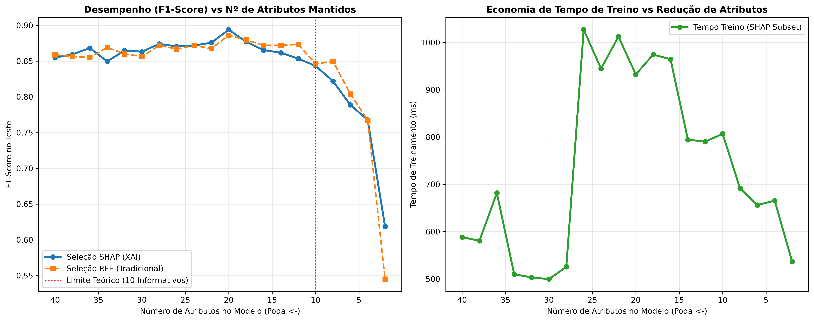

# Camada 08: Selecao Tradicional de Atributos e o Algoritmo RFE

**Trilha:** XAI Aplicada à Redução de Dados em Machine Learning
**Aplicação:** classificação binária de saúde (`0 = Saudável`, `1 = Patologia`)
**Código de referência:** [pipeline_completo.py](../pipeline_completo.py), funções com `RFE` e `executar_etapa_ablacao`

> **Objetivo da aula:** Analisar a taxonomia classica de selecao de atributos (filtros, embutidos e envoltorios/wrappers), dominando o mecanismo recursivo guloso do RFE (Recursive Feature Elimination), seu custo computacional quadratico em relacao ao numero de podas e sua funcao estrategica como linha de base classica e justa perante comites cientificos.

## Campo Didático: O Detetive Que Vai Eliminando Pistas

Execute o RFE em ciclos: **treine com todas as colunas, leia a importancia, remova a menos importante, repita e compare o desempenho a cada tamanho**. Desenhe uma tabela com `k`, atributos restantes, F1 e tempo para tornar visivel o custo da estrategia.

```text
todas as pistas -> treinar -> remover uma pista -> treinar de novo -> ranking final
       |                                                   |
       v                                                   v
   modelo caro                                      selecao gulosa
```

O que importa observar e o compromisso entre desempenho e custo, nao apenas o ranking final. O erro comum e usar o teste para escolher `k`; a escolha deve ocorrer em treino/validacao e o teste deve aparecer uma unica vez na comparacao final. A ponte para a Camada 09 e medir a curva completa de queda ao remover atributos.

---

### Roteiro de dominio

Trace uma rodada completa do RFE: ajuste, ranking, remocao e novo ajuste. Em seguida compare o custo dessa repeticao com um filtro de uma unica passada. O ponto didatico nao e demonizar o RFE; e entender quando uma selecao guiada pelo modelo vale o custo computacional.

### Duvidas que esta aula responde

- **O atributo removido e definitivamente inutil?** Nao. Ele foi menos importante dentro daquele modelo e conjunto de atributos.
- **A ordem do ranking e causal?** Nao. E uma ordem operacional produzida pelo estimador.
- **Por que atributos correlacionados complicam o ranking?** O modelo pode dividir ou alternar importancia entre substitutos.
- **RFE e filtro estatistico?** Nao. E um wrapper: treina repetidamente um modelo para decidir a poda.

### Regra de explicacao Feynman

Explique RFE como uma equipe eliminando candidatos em rodadas: o menos votado sai, a equipe e refeita e a proxima eliminacao depende do novo contexto.

### Uma eliminacao em camera lenta

Imagine dez candidatos para uma equipe. O RFE treina o modelo com todos, observa a importancia, elimina o menos importante e repete. Se a ordem inicial for `[A, B, C, D]` e `D` tiver a menor importancia, a proxima rodada usa `[A, B, C]`; a importancia e recalculada, porque a ausencia de `D` pode mudar a funcao dos demais.

```text
[A B C D] -> remove D -> [A B C] -> remove B -> [A C]
       |                    |                    |
    ranking 1            ranking 2             ranking 3
```

Essa recomputacao e a forca e o custo do wrapper. O RFE nao pergunta apenas se uma coluna parece boa isoladamente; pergunta como o modelo se comporta quando aquela coluna deixa de existir.

### Como ler o experimento

Registre o F1 de teste ou validacao a cada `k` atributos e o tempo acumulado. Uma curva que permanece estavel de 40 ate 10 sugere compressao possivel; uma queda brusca ao passar de 10 para 8 indica que o modelo perdeu sinal. O ranking RFE sozinho nao diz qual conjunto e melhor: o desempenho do subconjunto e a evidencia.

### Duvidas frequentes

- **RFE e um filtro univariado?** Nao. Ele usa o modelo para avaliar atributos em conjunto.
- **O atributo eliminado e sempre inutil?** Nao; ele foi menos necessario naquele modelo, amostra e rodada.
- **Por que o custo cresce?** Porque muitos modelos sao treinados em sequencia.
- **Posso escolher o menor `k` pelo teste?** Nao. Use validacao para decidir e reserve o teste para a comparacao final.

### Ponte para a ablacao

RFE oferece uma ordem gulosa de eliminacao. A Camada 09 amplia a pergunta e desenha a curva completa de desempenho conforme o numero de atributos diminui, procurando um ponto de equilibrio.

## Cultura, História e Referências

Selecao de atributos nasceu do encontro entre estatistica, reconhecimento de padroes e engenharia de sinais. O artigo de Guyon e Elisseeff, [An Introduction to Variable and Feature Selection](https://doi.org/10.1073/pnas.2011085003), e uma referencia panoramica; a documentacao do [RFE no scikit-learn](https://scikit-learn.org/stable/modules/feature_selection.html#rfe) mostra como a ideia foi transformada em API.

Historicamente, RFE representa a confianca em um modelo iterativo: o algoritmo aprende, elimina e aprende novamente. O [modulo4_ablation_curves.png](../assets/modulo4_ablation_curves.png) ajuda a lembrar que o ranking nao e o resultado final; o custo e a qualidade ao longo das rodadas tambem contam.

**Pergunta cultural:** por que metodos antigos continuam importantes? Porque uma comparacao justa precisa enfrentar baselines conhecidos, e nao apenas uma tecnica nova com um nome atraente.

## Recursos de Mídia (Visual e Áudio)

- **Visual local:** curva de ablação [modulo4_ablation_curves.png](../assets/modulo4_ablation_curves.png).
- **Imagem incorporada:**


- **Referencia:** [Feature selection no scikit-learn](https://scikit-learn.org/stable/modules/feature_selection.html).
- **Áudio sugerido:** a eliminação de candidatos de uma equipe, sempre reavaliando quem ficou.
- **Imagem mental:** ranking que muda a cada poda, como uma classificacao esportiva sob novas rodadas.

## 📊 Elementos de Comunidade e Status

- **Status:** `Baseline comparativo` quando custo, ranking e desempenho do RFE estiverem claros.
- **Debate:** “Um metodo antigo pode vencer uma tecnica nova? Como comparar honestamente?”
- **Papel rotativo:** defensor do RFE, defensor de XAI e juiz do protocolo.

## 💡 Engajamento e Conhecimento

- **Desafio:** prever qual atributo será removido, executar e explicar qualquer surpresa.
- **Produto da aula:** tabela de cada rodada com atributos, F1, tempo e justificativa.
- **Conexao profissional:** documentar por que o RFE foi escolhido como adversario de referencia.

## Mapa da aula

1. [Subcamada 08.1: O conceito na vida real](#subcamada-081-o-conceito-na-vida-real)
2. [Subcamada 08.2: Desenhando o conceito](#subcamada-082-desenhando-o-conceito)
3. [Subcamada 08.3: Desmistificando a teoria e a notacao formal](#subcamada-083-desmistificando-a-teoria-e-a-notacao-formal)
4. [Subcamada 08.4: Laboratorio ludico no Colab](#subcamada-084-laboratorio-ludico-no-colab)
5. [Subcamada 08.5: O momento serio da nossa aplicacao](#subcamada-085-o-momento-serio-da-nossa-aplicacao)
6. [Subcamada 08.6: Checkpoint de autonomia e fixacao ativa](#subcamada-086-checkpoint-de-autonomia-e-fixacao-ativa)

---

## Subcamada 08.1: O conceito na vida real

### A analogia das seletivas consecutivas de um time de elite

Imagine um comite olimpico selecionando os atletas para uma equipe de revezamento. O comite convoca inicialmente 40 candidatos para uma prova coletiva:
- Ao final da primeira bateria, os dois atletas com menor rendimento registrado sao dispensados (`step=2`).
- Na semana seguinte, os 38 sobreviventes disputam nova prova sob as novas dinamicas do grupo.
- Novamente, os dois com menor desempenho sao cortados.
- O processo repete-se de forma iterativa ate restarem exatamente os 10 titulares ideais.

Esse e o principio de funcionamento do algoritmo RFE (Recursive Feature Elimination, introduzido por Isabelle Guyon et al. em 2002 na identificacao de biomarcadores geneticos em microarrays): ele nao avalia atributos de forma isolada e estatica; ele ajusta o modelo, identifica as variaveis que menos colaboraram na rodada atual, remove as piores e reajusta o modelo do zero para medir como as caracteristicas remanescentes se comportam sem as colunas eliminadas.

### As tres grandes familias de selecao de atributos

Para compreender o papel do RFE no panorama do aprendizado de maquina, e necessario categorizar as abordagens existentes em tres familias fundamentais:

| Familia | Mecanismo Operacional | Analogia do Cotidiano | Vantagens e Limitacoes |
| :--- | :--- | :--- | :--- |
| **Metodos de Filtro (*Filter*)** | Testes estatisticos univariados independentes do modelo (ex: ANOVA, Correlacao, Qui-Quadrado). | **A balanca da farmacia:** avalia uma metrica individual em segundos de forma isolada. | Baixissimo custo computacional.<br>Ignora relacoes multivariadas e interacoes complexas. |
| **Metodos Embutidos (*Embedded*)** | A selecao ocorre internamente durante a otimizacao dos parametros (ex: Lasso L1, arvores de decisao). | **O disjuntor eletrico:** possui mecanismo interno que corta sobrecargas de forma automatica. | Integrado ao treinamento.<br>Preso a arquitetura matematica especifica do estimador. |
| **Metodos de Envoltorio (*Wrapper*)** | Usa o proprio algoritmo de aprendizado como juiz externo em um ciclo iterativo de selecao e re-treinamento. | **O provador de roupas:** experimenta pecas combinadas no espelho, ajustando o conjunto a cada troca. | Alta qualidade nas combinacoes capturadas.<br>Custo computacional elevado devido aos re-treinamentos. |

**A grande sacada:** o RFE pertence a familia dos metodos de envoltorio (*wrapper*). Ele e computacionalmente guloso porque re-treina o modelo completo apos cada ciclo de poda, mas atinge combinacoes sinergicas de alta qualidade.

---

## Subcamada 08.2: Desenhando o conceito

O diagrama abaixo ilustra o ciclo recursivo do RFE do conjunto original ate o subconjunto alvo:

```text
[ CONJUNTO INICIAL: p = 40 ATRIBUTOS ]
                 │
                 ▼
      ┌─────────────────────┐
      │  Ajusta o Modelo    │ <──────────────────────────────────────────┐
      │  (Random Forest)    │                                            │
      └──────────┬──────────┘                                            │
                 │                                                       │
                 ▼                                                       │
      ┌─────────────────────┐                                            │
      │ Calcula Importancia │ (MDI Gini ou magnitude dos coeficientes)   │
      │ w_j para cada coluna│                                            │
      └──────────┬──────────┘                                            │
                 │                                                       │
                 ▼                                                       │
      ┌─────────────────────┐                                            │
      │ Poda os s piores    │ (ex: step = 2 colunas descartadas)         │
      │ atributos da rodada │                                            │
      └──────────┬──────────┘                                            │
                 │                                                       │
                 ▼                                                       │
         Restam apenas k                                                 │
        atributos finais? ─────── NAO: Atualiza F^(t+1) = F^(t) \ S ─────┘
                 │
                SIM
                 ▼
[ RANKING FINAL RFE: 1º ao 40º ]
```

A estrutura de pontuacao do ranking gerado pelo RFE organiza os atributos em niveis hierarquicos de sobrevivencia:

```text
Ordem de Eliminacao no RFE:
Primeiras Rodadas (Descarte Imediato)  ------------------------> Finais (Sobreviventes)
Ranking: 16º, 15º, 14º ... 3º, 2º                                Ranking: 1º (Vencedores)
[ Ruido puro e variaveis espurias ]                             [ Biomarcadores vitais ]
```

| Elemento do RFE | Papel no Pipeline | Efeito no Experimento se Desajustado |
| :--- | :--- | :--- |
| **Estimador base** | Modelo supervisionado utilizado para pontuar atributos | Estimador instavel gera podas erraticas a cada rodada |
| **Tamanho do passo (`step`)** | Quantidade de colunas descartadas por iteracao | Passo muito grande acelera, mas pode descartar atributos uteis por engano |
| **Alvo final (`n_features_to_select`)** | Quantidade desejada de variaveis retidas | Se definido como 1, gera o ranking completo de 1 a $p$ |

---

## Subcamada 08.3: Desmistificando a teoria e a notacao formal

### A dinamica recursiva gulosa

Formalmente, seja $\mathcal{F}^{(0)} = \{1, 2, \dots, p\}$ o conjunto inicial com todos os $p$ atributos disponiveis. Em cada iteracao recursiva $t \ge 0$:

1. Ajusta-se o estimador supervisionado $\mathcal{M}$ utilizando apenas as colunas em $\mathcal{F}^{(t)}$:

$$\mathcal{M}^{(t)} \leftarrow \text{Fit}\left(X_{[:, \mathcal{F}^{(t)}]}, y\right)$$

2. Extrai-se o vetor de importancias relativas $w^{(t)} \in \mathbb{R}^{|\mathcal{F}^{(t)}|}$ fornecido pelo estimador (por exemplo, a reducao media de impureza de Gini na Random Forest):

$$w_j^{(t)} = \text{Importance}\left(\mathcal{M}^{(t)}, j\right), \quad \forall j \in \mathcal{F}^{(t)}$$

3. Ordena-se o vetor $w^{(t)}$ e identifica-se o subconjunto $\mathcal{S}^{(t)} \subset \mathcal{F}^{(t)}$ contendo os $s$ atributos com os menores valores de importancia:

$$\mathcal{S}^{(t)} = \arg\min_{\substack{S \subset \mathcal{F}^{(t)} \\ |S| = s}} \sum_{j \in S} w_j^{(t)}$$

4. Atualiza-se o conjunto de variaveis sobreviventes para a proxima iteracao:

$$\mathcal{F}^{(t+1)} = \mathcal{F}^{(t)} \setminus \mathcal{S}^{(t)}$$

O ciclo encerra quando $|\mathcal{F}^{(t+1)}| \le k_{\text{alvo}}$.

### Complexidade computacional e escala

Se o conjunto possui $p$ atributos e o algoritmo poda $s$ atributos a cada rodada ate atingir $k$ atributos finais, o numero total de re-treinamentos completos do estimador base e dado por:

$$N_{\text{treinos}} = \left\lceil \frac{p - k}{s} \right\rceil$$

Se o custo de treinar o estimador base com $m$ amostras e $j$ variaveis for denotado por $T_{\text{fit}}(m, j)$, o custo total do RFE e a somatoria de cada rodada:

$$\text{Custo}_{\text{RFE}} = \sum_{t=0}^{N_{\text{treinos}}-1} T_{\text{fit}}\left(m, \, p - t \cdot s\right)$$

Para bases com milhares de atributos (como sequenciamento genetico), o RFE com `step=1` torna-se computacionalmente proibitivo.

| Simbolo | Significado Formal | Leitura no Projeto |
| :--- | :--- | :--- |
| $\mathcal{F}^{(t)}$ | Conjunto de indices dos atributos sobreviventes na iteracao $t$ | Exames que ainda nao foram eliminados pelo modelo |
| $s$ (`step`) | Quantidade de atributos podados por iteracao | Cortamos 2 atributos por ciclo no experimento oficial |
| $w_j^{(t)}$ | Importancia atribuida a variavel $j$ na rodada $t$ | Nota de Gini da coluna naquela configuracao de arvore |
| $\mathcal{S}^{(t)}$ | Subconjunto dos piores atributos selecionados para descarte | Variaveis enviadas ao "paredao" de eliminacao |
| $k$ | Numero final de atributos desejados | Limite inferior da busca recursiva |

### A ordem correta evita vazamento

A execucao do RFE envolve dezenas de ciclos de aprendizado supervisionado guiados pelas respostas reais $y$. Portanto:
- O RFE deve ser executado **estritamente sobre a particao de treino**.
- Aplicar o RFE sobre a base completa antes do `train_test_split` constitui violacao metodologica grave (*data leakage* de selecao), invalidando os testes de generalizacao.

---

## Subcamada 08.4: Laboratorio ludico no Colab

Execute o codigo abaixo no Google Colab para inspecionar o funcionamento do RFE em uma base reduzida de 5 atributos:

```python
# =============================================================================
# CAMADA 08: LABORATORIO LUDICO DE SELECAO TRADICIONAL (RFE)
# Demonstracao: Poda Recursiva Gulosa e Inspecao de Rankings
# =============================================================================
import numpy as np
import pandas as pd
import matplotlib.pyplot as plt
from sklearn.feature_selection import RFE
from sklearn.ensemble import RandomForestClassifier

np.random.seed(42)

# 1. Base sintetica com 2 variaveis informativas e 3 variaveis de ruido puro
n_pacientes = 350
v1 = np.random.normal(0, 1, n_pacientes)
v2 = np.random.normal(0, 1, n_pacientes)
r1 = np.random.normal(0, 1, n_pacientes)
r2 = np.random.normal(0, 1, n_pacientes)
r3 = np.random.normal(0, 1, n_pacientes)

# Diagnostico real depende exclusivamente de v1 e v2
logit = 2.2 * v1 - 1.7 * v2 + np.random.normal(0, 0.4, n_pacientes)
y = (logit > 0).astype(int)

df_toy = pd.DataFrame({
    "Vital_1": v1,
    "Vital_2": v2,
    "Ruido_Alpha": r1,
    "Ruido_Beta": r2,
    "Ruido_Gama": r3
})

# 2. Configuracao do RFE para podar ate restar 1 variavel (gerando ranking completo)
estimador = RandomForestClassifier(n_estimators=40, max_depth=4, random_state=42)
seletor_rfe = RFE(estimator=estimador, n_features_to_select=1, step=1)
seletor_rfe.fit(df_toy, y)

# 3. Organizacao dos resultados de classificacao do ranking
# Posição 1 = O atributo mais resistente (ultimo a ser cortado)
df_resultado = pd.DataFrame({
    "Atributo": df_toy.columns,
    "Ranking_RFE": seletor_rfe.ranking_,
    "Sobreviveu_Top2": seletor_rfe.ranking_ <= 2
}).sort_values(by="Ranking_RFE").reset_index(drop=True)

print("Tabela de Sobrevivencia do RFE (Ordenada do Melhor ao Pior):")
print(df_resultado.to_string(index=False))

# 4. Visualizacao grafica do ranking de descarte
plt.figure(figsize=(8, 4))
cores = ["#27ae60" if r <= 2 else "#e74c3c" for r in df_resultado["Ranking_RFE"]]
barras = plt.barh(df_resultado["Atributo"][::-1], df_resultado["Ranking_RFE"][::-1], color=cores[::-1], edgecolor="black")
plt.xlabel("Ordem de Eliminacao (1 = Melhor/Sobrevivente, Valores Maiores = Piores)", fontsize=10)
plt.title("Mapeamento Hierarquico de Poda pelo RFE", fontsize=11, fontweight="bold")
plt.grid(axis="x", linestyle=":", alpha=0.6)

for barra in barras:
    val = int(barra.get_width())
    plt.text(val + 0.05, barra.get_y() + 0.25, f"Rank {val}", fontsize=9, fontweight="bold")

plt.tight_layout()
plt.show()
```

> **O que voce deve notar no grafico gerado:**
> 1. Os dois atributos informativos verdadeiros (`Vital_1` e `Vital_2`) ocupam o topo do ranking (`Rank 1` e `Rank 2`), sobrevivendo ate a rodada final.
> 2. Todas as variaveis com ruído estocastico puro foram prontamente eliminadas nas primeiras etapas de poda (`Rank 3`, `Rank 4` e `Rank 5`).

**Mini-experimento:** altere a configuracao de `step=1` para `step=3`. O que acontece com a capacidade do RFE de distinguir a ordem relativa de qualidade entre as variaveis de ruido?

---

## Subcamada 08.5: O momento serio da nossa aplicacao

> **Chega de brinquedo!** Agora que o conceito esta cristalino, vamos para a trincheira real da nossa aplicacao com os dados do projeto.

No protocolo experimental do projeto de reducao de dimensionalidade, o RFE atua como o **adversario de referencia (baseline consagrado)** contra o qual comparamos nossa metodologia proposta baseada em XAI (SHAP-Select).

```python
# =============================================================================
# APLICACAO REAL: SELECAO RECURSIVA TRADICIONAL (RFE) NO CENARIO DE 40 ATRIBUTOS
# Base oficial: 2.000 pacientes, 40 atributos clinicos
# =============================================================================
import time
import numpy as np
import pandas as pd
from sklearn.datasets import make_classification
from sklearn.model_selection import train_test_split
from sklearn.ensemble import RandomForestClassifier
from sklearn.feature_selection import RFE

# 1. Dataset oficial de 2.000 pacientes e 40 atributos
X_raw, y = make_classification(
    n_samples=2000,
    n_features=40,
    n_informative=10,
    n_redundant=10,
    n_classes=2,
    weights=[0.6, 0.4],
    flip_y=0.03,
    random_state=42
)

feature_names = (
    [f"biomarcador_{i+1:02d}" for i in range(10)] +
    [f"redundante_{i+1:02d}" for i in range(10)] +
    [f"ruido_{i+1:02d}" for i in range(20)]
)

df_clinico = pd.DataFrame(X_raw, columns=feature_names)
X_train, X_test, y_train, y_test = train_test_split(
    df_clinico, y, test_size=0.25, stratify=y, random_state=42
)

# 2. Execucao do RFE com cronometragem precisa
estimador_base = RandomForestClassifier(n_estimators=100, max_depth=8, random_state=42)
seletor_rfe = RFE(estimator=estimador_base, n_features_to_select=1, step=2)

print("=" * 72)
print("INICIANDO PROTOCOLO EXPERIMENTAL: SELECAO TRADICIONAL RFE (STEP = 2)")
print("=" * 72)

t0_rfe = time.perf_counter()
seletor_rfe.fit(X_train, y_train)
tempo_total_rfe = time.perf_counter() - t0_rfe

num_rodadas = (40 - 1) // 2 + 1

# 3. Consolidacao e auditoria do ranking RFE
df_ranking = pd.DataFrame({
    "Atributo": feature_names,
    "Ranking_RFE": seletor_rfe.ranking_,
    "Classe_Real": ["Informativo"]*10 + ["Redundante"]*10 + ["Ruido"]*20
}).sort_values(by="Ranking_RFE").reset_index(drop=True)

print(f"Tempo total de execucao do RFE   : {tempo_total_rfe:.2f} segundos")
print(f"Numero de retreinamentos completos: {num_rodadas} florestas ajustadas")
print("-" * 72)
print("TOP 10 ATRIBUTOS VENCEDORES SELECIONADOS PELO RFE:")
print("-" * 72)
print(df_ranking.head(10).to_string(index=False))

print("-" * 72)
print("PRIMEIROS 5 ATRIBUTOS DESCARTADOS PELO RFE (PIORES DA FILA):")
print("-" * 72)
print(df_ranking.tail(5).to_string(index=False))
print("=" * 72)
```

### Tabela oficial de KPIs

> Os valores abaixo sao produzidos pelo codigo, nao devem ser decorados como constantes. Tempo, latencia e ate pequenas variacoes de desempenho dependem do ambiente e da versao das bibliotecas.

| KPI | Como e calculado | Pergunta operacional |
| :--- | :--- | :--- |
| **Tempo de Execucao do RFE (s)** | Cronometrado via `time.perf_counter()` em todo o laco recursivo | Quantos segundos o metodo consome para convergir em relacao a solucao de XAI? |
| **Iteracoes de Retreinamento** | $\lceil (p - k) / s \rceil$ | Quantas florestas completas precisaram ser instanciadas e ajustadas? |
| **Pureza no Top-10 (%)** | Proporcao de atributos informativos verdadeiros retidos no Top 10 | O algoritmo conseguiu blindar a selecao contra variaveis de ruido estocastico? |
| **Custo por Rodada (s)** | Tempo total dividido pelo numero de iteracoes | Qual e a latencia media incremental a cada ciclo de poda? |

### Interpretacao clinica e de negocio

A utilizacao do RFE como baseline no projeto cumpre tres objetivos estrategicos:

1. **Rigor metodologico perante a comunidade cientifica:** nenhum artigo academico e aceito em periodicos de alto impacto se apresentar um novo metodo competindo apenas contra um modelo sem selecao alguma. O RFE e reconhecido globalmente como um dos metodos de selecao mais solidos da literatura, constituindo uma linha de base exigente e justa.
2. **Avaliacao do custo computacional:** embora o RFE atinja boa pureza de selecao, seu custo de retreinamento recursivo e proibitivo em bases hospitalares com rotatividade continua de pacientes. Enquanto o RFE demanda retreinar dezenas de florestas, abordagens analiticas de explicabilidade conseguem extrair o ranking em um unico ciclo de inspecao.
3. **Ausencia de explicabilidade clinica:** o RFE produz apenas um ranking ordinal de eliminacao. Ele nao informa ao medico a direcao biologica do exame (se valores altos aumentam ou reduzem o risco de patologia), limitando sua utilidade em auditorias diagnosticas diretas.

---

## Subcamada 08.6: Checkpoint de autonomia e fixacao ativa

Explique sem consultar o texto e depois confira sua resposta:

1. **Em qual das tres familias de selecao de atributos (filtro, embutido ou envoltorio) o RFE se enquadra e por que?**
2. **Qual e a consequencia computacional e metodologica de configurar o parametro `step=1` versus `step=5` no RFE?**
3. **Como a importancia relativa das variaveis remanescentes pode se alterar apos o descarte de atributos fortemente correlacionados?**
4. **Por que e obrigatorio rodar o RFE estritamente dentro da particao de treino (`X_train`)?**
5. **Se o RFE apresenta bom desempenho na selecao de features, por que pesquisadores buscam alternativas baseadas em XAI como o SHAP-Select?**
6. **Qual e a diferenca entre o criterio de descarte do RFE (baseado na importancia interna de impureza do modelo) e o descarte estatistico univariado por teste de hipotese?**

### Mini-desafio pratico

Execute o RFE variando o parametro `step` e preencha a matriz comparativa abaixo:

| Passo de Poda (`step`) | Retreinamentos Realizados | Tempo Total (s) | Quantidade de Ruidos no Top 10 |
| :--- | :--- | :--- | :--- |
| `step = 1` (Poda Unitaria) | 39 | | |
| `step = 2` (Padrao do Projeto)| 20 | | |
| `step = 5` (Poda Acelerada) | 8 | | |

**Pergunta reflexiva:** o ganho de velocidade obtido com passos de poda maiores comprometeu a pureza biologica do subconjunto final de atributos selecionados?
