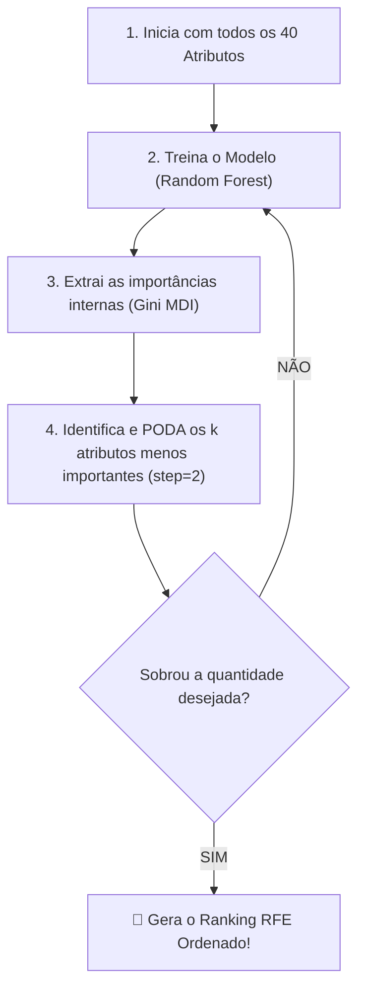

# Camada 08: Seleção Tradicional de Atributos — O Algoritmo RFE como Adversário Justo

**Trilha de Estudo:** XAI Aplicada à Redução de Dados em Machine Learning  
**Base Curricular:** Roteiro de Estudo — Etapa 8  
**Contexto Técnico:** [pipeline_completo.py](file:///c:/Users/eduar/projetos/xai_data_reduction/pipeline_completo.py) (`RFE` e `executar_etapa_ablacao`)

---

> [!NOTE]
> 🎯 **Foco Central desta Camada:**  
> Compreender o panorama geral da **Seleção de Atributos (*Feature Selection*)**. Entender a mecânica do método tradicional guloso **RFE (Recursive Feature Elimination)** e por que, em uma pesquisa científica séria, é obrigatório confrontar nossa proposta de XAI contra um "adversário justo" consagrado na literatura antes de afirmar qualquer superioridade.

---

## 1. O que Estudar em Profundidade?

### 1.1 O que é Seleção de Atributos e Quais São suas 3 Famílias?
A seleção de atributos é o processo de identificar um subconjunto $S \subset F$ de variáveis com máxima capacidade preditiva e mínimo ruído/redundância. Na literatura clássica, os métodos se dividem em três grandes categorias:

1. **Métodos de Filtro (*Filter Methods*):** Avaliam cada variável de forma independente e isolada usando estatística descritiva (ex: correlação de Pearson, teste Qui-Quadrado, ANOVA, ganho de informação mútua). São ultrarrápidos, mas ignoram como as variáveis interagem entre si dentro de um modelo complexo.
2. **Métodos Embutidos (*Embedded Methods*):** O próprio modelo penaliza variáveis durante o treinamento (ex: Regressão Lasso com norma $L_1$, ou a importância Gini interna do Random Forest).
3. **Métodos de Envoltório (*Wrapper Methods*):** Usam o modelo de Machine Learning como um "avaliador de caixa-preta". O algoritmo testa diferentes subconjuntos de variáveis, treina o modelo, mede o erro e vai refinando a busca de forma iterativa. **O RFE é o exemplo clássico dessa categoria.**

---

### 1.2 Como Funciona o RFE (Recursive Feature Elimination)?
Proposto por Isabelle Guyon em 2002 para bioinformática genética, o RFE opera através de um laço recursivo ganancioso (*greedy algorithm*):



1. Começa com o conjunto completo de 40 atributos.
2. Treina o modelo Random Forest no conjunto atual.
3. Extrai a importância de impureza (Gini) de cada variável.
4. Identifica e **elimina sumariamente** os $k$ piores atributos (no nosso código usamos `step=2`).
5. Repete os passos 2, 3 e 4 no conjunto restante até sobrar apenas 1 atributo.
6. A ordem em que os atributos foram eliminados define o **Ranking RFE** (os primeiros a serem eliminados têm pior ranking; os últimos sobreviventes são o Top 1).

---

### 1.3 Por que o RFE é Considerado Tradicional e Quais Suas Fraquezas?
O RFE não utiliza nenhuma teoria de explicabilidade moderna. Suas limitações históricas incluem:
- **Custo Computacional Elevado:** Como ele re-treina o modelo dezenas de vezes a cada corte, pode ser impraticável em bases com milhares de colunas.
- **Dependência da Importância Gini:** A importância interna do Random Forest tem um viés conhecido por beneficiar variáveis contínuas com muitos valores únicos, mesmo quando são ruído.
- **Sensibilidade à Multicolinearidade:** Se houver dois biomarcadores redundantes idênticos, a floresta pode dividir o peso entre eles, fazendo com que o RFE elimine prematuramente um deles achando que ambos são fracos.

---

## 2. Por que o RFE Importa para o Nosso Projeto?

Em ciência, você nunca pode publicar um artigo dizendo: *"Criei uma técnica com SHAP e ela é maravilhosa"* sem antes colocá-la para lutar no mesmo ringue contra o melhor método tradicional existente!  
O RFE é o nosso **adversário justo**:
- Ele usa exatamente o mesmo estimador (Random Forest).
- Ele é testado no mesmo conjunto de treino.
- Se provarmos que a seleção por SHAP é mais rápida e atinge $F_1$-scores mais estáveis ao longo da poda do que o RFE, temos uma **contribuição científica sólida e publicável**!

---

## 3. Onde Aparece no Código do Projeto?

No arquivo [pipeline_completo.py](file:///c:/Users/eduar/projetos/xai_data_reduction/pipeline_completo.py#L229):
```python
rfe = RFE(
    estimator=RandomForestClassifier(n_estimators=30, random_state=42, n_jobs=1),
    n_features_to_select=1,
    step=2
)
rfe.fit(X_train, y_train)
```
O ranking extraído (`df_rfe["atributo"].tolist()`) é enviado para o estudo de ablação comparativa na Camada 09.

---

## 4. Checkpoint de Autonomia do Estudante

Responda antes de seguir para a Camada 09:

> [!IMPORTANT]
> 🧠 **Pergunta do Checkpoint:**  
> **Qual é a diferença conceitual e matemática entre gerar um "ranking por SHAP" e gerar um "ranking por RFE"?**  
> *(Dica: Pense em quantas vezes cada método treina o modelo e em qual teoria matemática de atribuição de crédito cada um se apoia).*
