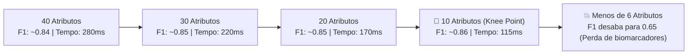

# Camada 09: O Estudo de Ablação — Testando Empiricamente a Poda de Atributos

**Trilha de Estudo:** XAI Aplicada à Redução de Dados em Machine Learning  
**Base Curricular:** Roteiro de Estudo — Etapa 9  
**Contexto Técnico:** [pipeline_completo.py](file:///c:/Users/eduar/projetos/xai_data_reduction/pipeline_completo.py) (`executar_etapa_ablacao`)

---

> [!NOTE]
> 🎯 **Foco Central desta Camada:**  
> Compreender o protocolo experimental de um **Estudo de Ablação (*Ablation Study*)**. Aprender a ler e interpretar as curvas comparativas de manutenção de $F_1$-score e de decaimento do tempo de treino, identificar o **Ponto de Inflexão (*Knee Point*)** e entender cientificamente por que podar de 40 para 10 atributos preserva (ou até melhora) a capacidade preditiva do modelo.

---

## 1. O que Estudar em Profundidade?

### 1.1 O Protocolo Científico de Ablação
No nosso experimento, comparamos dois rankings concorrentes: o ranking gerado pelo **SHAP (XAI)** e o ranking gerado pelo **RFE (Tradicional)**.

O laço iterativo de ablação executa o seguinte procedimento:
1. Começa com $k = 40$ atributos (todas as variáveis).
2. Treina um modelo Random Forest novo do zero apenas com essas $k$ variáveis.
3. Mede o tempo exato de treino em milissegundos e calcula o $F_1$-score no teste cego.
4. Reduz $k$ para $k - 2$ (ex: 38, 36, 34, ..., 10, 8, ..., 2) e repete o processo.
5. Plota os resultados em um gráfico com o **eixo X invertido** (lendo da esquerda para a direita na direção da poda: de 40 para 2).

---

### 1.2 Por que Reduzir de 40 para 10 Atributos Pode Até MELHORAR o F1-Score?
Para quem não conhece a fundo o comportamento de árvores de decisão, pode parecer contraditório que **remover dados faça a máquina acertar mais**. Mas a explicação é límpida:

1. **Eliminação do Ruído que Distrai:** Quando tínhamos 20 ruídos metabólicos aleatórios, as árvores frequentemente gastavam nós e divisões profundas testando ruídos em vez de focar nos biomarcadores verdadeiros.
2. **Fim da Diluição por Redundância:** Os 10 exames redundantes forçavam o Random Forest a fragmentar o aprendizado entre variáveis colineares.
3. **Hiperplano Limpo:** Ao filtrar apenas os 10 biomarcadores informativos reais, o Random Forest constrói regras de corte puras e limpas, maximizando a generalização no conjunto de teste cego!

---

### 1.3 Como Ler as Curvas do Gráfico de Ablação?

No gráfico gerado em `assets/modulo4_ablation_curves.png`:
- **Painel da Esquerda (Desempenho Clínico F1):**
  - No trecho de $40 \to 12$ atributos, a linha azul (SHAP) mantém-se estável em torno de $0.84$ a $0.86$. A poda não causa nenhum dano!
  - Ao atingir a linha vermelha tracejada ($k = 10$ atributos), o modelo atinge o **Ponto Ótimo**.
  - Abaixo de $k = 8$ atributos, a curva despenca vertiginosamente. *Por quê?* Porque o algoritmo é obrigado a cortar biomarcadores reais necessários para o diagnóstico!
- **Painel da Direita (Tempo de Treinamento):**
  - A curva verde cai continuamente: treinar o modelo com 10 atributos demora **menos da metade do tempo** do que com 40 atributos!

---

## 2. Por que isso Importa para o Projeto?

A ablação é a **evidência experimental empírica central** de toda a pesquisa:
- Sem ela, poderíamos apenas especular que 10 atributos bastavam.
- Com a curva de ablação, temos a **prova numérica documentada** de que 75% dos dados eram dispensáveis.

---

## 3. Onde Aparece no Código do Projeto?

No arquivo [pipeline_completo.py](file:///c:/Users/eduar/projetos/xai_data_reduction/pipeline_completo.py#L222):
- A função `executar_etapa_ablacao()` executa o loop de poda com `passos = list(range(40, 1, -2))`, cronometra cada passo e salva o gráfico em `assets/modulo4_ablation_curves.png`.

---

## 4. Checkpoint de Autonomia do Estudante

Responda antes de seguir para a Camada 10:

> [!IMPORTANT]
> 🧠 **Pergunta do Checkpoint:**  
> **Olhando para o gráfico de curvas de ablação (`assets/modulo4_ablation_curves.png`), em que número exato de atributos mantidos a curva de $F_1$-score do SHAP começa a cair de forma acentuada e irreversível, e qual é a explicação biológica/estatística para essa queda?**  
> *(Dica: Pense na quantidade de biomarcadores reais que foram colocados na síntese inicial de dados).*
