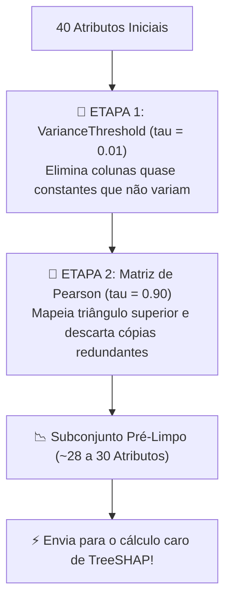

# Camada 10: Filtros Estatísticos Pré-XAI — O Pré-Filtro Híbrido (BOLIMES)

**Trilha de Estudo:** XAI Aplicada à Redução de Dados em Machine Learning  
**Base Curricular:** Roteiro de Estudo — Etapa 10  
**Contexto Técnico:** [pipeline_completo.py](file:///c:/Users/eduar/projetos/xai_data_reduction/pipeline_completo.py) (`pré_filtro_hibrido`)

---

> [!NOTE]
> 🎯 **Foco Central desta Camada:**  
> Compreender por que a moderna Inteligência Artificial Explicável **não substitui a estatística básica tradicional, mas sim se apoia nela**. Entender a mecânica do **Pré-Filtro Híbrido** (Limiar de Variância e Filtro de Multicolinearidade de Pearson), a filosofia por trás da abordagem biobjetivo **BOLIMES** e a lógica econômica de fazer uma faxina preliminar rápida antes de executar computações pesadas de XAI.

---

## 1. O que Estudar em Profundidade?

### 1.1 O Desperdício de Processamento em Variáveis Triviais
Calcular valores de explicabilidade (como SHAP e LIME) exige treinar florestas de decisão e avaliar perturbações ou árvores recursivas. Isso custa ciclos de CPU e memória RAM.  
Se você entregar para o explicador 100 variáveis onde:
- 10 variáveis têm **variância zero** (todos os pacientes têm exatamente o mesmo valor, ex: cidade de atendimento = "São Paulo");
- 15 variáveis têm **correlação quase perfeita** entre si ($r = 0.99$);

Você estará obrigando o algoritmo de XAI a gastar tempo precioso analisando dados que a matemática descritiva mais elementar do século XIX poderia ter descartado em **menos de 5 milissegundos**!

---

### 1.2 As Duas Etapas do Pré-Filtro Híbrido

#### Etapa A: O Filtro de Variância Mínima (`VarianceThreshold`)
A variância mede a dispersão dos dados ao redor da média:
$$\sigma^2 = \frac{1}{N} \sum_{i=1}^N (x_i - \mu)^2$$
- Se uma coluna tem variância $\sigma^2 \le 0.01$, significa que ela é praticamente constante para todos os pacientes. Se um exame dá sempre o mesmo valor para pessoas doentes e saudáveis, ele tem **zero capacidade discriminatória**. Pode ser eliminado sumariamente!

#### Etapa B: O Filtro de Multicolinearidade de Pearson ($|r| > 0.90$)
O coeficiente de correlação de Pearson ($r$) mede a força da relação linear entre duas variáveis contínuas:
$$r_{x,y} = \frac{\sum (x_i - \bar{x})(y_i - \bar{y})}{\sqrt{\sum (x_i - \bar{x})^2 \sum (y_i - \bar{y})^2}}$$
- Se duas variáveis têm correlação $|r| > 0.90$, elas carregam praticamente a **mesma informação redundante**.  
- No nosso código, calculamos a matriz de correlação, isolamos o **triângulo superior** com `np.triu(..., k=1)` (para não avaliar a diagonal $1.0$ e não duplicar pares espelhados) e descartamos a segunda coluna de cada par colinear.

---

### 1.3 A Filosofia do BOLIMES (Bi-objective Optimization)
Na literatura acadêmica recente (Al-Malaise Al-Ghamdi et al., 2022), essa estratégia é chamada de otimização biobjetivo:
- **Objetivo 1 (Estatístico / Filtro):** Reduzir dimensionalidade trivial em tempo $O(N)$.
- **Objetivo 2 (Explicabilidade / Causal):** Refinar o subconjunto restante usando técnicas não-lineares de XAI.

---

## 2. Por que isso Importa para o Projeto?

O Pré-Filtro Híbrido demonstra maturidade científica e pragmatismo de engenharia:
- Mostra que o pesquisador não é um "deslumbrado por XAI" que tenta resolver tudo com algoritmos pesados.
- Demonstra que estatística clássica e inteligência artificial cooperam de forma harmônica no pipeline.

---

## 3. Onde Aparece no Código do Projeto?

No arquivo [pipeline_completo.py](file:///c:/Users/eduar/projetos/xai_data_reduction/pipeline_completo.py#L274):
- A função `pré_filtro_hibrido()` executa o `VarianceThreshold(threshold=0.01)` e o corte de correlação no triângulo superior com `threshold_corr=0.90`, reduzindo a base antes de chamar o `executar_shap_select()`.

---

## 4. Checkpoint de Autonomia do Estudante

Responda antes de seguir para a Camada 11:

> [!IMPORTANT]
> 🧠 **Pergunta do Checkpoint:**  
> **Por que faz sentido do ponto de vista computacional e metodológico rodar o Pré-Filtro Híbrido ANTES de calcular os valores SHAP, e não depois?**  
> *(Dica: Pense no custo de processamento por coluna ao calcular valores Shapley e na redundância desnecessária de avaliar exames colineares).*
