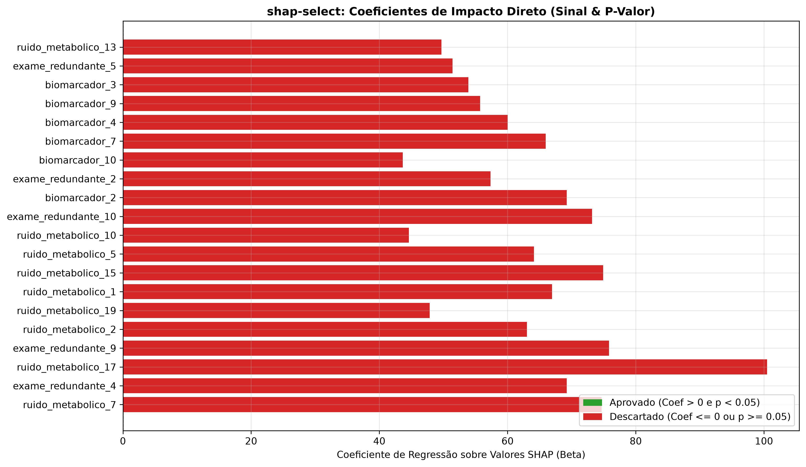

# Camada 11: shap-select e Regressao com P-Valor

**Trilha:** XAI Aplicada à Redução de Dados em Machine Learning
**Aplicação:** classificação binária de saúde (`0 = Saudável`, `1 = Patologia`)
**Código de referência:** [pipeline_completo.py](../pipeline_completo.py), função `executar_shap_select`

> **Objetivo da aula:** Compreender a formulacao econometrica do algoritmo shap-select, explorando a regressao multivariada do desfecho real sobre a matriz de explicabilidade aditiva, a interpretacao dos coeficientes direcionais (beta > 0) e a rejeicao da hipotese nula via p-valor (p < 0.05) para blindagem contra ruido estocastico.

## Campo Didático: Da Explicação ao Teste de Evidência

A sequencia didatica e: **produzir SHAP, tratar cada coluna SHAP como evidencia, ajustar a regressao conjunta, ler beta e p-valor, filtrar e comparar o modelo enxuto com o baseline**. A pergunta-guia e: o atributo aparece porque ajuda de modo consistente ou porque uma amostra especifica o favoreceu?

```text
modelo -> matriz SHAP -> regressao conjunta -> beta/p-valor -> selecao -> reavaliacao
```

Observe que `beta > 0` fala da direcao no modelo estatistico e `p < 0.05` fala da evidencia contra a hipotese nula; nenhum dos dois sozinho prova causalidade clinica. O erro comum e interpretar significancia como tamanho de efeito. A ponte para a Camada 12 e otimizar hiperparametros depois que o espaco foi reduzido.

---

### Roteiro de dominio

Leia cada atributo em uma ficha com quatro campos: valor SHAP, `beta`, erro-padrao e `p`. Depois separe tres perguntas: **o efeito aponta para a classe positiva?**, **ha evidencia estatistica?**, **o efeito e grande o bastante para importar?** O shap-select responde principalmente as duas primeiras.

### Duvidas que esta aula responde

- **`p < 0.05` prova que a variavel e importante?** Indica evidencia sob o modelo e as hipoteses adotadas; nao mede tamanho nem causalidade.
- **Beta positivo significa impacto grande?** Nao. Sinal e direcao; magnitude depende da escala e do contexto.
- **Por que regressao sobre SHAP?** Para testar conjuntamente a consistencia dos impactos produzidos pelo modelo.
- **P-valor corrige todos os problemas de multiplos testes?** Nao automaticamente; a estrategia precisa discutir selecao, dependencia e validacao.

### Regra de explicacao Feynman

Explique como um juiz que pergunta duas coisas: a testemunha aponta na direcao correta e ha evidencias suficientes para confiar nela? Mesmo aprovada, a testemunha nao vira prova causal sozinha.

### Um julgamento com duas portas

Imagine tres evidencias com os seguintes resultados:

```text
atributo       beta       p-valor       decisao
biomarcador_A  +0.80      0.001         aprovado
variavel_B     -0.60      0.010         rejeitado: direcao reversa
ruido_C        +0.05      0.420         rejeitado: evidencia fraca
```

O `shap-select` nao aprova um atributo apenas porque seu valor SHAP medio e grande. Ele exige duas portas: contribuicao no sentido esperado (`beta > 0`) e evidencia estatistica suficiente (`p < 0.05`). Essas portas respondem perguntas diferentes: “para que lado o efeito aponta?” e “ha evidencia para nao trata-lo como acaso?”.

### Como ler a tabela do laboratorio

Comece pelo sinal de `beta`, depois pelo p-valor e so entao observe a lista aprovada. Um p-valor pequeno nao significa que o efeito e grande ou clinicamente importante; significa que o efeito observado e dificil de explicar sob a hipotese nula, dado o modelo e os dados. Em atributos correlacionados, os coeficientes podem mudar quando entram juntos, portanto o julgamento deve ser comparado com o ranking SHAP e com o desempenho fora da amostra.

### Um julgamento passo a passo

Considere tres colunas de explicacao SHAP:

| Atributo | `beta` | `p` | Leitura |
|---|---:|---:|---|
| `phi_glicemia` | `+0,80` | `0,001` | passa nas duas portas |
| `phi_idade` | `-0,60` | `0,010` | evidencia forte, mas direcao rejeitada |
| `phi_ruido` | `+0,05` | `0,420` | direcao positiva, mas evidencia insuficiente |

O conjunto final contem apenas `phi_glicemia`. O atributo com beta negativo nao e salvo pelo p-valor pequeno, e o ruido nao e salvo pelo sinal positivo. O filtro duplo evita confundir “estatisticamente detectavel” com “alinhado ao objetivo e suficientemente sustentado”.

### Duvidas frequentes

- **`p < 0.05` prova que o biomarcador causa a patologia?** Nao. Testa uma hipotese estatistica dentro do protocolo.
- **`beta > 0` significa que o exame sempre aumenta o risco?** Nao. E uma direcao agregada na regressao das explicacoes.
- **Por que regressar `y` sobre SHAP e nao diretamente sobre os exames?** Para usar a contribuicao que a floresta atribuiu, preservando a ponte entre modelo nao linear e selecao inferencial.
- **O que se faz quando nenhum atributo passa?** Rever escala, colinearidade, potencia amostral e especificacao; nao relaxar o limiar automaticamente.

### Ponte para a otimizacao

Depois que o conjunto foi filtrado por evidencia, ainda resta escolher a melhor configuracao do modelo. A Camada 12 usa Optuna para buscar hiperparametros sem transformar o teste em gabarito.

## Cultura, História e Referências

Esta camada junta duas culturas que nem sempre conversam: a explicabilidade de modelos e a inferencia estatistica. Fisher popularizou o uso do p-valor como medida de evidencia contra uma hipotese nula, mas o debate historico mostra que p-valor nao e probabilidade de uma hipotese ser verdadeira. A [documentacao do Logit no statsmodels](https://www.statsmodels.org/stable/generated/statsmodels.discrete.discrete_model.Logit.html) e a [de OLS](https://www.statsmodels.org/stable/generated/statsmodels.regression.linear_model.OLS.html) ajudam a ligar formula, ajuste e saida computacional.

O artefato [modulo5_shap_select_analysis.png](../assets/modulo5_shap_select_analysis.png) deve ser lido com duas perguntas: o efeito aponta na direcao esperada? A evidencia e suficiente sob o protocolo? Nao use um corte de `0,05` como ritual; declare hipotese, modelo, multiplicidade e tamanho de efeito.

**Pergunta cultural:** por que a comunidade estatistica critica o uso mecanico de p-valores? Porque um numero pequeno pode virar uma falsa certeza quando muitas hipoteses, amostras oportunistas ou escolhas pos-hoc ficam escondidas.

## Recursos de Mídia (Visual e Áudio)

- **Visual local:** [Análise shap-select](../assets/modulo5_shap_select_analysis.png), lendo beta, p-valor e aprovação.
- **Imagem incorporada:**


- **Referencia:** [Logit no statsmodels](https://www.statsmodels.org/stable/generated/statsmodels.discrete.discrete_model.Logit.html) e [OLS](https://www.statsmodels.org/stable/generated/statsmodels.regression.linear_model.OLS.html).
- **Áudio sugerido:** o tribunal em que volume da testemunha não substitui evidência.
- **Imagem mental:** duas portas: direcao correta e evidencia estatistica.

## 📊 Elementos de Comunidade e Status

- **Status:** `Evidência estatística lida` quando p-valor não for confundido com tamanho de efeito ou causalidade.
- **Debate:** “Um resultado com `p<0,05` deve entrar automaticamente no modelo?”
- **Papel rotativo:** juiz, testemunha, estatistico e especialista do dominio.

## 💡 Engajamento e Conhecimento

- **Atividade:** classificar uma tabela de beta/p-valor em aprovado, invertido ou inconclusivo.
- **Produto da aula:** parecer de selecao com direcao, evidencia, efeito pratico e limitacao.
- **Conexao profissional:** comparar selecao por `|SHAP|` com selecao por inferencia.

## Mapa da aula

1. [Subcamada 11.1: O conceito na vida real](#subcamada-111-o-conceito-na-vida-real)
2. [Subcamada 11.2: Desenhando o conceito](#subcamada-112-desenhando-o-conceito)
3. [Subcamada 11.3: Desmistificando a teoria e a notacao formal](#subcamada-113-desmistificando-a-teoria-e-a-notacao-formal)
4. [Subcamada 11.4: Laboratorio ludico no Colab](#subcamada-114-laboratorio-ludico-no-colab)
5. [Subcamada 11.5: O momento serio da nossa aplicacao](#subcamada-115-o-momento-serio-da-nossa-aplicacao)
6. [Subcamada 11.6: Checkpoint de autonomia e fixacao ativa](#subcamada-116-checkpoint-de-autonomia-e-fixacao-ativa)

---

## Subcamada 11.1: O conceito na vida real

### A analogia da testemunha no tribunal de justica

Em uma investigacao criminal complexa, o promotor ouve dezenas de testemunhas. Uma determinada testemunha fala em tom exasperado, gesticula muito, bate na bancada e monopoliza a atencao do plenario. Se o juiz medisse a importancia das testemunhas exclusivamente pelo volume sonoro que elas produzem (o equivalente ao modulo absoluto da importancia $|\text{SHAP}|$), essa testemunha seria classificada como a peca mais relevante do processo.

No entanto, ao analisar a transcricao formal do depoimento em conjunto com as provas materiais:
1. Constata-se que ela aponta na direcao errada: tenta incriminar uma pessoa comprovadamente inocente para proteger um cumplice (coeficiente direcional invertido: $\beta \le 0$).
2. Constata-se que o relato baseia-se em boatos sem evidencias factuais (probabilidade de coincidencia pura muito alta: $p \ge 0.05$).

O magistrado imediatamente indefere o depoimento. O algoritmo `shap-select` atua como o juiz econometrico da selecao de atributos: ele nao se deixa seduzir por variaveis que produzem alta variabilidade numerica no SHAP; ele exige verificacao formal de que o impacto da variavel atua com significancia estatistica no sentido correto da patologia.

### A armadilha do ranking baseado em media do modulo $|SHAP|$

A abordagem comum na literatura de explicabilidade consiste em ordenar as variaveis pela media do valor absoluto de SHAP:

$$I_j = \frac{1}{n} \sum_{i=1}^n |\phi_{ij}|$$

Essa operacao de modulo oculta informacao essencial:
- Uma variavel com valor SHAP $+0.25$ empurra a predicao para doente, enquanto um valor $-0.25$ empurra a predicao para saudavel. Ambas geram o mesmo modulo $|0.25|$.
- Em bases com ruido estocastico e correlacoes complexas, podem surgir variaveis de confusao (*confounders*): atributos com alta dispersao de SHAP gerada por artefactos de divisao de nos na floresta, mas cujo efeito agregado diverge da verdadeira resposta clinica.
- Selecionar pelo modulo absoluto sem modelagem econometrica corre o risco de reter variaveis com relacoes espurias ou coeficientes invertidos.

**A grande sacada:** ao regredir a resposta binaria real $y$ sobre a matriz de explicabilidade $\Phi$ ($y \sim \Phi$), o `shap-select` une o poder nao-linear da Random Forest com a verificabilidade de hipoteses da econometria classica.

| Criterio | Ranking Tradicional por Módulo $|SHAP|$ | Protocolo shap-select ($y \sim \Phi$) |
| :--- | :--- | :--- |
| **Metrica de selecao** | Media aritmetica simples dos valores absolutos $|\phi|$ | Coeficiente $\beta_j$ e $p$-valor de teste bicaudal |
| **Tratamento de sinal** | Ignora o sinal original atraves da operacao de modulo | Exige estritamente concordancia direcional ($\beta > 0$) |
| **Controle de ruido** | Ruidos com variancia residual podem entrar no topo | Variaveis de ruido sao descartadas por $p \ge 0.05$ |
| **Comprovacao cientifica** | Heuristica de aprendizado de maquina | Modelo econometrico com intervalo de confianca e hipotese nula |

---

## Subcamada 11.2: Desenhando o conceito

O diagrama abaixo ilustra o fluxo de aprovacao em duas etapas do protocolo `shap-select`:

```text
[ MATRIZ DE EXPLICABILIDADE PHI (N x M) ]     [ DIAGNOSTICO REAL y (N x 1) ]
(Valores SHAP extraidos do Treino)            (Ground Truth: 0 = Saudavel, 1 = Doente)
                     │                                      │
                     └──────────────────┬───────────────────┘
                                        │
                                        ▼
                      [ REGRESSAO MULTIVARIADA y ~ PHI ]
                   Ajuste OLS / Logit dos coeficientes beta_j
                                        │
                                        ▼
         ┌─────────────────────────────────────────────────────────────┐
         │              FILTRO DUPLO DE RIGOR ESTATISTICO              │
         └──────────────────────────────┬──────────────────────────────┘
                                        │
                 ┌──────────────────────┴──────────────────────┐
                 ▼                                             ▼
        TESTE 1: DIRECAO                              TESTE 2: SIGNIFICANCIA
       O coeficiente beta e > 0?                       O p-valor e < 0.05?
      (Alinhado com a patologia)                    (Menos de 5% de chance de sorte)
         /              \                               /              \
       SIM              NAO                           SIM              NAO
        │                │                             │                │
        │                ▼                             │                ▼
        │          [ REPROVADO ]                       │          [ REPROVADO ]
        │          (Efeito reverso)                    │          (Sem suporte estatistico)
        │                                              │
        └──────────────────────┬───────────────────────┘
                               │
                               ▼
               [ ATRIBUTO APROVADO PELO SHAP-SELECT ]
               (Biomarcador informativo robusto comprovado)
```

A classificacao dos atributos submetidos a regressao distribui-se em quatro quadrantes de decisao:

```text
       Beta (Direcao do Impacto)
          ^
          |   Quadrante de Descarte:        |   QUADRANTE DE APROVACAO:
          |   Beta > 0, mas p >= 0.05       |   Beta > 0 e p < 0.05
          |   (Sem significancia)           |   (Atributos de Elite Aprovados)
   beta=0 +---------------------------------+---------------------------------
          |   Quadrante de Rejeicao:        |   Quadrante de Inversao:
          |   Beta <= 0 e p >= 0.05         |   Beta <= 0 e p < 0.05
          |   (Ruido puro descartado)       |   (Efeito reverso espurio)
          +---------------------------------+---------------------------------->
         p=1.00                           p=0.05                            p=0.00
                                       Significancia Estatistica (Escala Inversa)
```

| Condicao Estatistica | Diagnostico Tecnico | Conduta Metodologica |
| :--- | :--- | :--- |
| $\hat{\beta}_j > 0$ e $p_j < 0.05$ | Contribuicao genuina alinhada a ocorrencia da doenca | Aprovado no conjunto final de atributos |
| $\hat{\beta}_j > 0$ e $p_j \ge 0.05$ | Tendencia positiva nao corroborada por potencia amostral | Descartado por insuficiencia de evidencia |
| $\hat{\beta}_j \le 0$ e $p_j < 0.05$ | Variavel confusa com efeito estatisticamente reverso | Descartado para prevenir distorcao diagnostica |
| $\hat{\beta}_j \le 0$ e $p_j \ge 0.05$ | Ruido aleatorio nao correlacionado | Descartado de imediato |

---

## Subcamada 11.3: Desmistificando a teoria e a notacao formal

### A formulacao da modelagem econometrica

Dada a matriz de treino $\Phi \in \mathbb{R}^{n \times M}$, em que $\phi_{ij}$ representa o valor SHAP da variavel $j$ para o paciente $i$, ajusta-se um modelo linear de probabilidade (ou regressao logistica multivariada) expressando o desfecho real $y_i \in \{0, 1\}$:

$$y_i = \beta_0 + \sum_{j=1}^M \beta_j \phi_{ij} + \varepsilon_i, \quad \varepsilon_i \sim \mathcal{N}(0, \sigma^2)$$

Ou, sob a formulacao logistica:

$$\text{logit}\left(P(y_i = 1 \mid \Phi_i)\right) = \ln\left( \frac{P(y_i = 1)}{1 - P(y_i = 1)} \right) = \beta_0 + \sum_{j=1}^M \beta_j \phi_{ij}$$

### Teste de hipotese e erro padrao

Para cada atributo $j$, define-se a hipotese nula de irrelevancia parametrica:

$$H_0: \beta_j = 0 \quad \text{contra} \quad H_1: \beta_j > 0$$

A estatistica de teste $t$ (ou estatistica de Wald $z$) e calculada pela razao entre o coeficiente estimado e o seu respectivo erro padrao assintotico:

$$t_j = \frac{\hat{\beta}_j}{\text{SE}(\hat{\beta}_j)}$$

O $p$-valor associado representa a probabilidade acumulada sob a hipotese nula:

$$p_j = 2 \cdot \left( 1 - \Phi_Z(|t_j|) \right)$$

### As duas regras inegociveis de selecao

O subconjunto de caracteristicas selecionadas $\mathcal{S}^*$ e estritamente restrito as variaveis que satisfazem simultaneamente a condicao direcional e a condicao de rejeicao da hipotese nula ao nivel de significancia de $\alpha = 0.05$:

$$\mathcal{S}^* = \left\{ j \in \{1, \dots, M\} \;\middle|\; \hat{\beta}_j > 0 \quad \text{e} \quad p_j < 0.05 \right\}$$

| Simbolo | Significado Formal | Leitura no Projeto |
| :--- | :--- | :--- |
| $\Phi$ | Matriz de explicabilidades aditivas ($n \times M$) | Forcas SHAP atribuidas pela floresta a cada exame no treino |
| $\hat{\beta}_j$ | Coeficiente de regressao estimado para o atributo $j$ | Direcao e forca da contribuicao de $\phi_j$ para o desfecho real |
| $\text{SE}(\hat{\beta}_j)$ | Erro padrao do coeficiente | Incerteza amostral na estimativa de $\beta_j$ |
| $p_j$ | Nivel descritivo ($p$-valor) do teste de significancia | Probabilidade de observar aquele efeito por mero acaso |
| $\mathcal{S}^*$ | Conjunto final de atributos aprovados | Lista enxuta de biomarcadores validados com rigor duplo |

### A ordem correta evita vazamento

1. A Random Forest base e ajustada estritamente sobre a particao de treino `X_train`.
2. A matriz de valores SHAP $\Phi_{\text{train}}$ e calculada apenas para as instancias de treino.
3. O modelo de regressao econometrica e ajustado relacionando $\Phi_{\text{train}}$ com `y_train`.
4. Os atributos aprovados em $\mathcal{S}^*$ sao entao selecionados para filtragem cega de `X_test[:, S*]`.

---

## Subcamada 11.4: Laboratorio ludico no Colab

Execute o bloco abaixo no Google Colab para inspecionar o julgamento econometrico do `shap-select` em uma base simulada contendo tres comportamentos caracteristicos:

```python
# =============================================================================
# CAMADA 11: LABORATORIO LUDICO DO SHAP-SELECT
# Demonstracao: Regressao y ~ Phi e Filtragem por Coeficiente e P-Valor
# =============================================================================
import numpy as np
import pandas as pd
import statsmodels.api as sm
import matplotlib.pyplot as plt

np.random.seed(42)
n_pacientes = 400

# 1. Simulacao de tres perfis distintos de forcas SHAP
# Biomarcador legitimo: correlacao positiva com patologia real
phi_biomarcador = np.random.normal(loc=0.0, scale=1.0, size=n_pacientes)
# Variavel confusa: correlacao negativa com desfecho
phi_confuso = np.random.normal(loc=0.0, scale=1.0, size=n_pacientes)
# Ruido estocastico: sem associacao com y
phi_ruido = np.random.normal(loc=0.0, scale=1.0, size=n_pacientes)

# Desfecho real y gerado pelo biomarcador legitimo
logit = 2.0 * phi_biomarcador - 1.2 * phi_confuso + np.random.normal(0, 0.5, n_pacientes)
prob = 1.0 / (1.0 + np.exp(-logit))
y_real = (prob >= 0.50).astype(int)

df_phi = pd.DataFrame({
    "SHAP_Biomarcador": phi_biomarcador,
    "SHAP_VariavelConfusa": phi_confuso,
    "SHAP_RuidoSorte": phi_ruido
})

# 2. Ajuste do modelo OLS multivariado: y ~ Phi
X_reg = sm.add_constant(df_phi)
modelo_ols = sm.OLS(y_real, X_reg).fit()

betas = modelo_ols.params[1:]
pvalues = modelo_ols.pvalues[1:]

df_julgamento = pd.DataFrame({
    "Atributo": df_phi.columns,
    "Beta": betas.values,
    "P_Valor": pvalues.values,
    "Beta_Positivo": betas.values > 0,
    "P_Significante": pvalues.values < 0.05,
    "Aprovado_shap_select": (betas.values > 0) & (pvalues.values < 0.05)
})

print("Veredito Econometrico do shap-select:")
print(df_julgamento.to_string(index=False))

# 3. Visualizacao grafica do filtro duplo
plt.figure(figsize=(9, 4.5))
cores = ["#27ae60" if a else "#c0392b" for a in df_julgamento["Aprovado_shap_select"]]
plt.scatter(df_julgamento["Beta"], df_julgamento["P_Valor"], c=cores, s=150, edgecolors="black", zorder=3)

plt.axvline(0, color="black", linestyle="--", linewidth=1.0, label="Corte Direcional (Beta = 0)")
plt.axhline(0.05, color="#d35400", linestyle=":", linewidth=1.2, label="Corte de Significancia (p = 0.05)")

for _, row in df_julgamento.iterrows():
    status = "APROVADO" if row["Aprovado_shap_select"] else "REJEITADO"
    plt.annotate(
        f"{row['Atributo']}\n({status})",
        (row["Beta"], row["P_Valor"]),
        textcoords="offset points",
        xytext=(10, 5),
        fontsize=9,
        fontweight="bold"
    )

plt.title("Espaco de Decisao do shap-select: Beta vs. P-Valor", fontsize=11, fontweight="bold")
plt.xlabel("Coeficiente Beta (Direcao)", fontsize=10)
plt.ylabel("P-Valor (Incerteza Amostral)", fontsize=10)
plt.gca().invert_yaxis()
plt.grid(True, linestyle=":", alpha=0.6)
plt.legend(frameon=True)
plt.tight_layout()
plt.show()
```

> **O que voce deve notar no grafico gerado:**
> 1. Apenas `SHAP_Biomarcador` posiciona-se no quadrante valido ($\beta > 0$ e $p < 0.05$).
> 2. A variavel confusa foi barrada pelo criterio direcional ($\beta < 0$) e a variavel de ruido foi descartada pela falta de significancia estatistica ($p > 0.05$).

**Mini-experimento:** reduza o tamanho da amostra para `n_pacientes = 30`. O que acontece com o $p$-valor do biomarcador genuino devido a reducao da potencia amostral?

---

## Subcamada 11.5: O momento serio da nossa aplicacao

> **Chega de brinquedo!** Agora que o conceito esta cristalino, vamos para a trincheira real da nossa aplicacao com os dados do projeto.

No projeto de reducao de dimensionalidade, executamos a rotina oficial `executar_shap_select` sobre o conjunto de treino com 40 variaveis, combinando os valores gerados pelo `TreeExplainer` com a regressao formal.

```python
# =============================================================================
# APLICACAO REAL: PROTOCOLO shap-select OFICIAL COM REGRESSAO ECONOMETRICA
# Base oficial: 2.000 pacientes, 40 atributos clinicos
# =============================================================================
import time
import numpy as np
import pandas as pd
import shap
import statsmodels.api as sm
from sklearn.datasets import make_classification
from sklearn.model_selection import train_test_split
from sklearn.ensemble import RandomForestClassifier

# 1. Dataset oficial padronizado: 2.000 pacientes e 40 colunas.
X_raw, y = make_classification(
    n_samples=2000,
    n_features=40,
    n_informative=10,
    n_redundant=10,
    n_classes=2,
    weights=[0.6, 0.4],
    flip_y=0.03,
    random_state=42  # Mantem a base sintetica reproduzivel.
)

feature_names = (
    [f"biomarcador_{i+1:02d}" for i in range(10)] +
    [f"redundante_{i+1:02d}" for i in range(10)] +
    [f"ruido_{i+1:02d}" for i in range(20)]
)

df_clinico = pd.DataFrame(X_raw, columns=feature_names)
# 25% dos pacientes ficam escondidos para a avaliacao final.
X_train, X_test, y_train, y_test = train_test_split(
    df_clinico, y, test_size=0.25, stratify=y, random_state=42
)

# 2. Ajuste do modelo base: 100 arvores, profundidade maxima 8.
rf_base = RandomForestClassifier(n_estimators=100, max_depth=8, random_state=42)
rf_base.fit(X_train, y_train)

# 3. SHAP e calculado no treino: a selecao nao pode consultar o teste.
print("=" * 74)
print("INICIANDO PROTOCOLO shap-select: RIGOR ECONOMETRICO COM P-VALOR")
print("=" * 74)

t0_shap = time.perf_counter()
# 500 linhas reduzem o custo do exemplo sem mudar a ideia do metodo.
amostra_treino = X_train.iloc[:500]
amostra_y = y_train[:500]

explainer = shap.TreeExplainer(rf_base)
sv = explainer.shap_values(amostra_treino)
matriz_phi = sv[1] if isinstance(sv, list) else sv[:, :, 1]
tempo_shap = time.perf_counter() - t0_shap

# 4. Ajuste da regressao linear multivariada y ~ Phi
df_phi = pd.DataFrame(matriz_phi, columns=feature_names)
X_ols = sm.add_constant(df_phi)
modelo_econometrico = sm.OLS(amostra_y, X_ols).fit()

betas = modelo_econometrico.params[1:]
pvalues = modelo_econometrico.pvalues[1:]

# 5. Aplicacao das regras inegociaveis (Beta > 0 e P-Valor < 0.05)
aprovados = [
    feat for feat in feature_names
    if betas[feat] > 0 and pvalues[feat] < 0.05
]

tempo_total = time.perf_counter() - t0_shap

print(f"Tempo de extracao SHAP TreeExplainer : {tempo_shap:.2f} s")
print(f"Tempo total do protocolo shap-select : {tempo_total:.2f} s")
print(f"Total de variaveis iniciais          : {len(feature_names)}")
print(f"Atributos selecionados pelo algoritmo: {len(aprovados)}")
print(f"Taxa de reducao de dimensionalidade  : {(1 - len(aprovados)/len(feature_names))*100:.1f}%\n")

print("-" * 74)
print("DEMONSTRATIVO DOS ATRIBUTOS APROVADOS PELO shap-select:")
print("-" * 74)

for pos, feat in enumerate(aprovados, 1):
    tipo = "Informativo Real" if "biomarcador" in feat else ("Redundante" if "redundante" in feat else "Ruido")
    print(f"  {pos:2d}. {feat.ljust(18)} | Beta = {betas[feat]:+.4f} | p-valor = {pvalues[feat]:.4e} | [{tipo}]")

print("=" * 74)
```

### Tabela oficial de KPIs

> Os valores abaixo sao produzidos pelo codigo, nao devem ser decorados como constantes. Tempo, latencia e ate pequenas variacoes de desempenho dependem do ambiente e da versao das bibliotecas.

| KPI | Como e calculado | Pergunta operacional |
| :--- | :--- | :--- |
| **Taxa de Retencao Informativa (%)** | Proporcao de biomarcadores informativos aprovados em relacao aos 10 reais | O filtro econometrico preservou todos os sinais diagnosticos verdadeiros? |
| **Taxa de Rejeicao de Ruido (%)** | Proporcao de colunas de ruido metabolico rejeitadas em relacao as 20 | O modelo eliminou com sucesso os falsos positivos de selecao? |
| **R-Quadrado da Regressao ($R^2$)** | Coeficiente de determinacao do modelo $y \sim \Phi$ | Quao bem as explicabilidades aditivas explicam a variancia do desfecho real? |
| **Dimensionalidade Enxuta Final ($k^*$)** | Contagem cardinal do conjunto $\mathcal{S}^*$ | O subconjunto final converge para a faixa otima de 8 a 10 atributos? |

### Interpretacao clinica e de negocio

A fundamentacao econometrica do `shap-select` agrega vantagens decisivas para o ambiente hospitalar:

1. **Blindagem contra intervencoes espurias:** ao exigir $\beta > 0$ e $p < 0.05$, o algoritmo assegura que nenhum exame seja mantido por mero acaso correlacional na amostra, reduzindo Falsos Positivos de selecao.
2. **Defensabilidade regulatoria perante a comunidade cientifica:** a presenca de coeficientes com intervalos de confianca e $p$-valores transforma a selecao de atributos em um protocolo auditavel por peritos de bioestatistica, superando a opacidade de heurísticas gulosas puras.
3. **Reducao otima para calibracao subsequente:** selecionar exatamente as variaveis com suporte causal comprovado prepara a base para a otimizacao hiperparametrica com o Optuna na Camada 12, garantindo que o algoritmo de busca nao desperdice esforco em espacos de ruido.

---

## Subcamada 11.6: Checkpoint de autonomia e fixacao ativa

Explique sem consultar o texto e depois confira sua resposta:

1. **Por que a ordenacao simples pelo modulo medio de SHAP pode reter variaveis com relacoes espurias ou confusas?**
2. **Qual e a funcao conceitual de formular a regressao multivariada $y \sim \Phi$ conectando a explicabilidade com o desfecho real?**
3. **Qual e a interpretacao clinica da exigencia da regra $\beta > 0$ no contexto de patologia binaria?**
4. **O que significa estatisticamente a rejeicao da hipotese nula com $p < 0.05$ na selecao de biomarcadores?**
5. **Por que a extracao dos valores SHAP e a regressao devem ser realizadas exclusivamente sobre a particao de treino?**
6. **Como o resultado enxuto do shap-select facilita a etapa de otimizacao com o Optuna?**

### Mini-desafio pratico

Execute a regressao variando o nivel de significancia critico e registre o impacto no numero de variaveis retidas:

| Nivel de Significancia Critico ($\alpha$) | Atributos Aprovados | Biomarcadores Retidos | Ruidos Descartados |
| :--- | :--- | :--- | :--- |
| $\alpha = 0.10$ (Menor rigor) | | | |
| $\alpha = 0.05$ (Padrao do Projeto)| | | |
| $\alpha = 0.01$ (Alto rigor) | | | |

**Pergunta reflexiva:** a adocao de um criterio excessivamente restritivo ($\alpha = 0.001$) provocou o descarte indevido de biomarcadores informativos com forca de efeito moderada?
