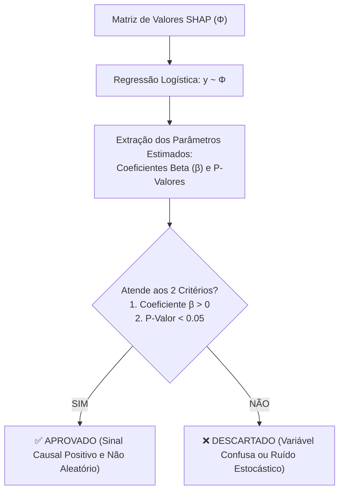

# Camada 11: shap-select — Seleção Econométrica e Rigor Estatístico com P-Valor

**Trilha de Estudo:** XAI Aplicada à Redução de Dados em Machine Learning  
**Base Curricular:** Roteiro de Estudo — Etapa 11  
**Contexto Técnico:** [pipeline_completo.py](file:///c:/Users/eduar/projetos/xai_data_reduction/pipeline_completo.py) (`executar_shap_select`)

---

> [!NOTE]
> 🎯 **Foco Central desta Camada:**  
> Dominar a etapa mais sofisticada do nosso projeto: a metodologia **`shap-select`**. Compreender por que ranquear atributos apenas pela magnitude média $|SHAP|$ é insuficiente, aprender a ajustar uma **Regressão Logística** da classe real ($y$) sobre a matriz de contribuições $\Phi$, entender o significado do **$p$-valor** e responder com precisão: **por que descartamos atributos com coeficiente $\beta \le 0$ mesmo quando o impacto deles parece alto?**

---

## 1. O que Estudar em Profundidade?

### 1.1 A Falha Oculta dos Rankings de Importância Pura
Até a Camada 09, nós selecionávamos atributos olhando apenas para a média do módulo: $|SHAP|$.  
Mas considere este cenário perigoso:
- Imagine um exame clínico que tem um $|SHAP|$ médio alto ($0.15$).
- Porém, quando investigamos a relação dele com a doença real, descobrimos que **sempre que o modelo usa esse exame para aumentar a predição, o paciente na verdade era saudável**!
- Esse atributo tem alto impacto, mas atua como uma **variável de confusão**: ele ensina a máquina a errar em direção oposta à verdade biológica!
- Se você selecionar esse atributo apenas porque o módulo $|SHAP|$ é alto, você estará mantendo um "sabotador" dentro do modelo!

---

### 1.2 A Mecânica Matemática do `shap-select`
Para blindar a seleção com rigor econométrico, aplicamos uma modelagem estatística formal em dois passos:

1. **Construção da Matriz de Explicabilidade ($\Phi$):**  
   Extraímos a matriz $\Phi \in \mathbb{R}^{N \times M}$, onde cada elemento $\phi_{i,j}$ é o valor SHAP que o atributo $j$ deu para o paciente $i$.
2. **Ajuste da Regressão Logística ($y \sim \Phi$):**  
   Ajustamos um modelo linear generalizado (Logit) usando o pacote `statsmodels`, onde a variável dependente é o diagnóstico real ($y \in \{0, 1\}$):
   $$\ln\left(\frac{P(y=1)}{1 - P(y=1)}\right) = \alpha + \beta_1 \phi_1 + \beta_2 \phi_2 + \dots + \beta_M \phi_M$$



---

### 1.3 As Duas Regras de Aprovação Inegociáveis

#### Regra 1: O Coeficiente Deve Ser Positivo ($\beta_j > 0$)
- O coeficiente $\beta_j$ mede o efeito marginal que a contribuição SHAP daquela variável tem sobre a probabilidade real da doença.
- Se $\beta_j > 0$: Significa que quando o modelo atribui importância positiva para essa coluna, a chance de o paciente realmente ter a patologia aumenta. **A variável atua a favor da verdade!**
- Se $\beta_j \le 0$: Significa que o atributo atua na direção errada. É descartado sumariamente!

#### Regra 2: O P-Valor Deve Ser Significativo ($p < 0.05$)
- O **$p$-valor** é a probabilidade de termos observado aquele coeficiente $\beta_j$ por mero acaso estatístico (sob a hipótese nula $H_0: \beta_j = 0$).
- Exigir $p < 0.05$ garante um nível de confiança científica de **95%** de que a variável realmente carrega sinal informativo legítimo.

---

## 2. Por que isso Importa para o Projeto?

O `shap-select` eleva o projeto de uma simples aplicação prática para uma **pesquisa acadêmica de ponta**:
- A maioria dos artigos da área para no ranking simples de SHAP.
- O seu projeto traz o rigor dos testes de hipótese e da Econometria clássica para dentro da explicabilidade de IA, garantindo que o subconjunto final de 8 a 10 atributos seja estatisticamente inquestionável.

---

## 3. Onde Aparece no Código do Projeto?

No arquivo [pipeline_completo.py](file:///c:/Users/eduar/projetos/xai_data_reduction/pipeline_completo.py#L301):
```python
df_stat["selecionado"] = (df_stat["coeficiente"] > 0) & (df_stat["p_value"] < p_value_cutoff)
atributos_aprovados = df_stat[df_stat["selecionado"]]["atributo"].head(10).tolist()
```
O gráfico gerado com as barras verdes (aprovadas) e vermelhas (descartadas) é salvo em `assets/modulo5_shap_select_analysis.png`.

---

## 4. Checkpoint de Autonomia do Estudante

Responda antes de seguir para a Camada 12:

> [!IMPORTANT]
> 🧠 **Pergunta do Checkpoint:**  
> **Por que um atributo que possui um valor de $|SHAP|$ médio alto pode ser descartado pelo `shap-select` se o seu coeficiente $\beta$ na regressão for negativo? O que esse coeficiente negativo significa na vida real?**  
> *(Dica: Pense na relação entre a previsão que a máquina tentou fazer e a realidade factual do paciente).*
