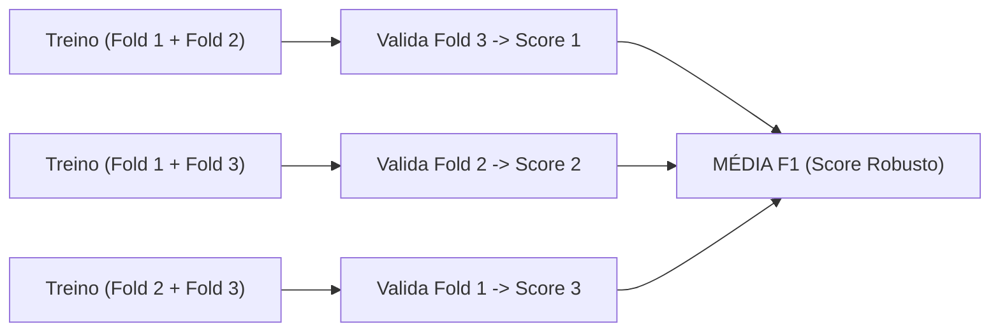

# Camada 12: Otimização Bayesiana com Optuna — Re-afinando o Modelo Reduzido

**Trilha de Estudo:** XAI Aplicada à Redução de Dados em Machine Learning  
**Base Curricular:** Roteiro de Estudo — Etapa 12  
**Contexto Técnico:** [pipeline_completo.py](file:///c:/Users/eduar/projetos/xai_data_reduction/pipeline_completo.py) (`otimizar_optuna`)

---

> [!NOTE]
> 🎯 **Foco Central desta Camada:**  
> Compreender a distinção fundamental entre **parâmetros** e **hiperparâmetros**, dominar o princípio da **Validação Cruzada Estratificada (*Cross-Validation*)**, entender por que a busca bayesiana via **Optuna (TPE)** é exponencialmente superior a buscas aleatórias ou em grade, e justificar cientificamente: **por que um modelo reduzido para 10 atributos precisa obrigatoriamente de novos hiperparâmetros antes da avaliação final?**

---

## 1. O que Estudar em Profundidade?

### 1.1 Parâmetros vs. Hiperparâmetros
- **Parâmetros Internos:** São os valores que o algoritmo aprende diretamente a partir dos dados durante o treinamento (ex: os limiares de corte em cada nó da árvore: *"glicemia > 126"*).
- **Hiperparâmetros Externos:** São os botões de controle arquitetural definidos pelo engenheiro de IA **antes** do treino começar (ex: quantas árvores criar? Qual a profundidade máxima permitida? Quantas amostras mínimas por folha?).

---

### 1.2 Por que o Espaço Reduzido Exige Novos Hiperparâmetros?
Quando tínhamos 40 variáveis, o espaço geométrico era esparso e cheio de ruído. O Random Forest precisava de árvores profundas (`max_depth=15`) para contornar o lixo estatístico.  
Ao podar para apenas 8 a 10 atributos de elite, o espaço torna-se ultra-compacto e purificado. Se você mantiver as árvores profundas antigas, o modelo correrá o risco de sofrer **overfitting nos próprios biomarcadores**!  
Re-otimizar os hiperparâmetros garante que o novo modelo opere no seu ponto de equilíbrio ótimo entre viés e variância.

---

### 1.3 Por que Validação Cruzada (*Cross-Validation*) em Vez de Treino Simples?
Dentro do Optuna, nunca avaliamos uma tentativa (*trial*) olhando para uma divisão simples de treino e teste, pois o algoritmo poderia "ter sorte" naquele sorteio.  
Usamos a **Validação Cruzada em 3 Dobras (3-Fold CV)**:
1. Divide a base de treino em 3 partes iguais.
2. Treina nas partes 1 e 2, avalia na parte 3.
3. Treina nas partes 1 e 3, avalia na parte 2.
4. Treina nas partes 2 e 3, avalia na parte 1.
5. O score da tentativa é a **média exata das 3 dobras**!

---

### 1.4 A Inteligência do Optuna (O Algoritmo TPE)
Enquanto métodos antigos como o **Grid Search** testam combinações exaustivas sem aprender nada, o **Optuna** utiliza o algoritmo **TPE (Tree-structured Parzen Estimator)**:
- Ele constrói uma distribuição probabilística de quais faixas de valores produziram os maiores $F_1$-scores nas tentativas anteriores.
- A cada nova tentativa, ele concentra a busca nas regiões mais promissoras do hiperplano de parâmetros, atingindo a sintonia ideal em **menos de 15 ensaios**!

---

## 2. Por que isso Importa para o Projeto?

Esta etapa garante a **justiça metodológica** da pesquisa:
- Se comparássemos o Baseline contra um modelo reduzido com parâmetros ruins e mal calibrados, o modelo reduzido perderia por culpa da má configuração, e não por culpa da seleção de variáveis.
- Ao re-otimizar com Optuna, damos ao modelo reduzido a **melhor chance possível de brilhar**, provando que 10 atributos bem afinados competem de igual para igual com 40 atributos brutos.

---

## 3. Onde Aparece no Código do Projeto?

No arquivo [pipeline_completo.py](file:///c:/Users/eduar/projetos/xai_data_reduction/pipeline_completo.py#L347):
- A função `otimizar_optuna()` cria o estudo bayesiano `optuna.create_study(direction="maximize")`, executa os ensaios com `cross_val_score(cv=3, scoring="f1")` e retorna os melhores parâmetros para treinar o modelo campeão final.

---

## 4. Checkpoint de Autonomia do Estudante

Responda antes de seguir para a Camada 13:

> [!IMPORTANT]
> 🧠 **Pergunta do Checkpoint:**  
> **Por que seria cientificamente injusto comparar o Baseline (com 40 atributos) com um modelo reduzido (com 10 atributos) sem antes re-otimizar os hiperparâmetros da floresta reduzida?**  
> *(Dica: Pense na alteração geométrica da densidade do espaço de atributos e no equilíbrio entre viés e variância).*
