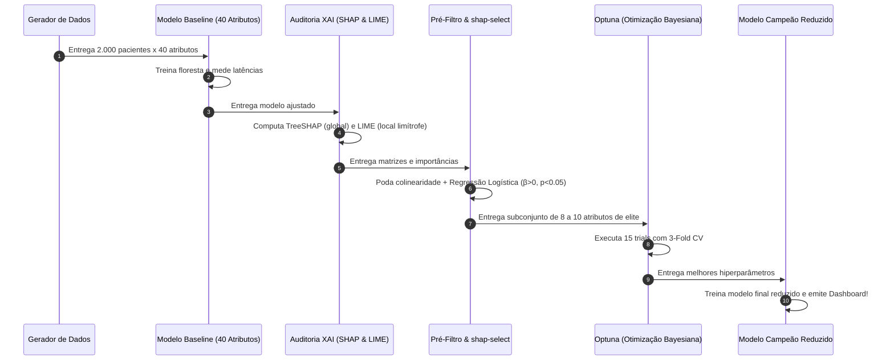

# Camada 13: O Pipeline Completo — Orquestração de Ponta a Ponta

**Trilha de Estudo:** XAI Aplicada à Redução de Dados em Machine Learning  
**Base Curricular:** Roteiro de Estudo — Etapa 13  
**Contexto Técnico:** [pipeline_completo.py](file:///c:/Users/eduar/projetos/xai_data_reduction/pipeline_completo.py) (`executar_pipeline_completo`)

---

> [!NOTE]
> 🎯 **Foco Central desta Camada:**  
> Compreender a arquitetura de **Engenharia de Machine Learning (MLOps)** que une todas as etapas isoladas em uma única engrenagem contínua, automatizada e reprodutível. Aprender a narrar com clareza o fluxo de dados e controle que vai da geração da base até o dashboard final.

---

## 1. O que Estudar em Profundidade?

### 1.1 A Orquestração em 6 Movimentos Consecutivos
No arquivo [pipeline_completo.py](file:///c:/Users/eduar/projetos/xai_data_reduction/pipeline_completo.py), nós temos a função `executar_pipeline_completo()`. Ela executa uma sinfonia em 6 etapas perfeitamente orquestradas:

---

### 1.2 A Narração do Fluxo de Dados em Linguagem Humana
Se você precisar explicar o pipeline para um comitê avaliador ou em uma entrevista técnica, siga este roteiro mental:

1. **Geração e Split:** Criamos 2.000 prontuários com 40 medições conhecidas e separamos 25% para teste cego estratificado.
2. **Ponto de Partida (Baseline):** Treinamos uma floresta com todas as 40 colunas e medimos o tempo de resposta e o $F_1$-score (nossa régua de comparação).
3. **Inspeção com XAI:** O SHAP nos dá a lista de quem realmente importa globalmente e o LIME audita o paciente limítrofe de $50\%$.
4. **Filtragem Estatística Ativa:** Rodamos o Pré-Filtro Híbrido (corta variância baixa e correlações $> 0.90$) e o `shap-select` (elimina quem tem $\beta \le 0$ ou $p \ge 0.05$), reduzindo a base em mais de 75%.
5. **Re-calibração com Optuna:** O Optuna explora o novo espaço compacto de 10 dimensões e acha os hiperparâmetros ideais.
6. **Avaliação Cega e Dashboard:** O modelo campeão é testado nos mesmos pacientes de teste da Etapa 1 e geramos o painel comparativo final.

---

## 2. Por que isso Importa para o Projeto?

Um código desorganizado em dezenas de scripts soltos é frágil e difícil de defender em bancas acadêmicas ou auditorias corporativas.  
A consolidação em um pipeline único:
- Garante **reprodutibilidade científica total** (qualquer pessoa roda `python pipeline_completo.py` e obtém os mesmos números exatos).
- Demonstra maturidade de arquitetura de software para Ciência de Dados.

---

## 3. Onde Aparece no Código do Projeto?

No arquivo [pipeline_completo.py](file:///c:/Users/eduar/projetos/xai_data_reduction/pipeline_completo.py#L286):
- A função `executar_pipeline_completo()` organiza as chamadas sequenciais e encerra com os testes de sanidade finais que validam a redução mínima de 40% e a manutenção do $F_1$-score.

---

## 4. Checkpoint de Autonomia do Estudante

Responda antes de seguir para a Camada 14:

> [!IMPORTANT]
> 🧠 **Pergunta do Checkpoint:**  
> **Você consegue fechar os olhos e narrar em voz alta, passo a passo, o que acontece do início ao fim da execução do `pipeline_completo.py`, sem olhar para a tela do computador?**  
> *(Dica: Use a sequência dos 6 blocos do diagrama acima).*
